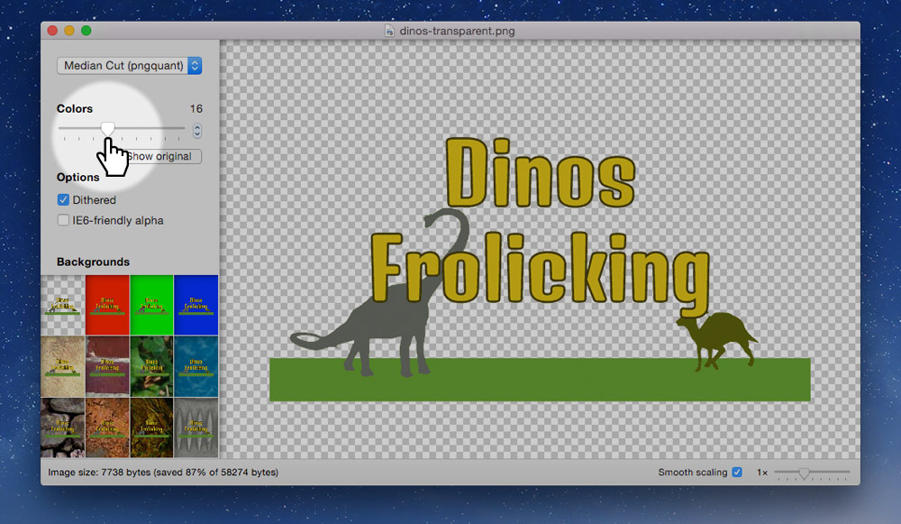
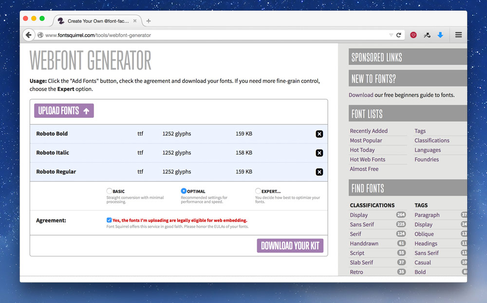
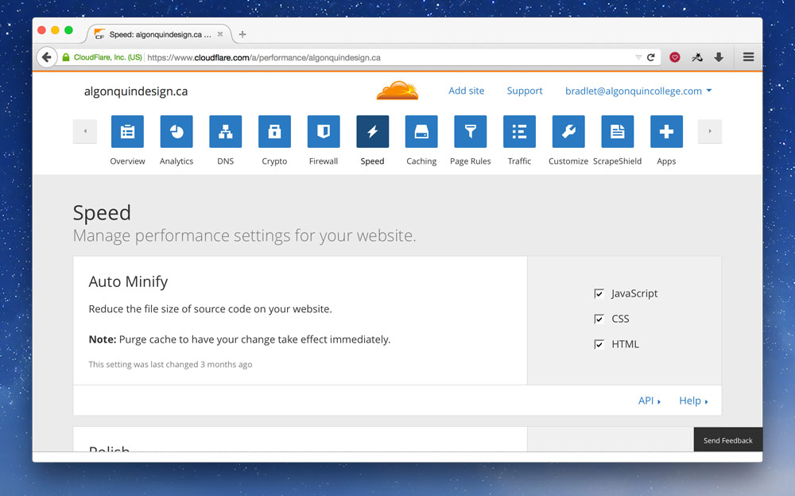
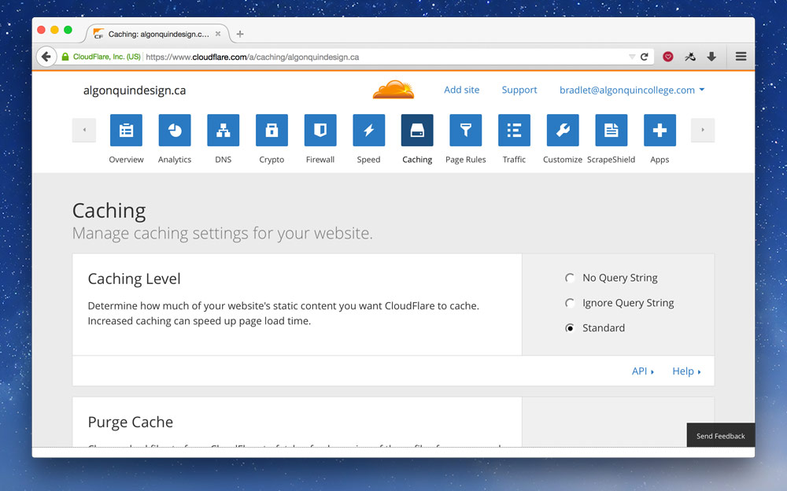
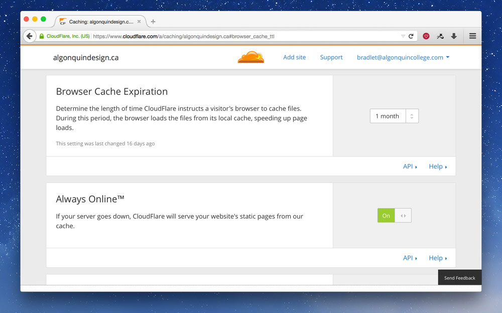

Performance is one of the most important constraints of web design. There’s lots extra we can do to make our websites super fast and therefore our users super happy.

---

## Basic performance first

There’s a whole lot you can do to make your website faster before getting to these steps.

**[☛ Make sure you follow all the steps in the basic performance tutorial first.](/topics/performance/)**

---

## Advanced resource compression

For images we always start by choosing the correct format, compressing as best we can, and running through ImageOptim. But there’s more we can do. And for other website resources we can increase performance with just a little care.

### Smaller PNG-8

The difference between PNG-24 and PNG-8 is just the number of colours that can exist in the file:

- PNG-8 — 256 colours.
- PNG-24 – millions of colours.

When exporting our PNGs from Photoshop we always choose PNG-24 because Photoshop’s PNG-8 implementation isn’t correct, lacking 8-bit transparency.

But, PNG-8 has lots of performance gains because it can make much smaller file sizes with it’s limited colour palette. There’s another tool called [ImageAlpha](http://pngmini.com/) that allows us to take our PNG-24 graphics and convert them to PNG-8, reducing their colour palette but keeping nice transparency.

Open up ImageAlpha and drag and drop your PNG into its window.



Using the slider on the left, reduce the number of colours until the image doesn’t become distorted. Try to make the colours number as small as possible without destroying the integrity of the image.

After you’re finished you have to re-save the image over top, so go to the menu and go to `File > Save As…` and just overwrite your original PNG. Check “Optimize with ImageOptim” to get an extra size reduction.

With the image you’re seeing above the size reduction was pretty great, with no noticeable loss of quality.

- Original PNG-24: **58 KB**
- New PNG-8, 16 colours: **7 KB**

### Blur JPGs to reduce file size

One way to significantly decrease the size of JPG files is to blur the sections that aren’t the focus. Literally take the blur tool in Photoshop and significantly blur out the background of the image.

Compare these two images:


This is the original JPG—136 KB.


This one has a blurred background—102 KB.

*Photos copyright [elizabeth&jane photography](http://elizabethandjane.ca/).*

### Optimize favicons

Since favicons are automatically requested on every website there’s a few things you can do to increase their performance.

1. **Make sure it exists** — the browser will automatically request it, so if it doesn’t exist there will still be a delay while attempting to fetch it.
2. **Smush the PNGs first** — before creating the final `.ico` file make sure to run you favicon PNGs through ImageOptim. And ideally you should be able to run them through ImageAlpha to compress the images even further.

### Embed single-use SVGs

If an SVG image is used only once on your website, on a single page, consider embedding it directly into the HTML.

**[See the advanced SVG tutorial on how to embed SVGs in HTML.](/topics/advanced-svg/)**

### Reduce web font size

Most typefaces come with many characters so they can support lots of different languages. But, depending on the site you’re making you may only need a few of those characters. For example, if your website is only in English you can remove a bunch of characters from the font file. Removing characters from the font file is called sub-setting.

Google Fonts provides a limited sub-setting of their typefaces, but you can download the fonts and run them through another system to truly reduce the file size.

#### Sub-set fonts with FontSquirrel

Go to [FontSquirrel’s Web Font Generator](http://www.fontsquirrel.com/tools/webfont-generator) and upload the styles and weights of the fonts you’re planning on using.



**The “Optimal” setting is likely what you need.**

I usually go with “Expert…” and only choose “WOFF” for the font formats because, [according to Can I Use, it has good enough browser support](http://caniuse.com/#feat=woff)—custom fonts are a luxury, not a must have.

After you’ve downloaded the font package, put the font files in your website, maybe a folder named `fonts`—[or ideally on a CDN](#content-delivery-networks). Then copy the CSS from the CSS file into the top of your CSS—you may have to update the font paths at the top of the CSS you copied-and-pasted.

Looking at Roboto, the typeface I used above, these are my file size reductions:

- Roboto Regular: 163 KB to 26 KB.
- Roboto Italic: 161 KB to 30 KB.
- Roboto Bold: 162 KB to 26 KB.

### Embed small images in CSS

For really small graphics it makes more sense to embed them directly into your CSS or HTML instead of forcing the browser to open another request and download the file. These are called Data URIs.

Data URIs are great for small PNGs, like icons, and also work really well for small SVGs.

Here’s an example of some CSS:

```css
.icon {
  background-image: url("../icon.png");
}
```

With this in your CSS, the browser will encounter the `background-image` line then go and download the `icon.png` file. Even though the icon is really small the overhead of having to open another connection to the server and initiate the download takes time.

But, using a tool like [DataURL.net](http://dataurl.net/#dataurlmaker), we can convert the icon to text and embed it into our CSS file.

Our CSS would then look like this:

```css
.icon {
  background-image: url("data:image/png;base64,iVBORw0KGgoAAAANSUhEUgAAADAAAAAwCAYA…");
}
```

*Be careful with data URIs, because they can make the image file size larger, the saving with data URIs is there isn’t another request—so stick to small images only.*

#### SVGs as Data URIs

We can do something really similar with SVGs, embed them directly into our CSS:

```css
.icon {
  background-image: url("data:image/svg+xml;charset=utf8,%3Csvg xmlns='http://www.w3.org/2000/svg' width='3' height='10' viewBox='0 0 3 10'%3E%3Crect fill='%23e2e2e2' x='0' y='0' width='3' height='10'/%3E%3C/svg%3E");
}
```

There’s a few important things to notice about the embedded SVG:

- The whole thing is surrounded in double quotes (").
- But the SVG inside, is in single quotes (') — most tools will output those as double quotes.
- All greater than symbols (>) are replaced with `%3E`.
- All less than symbols (<) are replaced with `%3C`.
- All hashes (#) are replaced with `%23`.

*I generally don’t do this manually, but use a tool like Gulp. [Read more about command-line tools below.](#command-line-tools)*

**Links**

- **[ImageAlpha](http://pngmini.com/)**
- **[FontSquirrel Web Font Generator](http://www.fontsquirrel.com/tools/webfont-generator)**
- [Instagram and Optimizing Favicons](https://zoompf.com/blog/2012/04/instagram-and-optimizing-favicons)
- [DataURL.net](http://dataurl.net/#dataurlmaker)
- [Data URI Converter](https://datauriconverter.appspot.com/)
- [Image2Base64](http://image2base64.wemakesites.net/)
- [Base64 File Encoder](http://jpillora.com/base64-encoder/)
- [Optimizing SVGs in data URIs](http://codepen.io/Tigt/blog/optimizing-svgs-in-data-uris)
- [Comparison of all optimisation tools](https://jamiemason.github.io/ImageOptim-CLI/)

---

## Reduce the size of code

*First, try remove all the duplicate code and try to merge your CSS into common components.*

After doing that we can reduce the size of our code even more, a process called minification. It’s like smushing images, but for code. It removes all the extra characters, all the white space, all the tabs—everything that’s helpful for humans and unnecessary for computers. Resulting in a smaller file size.

Concatenation is just a fancy word for combining.

### CSS & JS minification & concatenation

We use these two processes on our CSS and Javascript files. Combine together all our CSS files into one file and strip all the extra stuff to make them download faster. We even combine all our Javascript files together, strip the whitespace, and some minifiers even rename functions to a single letter to save space.

#### CSS minification example

Here’s an idea of what CSS will look like before and after minification.

Before:

```css
body {
  color: red;
  font: sans-serif;
}

h1 {
  color: green;
  font-weight: bold;
}
```

After:

```css
body{color:red;font:sans-serif}h1{color:green;font-weight:bold}
```

The computer can’t tell the difference between the two pieces of code, and it saves us a lot in download time.

#### JS minification example

Here’s what Javascript might look like before and after minification.

Before:

```js
var $btn = $('.btn');
var onBtnClick = function (e) {
  $btn.addClass('is-active');
}

$btn.on('click', onBtnClick);
```
After:

```js
var a=$('.btn'),b=function(){a.addClass('is-active')};a.on('click',b);
```

Notice how the variables and functions have been renamed and simplified.

### Minification naming

After your files have been minified it’s convention to append the `.min` extension onto them.

**Never delete the original source file. Always keep the original and the minified versions.**

For CSS you’ll end up with something like this:

```
main.css
main.min.css
```

**In your HTML you point to the minified version of your CSS, like this:**

```html
<link href="css/main.min.css" rel="stylesheet">
```

### Minification tools

Minification is a process that shouldn’t be done by hand, but should be automated by a tool. There are lost of different tools, manual & automatic, GUI & command line. Many of these tools will even automatically minify when you save your file. *Choose the one that works best for you.*

#### GUI tools

GUI tools provide an interface where you can drag and drop a project folder. The tool will detect CSS and Javascript files and minify them for you.

Some popular GUI tools are [Prepros](https://prepros.io/) & [CodeKit](http://incident57.com/codekit/).

#### Command-line tools

Command-line tools are extremely popular (and this is how I do it). They have many advantages over GUI tools but are slightly more complicated to get running.

Some of the popular command-line tools are **[Gulp](http://gulpjs.com/)** & [Grunt](http://gruntjs.com/). The tools are really just task runners, they delegate to other pieces of code to do the minification and concatenation.

- For CSS a popular minifier is [clean-css](https://www.npmjs.com/package/clean-css) or [cssnano](http://cssnano.co/).
- For JS the most widely used minifier is [UglifyJS](http://lisperator.net/uglifyjs/).

These minifiers can be run without a task runner, but it’s a much less manual if you use something like Gulp.

##### Concatenation with Jekyll

If you’re using Jekyll you can use its include system to concatenate CSS and Javascript.

**[☛ Watch a video on concatenating CSS with Jekyll.](https://www.youtube.com/watch?v=H4Fc2xL79nU&list=PLWjCJDeWfDdfVEcLGAfdJn_HXyM4Y7_k-&index=28)**

#### Automatic minification with CloudFlare

If your CSS and Javascript files are already concatenated, then you can get CloudFlare to automatically minify them for you. This works really well if you’re using Jekyll to combine files.



Go to the “Speed” section and check all the options in “Auto Minify̦”.

**Links**

- **[Gulp](http://gulpjs.com/)**, [Gulp for Beginners](https://css-tricks.com/gulp-for-beginners/)
- [Grunt](http://gruntjs.com/)
- [Prepros](https://prepros.io/)
- [CodeKit](http://incident57.com/codekit/)
- [cssnano](http://cssnano.co/)
- [UglifyJS](http://lisperator.net/uglifyjs/)
- [Give Grunt the Boot! A Guide to Using npm as a Build Tool](http://www.sitepoint.com/guide-to-npm-as-a-build-tool/)

---

## Server considerations

Not only is it extremely important to make our code and resources, like images, download really quickly, but the server we host our website can have a big impact too.

### Compress code files

After minifying and concatenating our CSS and Javascript, we can make the download size of the files even smaller by compressing them—basically zipping them. This is a completely automatic process done by the server.

*When using GitHub as a host, you’ll have to hook up CloudFlare to get the best compression.*

- For the Apache web server, [check out the configuration provided by HTML5 Boilerplate](https://github.com/h5bp/server-configs-apache/blob/master/dist/.htaccess).
- For the Nginx web server, [also check out the configuration provided by HTML5 Boilerplate](https://github.com/h5bp/server-configs-nginx/blob/master/nginx.conf).
- [There’s more configurations in the repository too.](https://github.com/h5bp/server-configs)

### Caching headers

Another thing you want to set up on your server is proper caching headers. The idea behind caching headers is that they encourage the user’s browser to save a copy of your website on the local computer. You can choose how long the local copy should be kept.

This is really great for CSS and Javascript because each new page the user goes to they don’t have to redownload the CSS, it’s already on their computer.

*When using GitHub as a host, you have no control over this, so hooking up CloudFlare is a great solution.*

*Check the server configurations above for setting this up on other web servers.*

### Automatic server setup with CloudFlare

If you’re using CloudFlare you can set up the proper compression and caching headings really easily. In fact the compression is already on.

For the caching headers, go to the “Caching” section:



At the very top set the “Caching Level” to “Standard”.



Scroll down a little and set the “Browser Cache Expiration̦” to something high, like “1 month”. You may as well turn on “Always Online” while you’re at it.

**Links**

- [Web Caching Basics: Terminology, HTTP Headers, and Caching Strategies](https://www.digitalocean.com/community/tutorials/web-caching-basics-terminology-http-headers-and-caching-strategies)
- [The Difference Between Minification and Gzipping](https://css-tricks.com/the-difference-between-minification-and-gzipping/)

---

## Content delivery networks

Content delivery networks (CDNs) allow us to distribute our resources around the world on lots of different servers. Then when a user downloads our website they receive the file from the server that’s closest to them making it download more quickly.

Most often we put our static files on CDNs, primarily images, because they’re the files that most benefit from CDNs.

*Using a CDN when hosting on GitHub is really helpful because Git/GitHub do not support large files. Things like fonts, large images, videos, etc. should all go onto a CDN instead of in your repository.*

### CloudFlare

CloudFlare is a very popular CDN with lots of great free features. But not only do they provide CDN features—automatically—they also perform other performance tasks: like minification, caching headers, gzipping and more.

After CloudFlare becomes our DNS provider these features are fairly automatic after the set up. They even provide a bunch of security features like DDOS protection and free HTTPS for websites.

*If you’re hosting on GitHub you’ll have to use a [custom domain](https://github.com/algonquindesign/resources/tree/master/domains) in order to take advantage of CloudFlare.*

*Also not that if you’re hosting on GitHub the HTTPS isn’t true: the connection between your user and CloudFlare is encrypted, but the connection between CloudFlare and GitHub is not. This is just a limitation of GitHub hosting right now.*

**[☛ See how to set up CloudFlare as your DNS provider.](/topics/domains#better-security-and-performance-with-cloudflare)**

### KeyCDN

KeyCDN is another very popular CDN. They are a little more traditional than CloudFlare: they only provide resource hosting, not all the other compression & security features.

With KeyCDN we can either upload our large files to them or host the files on our server and KeyCDN will pull them onto their servers and distribute them around the world.

**[☛ See how to use KeyCDN to host large video files.](/topics/video-audio/#hosting-on-a-cdn)**

**Links**

- [Know When to CDN](http://www.kendoui.com/blogs/teamblog/posts/13-11-07/know-when-to-cdn.aspx)
- **[CloudFlare](https://www.cloudflare.com/)** — also provides security, minification, caching headers
- **[KeyCDN](https://www.keycdn.com/)**
- [cdnjs](http://cdnjs.com/)
- [MaxCDN](http://www.maxcdn.com/)
- [Coral CDN](http://www.coralcdn.org/)
- [Amazon CloudFront](http://aws.amazon.com/cloudfront/)
- [Kraken.io](https://kraken.io/)

---

## Ads and tracking scripts

One major killer of performance on your website is third-party scripts, like advertisements and trackers, that you can’t completely control.

Be sure to test any ad services and tracking systems you use on your website to make sure they don’t completely destroy the performance.

---

## Browser performance

Even though the download time of our website is one of the biggest contributers to slow websites we can also help the browser render our website more quickly.

### Rendering performance

The time it takes for our website to become visible on the screen is really important, we want to try to avoid white screens and unstyled text as much as possible.

#### Webfonts delay rendering

Fonts can impede rendering with an effect called “Flash of Invisible Text”. FOIT is when the website background colours and CSS design renders but there is absolutely no text on the page. After at least a few hundred milliseconds the text pops into the design.

FOIT makes the website feel like it’s loading more slowly—it technically isn’t—but the time to screen is longer.

This is a choice that browsers have made when rendering websites: choosing to hide the text until the font has finished loading.

There are a few solutions to this problem, but most importantly make sure your website renders properly without your custom typeface.

Most solutions delay the loading of the fonts and show the default web-safe fonts until after the font face loads. After the font face has finished loading we add it to the page, add a class to the page that changes the font to the custom typeface.

##### Using Font Face Observer

There’s a great Javascript solution—[Font Face Observer](https://github.com/bramstein/fontfaceobserver)—that can help our websites visually load more quickly by displaying our fallback font while the font is loading then switching into the web font when it’s ready.

To make Font Face Observer work there’s a few things to do. First we download the Javascript file and place it in a `<script>` tag directly at the bottom of our page:

```html
  <script>
    // Paste everything from `fontfaceobserver.js` into here
    (function(){'use strict';…
  </script>
</body>
</html>
```

Next up we write a little script that checks if the font has finished loading. When it has finished loading, then we add a class to the `<html>` element.

```html
  <script>
    (function(){'use strict';…
  </script>
  <script>
    var observer;

    if (!sessionStorage.fontsLoaded) {
      // On this line we specify the font exactly how it’s written in our CSS
      observer = new FontFaceObserver('Bree Serif');

      observer.check().then(function () {
        document.documentElement.className += ' fonts-loaded';
        sessionStorage.fontsLoaded = true;
      });
    } else {
      document.documentElement.className += ' fonts-loaded';
    }
  </script>
</body>
</html>
```

*If you have more than one font weight or style you’ll need a slightly more advanced script. [See the font face observer script for this website with multiple weights and styles.](https://github.com/acgd-learn-the-web/acgd-learn-the-web.github.io/blob/master/_includes/alegreya-observer.js)*

After that’s in place, we just need to adjust our CSS a little bit to display fallback font first:

```css
/* All the `@font-face` stuff would be above here */

html {
  /* Here we specify our fallback font only */
  font-family: Georgia,serif;
}

.fonts-loaded {
  /* Here we specify our web font too */
  font-family: "Bree Serif",Georgia,serif;
}
```

The reason we don’t specify the primary web font on the `<html>` directly is because it will freeze the display immediately as the browser tries to use it. By putting the web font under a class—that gets added by Font Face Observer—the browser can default to our fallback and only display the web font when it’s ready.

**It’s important that you find a fallback font that closely matches your web font is height, weight, etc.**

###### Prefetching fonts

To take it even a step further we can request that the browser download our fonts ahead of time to encourge a quicker rendering by using `<link>` tag in the `<head>`.

```html
<head>
  ⋮
  <link href="fonts/breeserif-regular.woff" rel="prefetch">
```

##### Fancy font features

There are lots of great features of fonts that we can use on the web but each new feature has some performance issues.

Consider how important these features are before implementing them.

- `hyphens` — causes rendering lag because the browser has to calculate where all the hyphens should be and re-layout the content—every time the page loads or screen resizes.
- `text-rendering: optimizeLegibility` — adds a bunch of features like ligatures and hyphens to your text but currently has abysmal performance on browsers, so be very careful.

#### Inlining critical CSS

Many performance advocates—especially Google—really push for inlining critical CSS. The idea is to figure out the CSS that is used to display the content that’s visible on the screen before scrolling, then take that CSS and put it into `<style>` tags.

```html
<head>
  <style>
    /* Put the CSS for the top portion of the site here */
  </style>
</head>
```

This isn’t something you really want to do manually, but something you should leave up to tools—something like [Critical](https://github.com/addyosmani/critical) in combination with [Gulp](http://gulpjs.com/).

##### Inlining CSS for single page websites

When you’re creating a single page website it makes total sense to put *all* your CSS and Javascript directly into the page: CSS between `<style>` tags and JS between `<script>` tags. Make sure you completely minify the code before doing so.

[You can see inline CSS in action on my website.](http://thomasjbradley.ca)

### Scrolling performance

Nothing is worse than a website that doesn’t scroll smoothly, aka a janky website.

There are a few things that can cause scrolling and performance issues, so be careful of these things:

- `position: fixed` & `background-attachment: fixed` can have major performance issues causing the browser to re-render the whole page every time you scroll.
- CSS effects: `text-shadow`, `box-shadow` and especially `filter`.
- Parallax is almost always janky, there is so much changing on the screen every time you scroll browsers have a difficult time keeping up.
- Javascript waypoints and scrolling based animations can cause problems since Javascript needs to run and calculate every time a person scrolls to check the scroll location.

There is a fairly new CSS property called `will-change`, it can help with a few of these issues. [Sara Soueidan](https://dev.opera.com/articles/css-will-change-property/) & [Chris Ruppel](https://fourword.fourkitchens.com/article/fix-scrolling-performance-css-will-change-property) both have great articles on `will-change`.

### Battery drain, CPU load & memory usage

Since the web is a big place with many different devices, there’s lots of devices that have slower processors, less memory to render websites—and batteries. Nobody wants their battery to be drained by a sucky website.

There are a few things to consider that can cause these problems:

- **Oversized images** — large images, much bigger than the device, cause memory problems because they need to be shrunk down to display on the screen, but are still too big for the device.
- **Data URIs** — can cause processor lag because they have to be decompressed and re-generated into their original format.
- **Lots of unnecessary downloads, trackers, etc.** — the more you use the network on the device the more battery is consumed, the more memory is used, etc. Be careful.

**Links**

- **[Font Face Observer](https://github.com/bramstein/fontfaceobserver)**
- [The @font-face dilemma](https://viget.com/extend/the-font-face-dilemma)
- [How we use web fonts responsibly, or, avoiding a @font-face-palm](https://www.filamentgroup.com/lab/font-loading.html)
- [Font Loading Revisited with Font Events](https://www.filamentgroup.com/lab/font-events.html)
- [CSS Triggers… A game of layout, paint, and composite.](http://csstriggers.com/)
- [What forces layout / reflow](https://gist.github.com/paulirish/5d52fb081b3570c81e3a)
- [Everything You Need to Know About the CSS will-change Property](https://dev.opera.com/articles/css-will-change-property/)
- [Fix scrolling performance with CSS will-change property](https://fourword.fourkitchens.com/article/fix-scrolling-performance-css-will-change-property)
- [Use Gulp to automate your critical path CSS](http://fourword.fourkitchens.com/article/use-gulp-automate-your-critical-path-css)
- [Understanding Critical CSS](http://www.smashingmagazine.com/2015/08/understanding-critical-css/)
- [10 Ways to Minimize Reflows and Improve Performance](http://www.sitepoint.com/10-ways-minimize-reflows-improve-performance/)
- [Jank Free](http://jankfree.org/)
- [Critical rendering path](https://varvy.com/pagespeed/critical-render-path.html)
- [Faster Font Loading with Font Events](https://jonsuh.com/blog/font-loading-with-font-events/)
- [iOS Fonts](http://iosfonts.com/)
- [Ffffallback](http://ffffallback.com/)
- [Web Fonts Performance](https://speakerdeck.com/bramstein/web-fonts-performance)
- [Collateral Damage](http://miranj.in/blog/2015/collateral-damage)

---

## Video list

1. [Advanced performance: ImageAlpha + PNG-8](https://www.youtube.com/watch?v=DvALia-wU5k&list=PLWjCJDeWfDdfmwQEiq7uyItB0c47y2inQ&index=1)
2. [Advanced performance: blurring JPGs](https://www.youtube.com/watch?v=P2WFfpWIlGU&list=PLWjCJDeWfDdfmwQEiq7uyItB0c47y2inQ&index=2)
3. [Advanced performance: optimizing favicons](https://www.youtube.com/watch?v=9llDkAYTju4&list=PLWjCJDeWfDdfmwQEiq7uyItB0c47y2inQ&index=3)
4. [Advanced performance: sub-setting fonts](https://www.youtube.com/watch?v=CVTt4msJVXM&list=PLWjCJDeWfDdfmwQEiq7uyItB0c47y2inQ&index=4)
5. [Advanced performance: delaying font loading](https://www.youtube.com/watch?v=B-J5IEjilO0&index=5&list=PLWjCJDeWfDdfmwQEiq7uyItB0c47y2inQ)
6. [Advanced performance: data URIs](https://www.youtube.com/watch?v=pzNGhDD-1QU&list=PLWjCJDeWfDdfmwQEiq7uyItB0c47y2inQ&index=6)
7. [Advanced performance: SVG data URIs](https://www.youtube.com/watch?v=Np7TnNlRSFE&list=PLWjCJDeWfDdfmwQEiq7uyItB0c47y2inQ&index=7)
8. [Advanced performance: CloudFlare settings](https://www.youtube.com/watch?v=mb6q-MG8LWs&list=PLWjCJDeWfDdfmwQEiq7uyItB0c47y2inQ&index=8)

## Supplemental links

- [Designing for Performance](http://designingforperformance.com/)
- [Breaking news at 1000ms](https://speakerdeck.com/patrickhamann/breaking-news-at-1000ms-front-trends-2014)
- [Google Web Fundamentals: Performance](https://developers.google.com/web/fundamentals/performance/)
- [Performance Tools](https://css-tricks.com/performance-tools/)
- [More Weight Doesn’t Mean More Wait](https://www.filamentgroup.com/lab/weight-wait.html)
- [Need for Speed 2: Improving Front-End Performance](https://jonsuh.com/blog/need-for-speed-2/)
- [Website Performance Checklist](http://websiteperformancechecklist.com/)
- [Performance & Organization](http://learn.shayhowe.com/advanced-html-css/performance-organization/)
- [Prefetching, preloading, prebrowsing](https://css-tricks.com/prefetching-preloading-prebrowsing/)
- [Pagespeed Optimization](https://varvy.com/pagespeed/)
- [Web performance](https://varvy.com/performance/)
- [Introducing RAIL: A User-Centric Model For Performance](http://www.smashingmagazine.com/2015/10/rail-user-centric-model-performance/)
