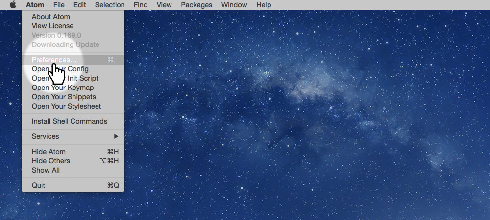
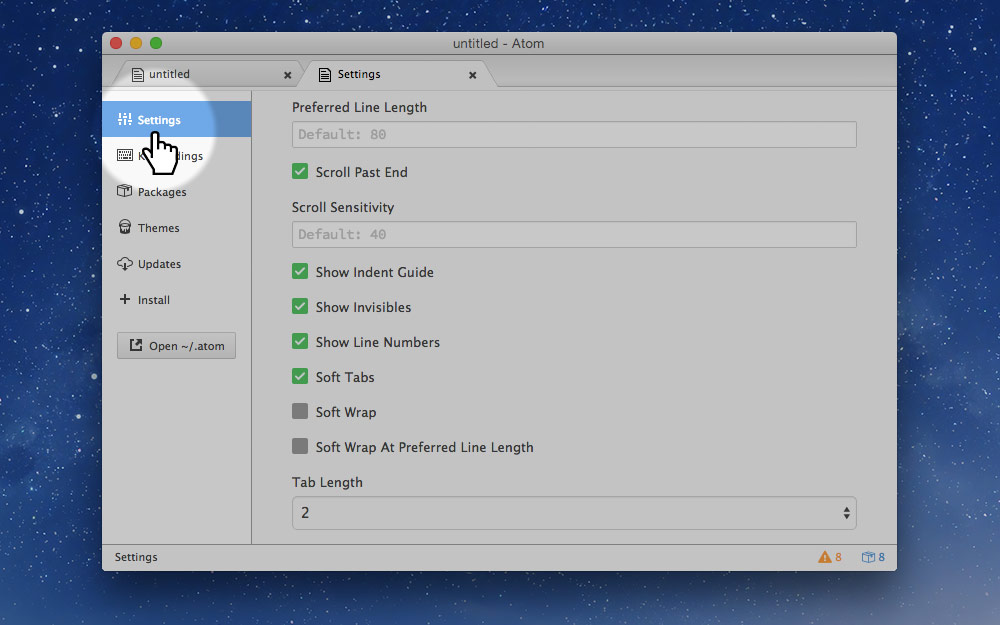
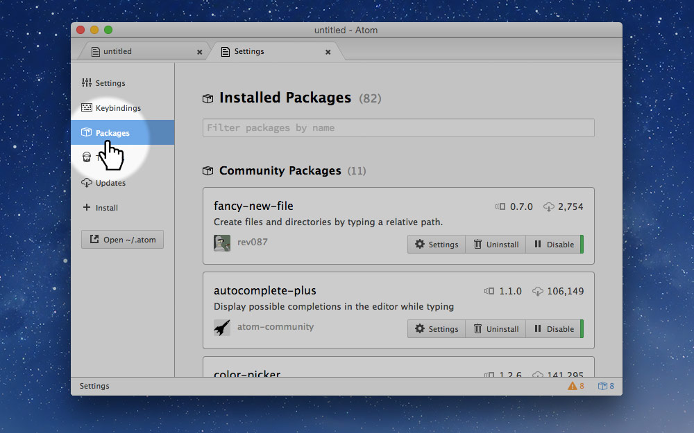
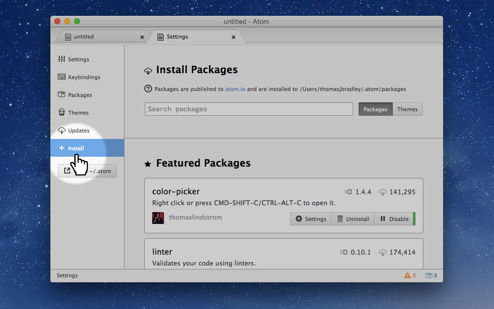
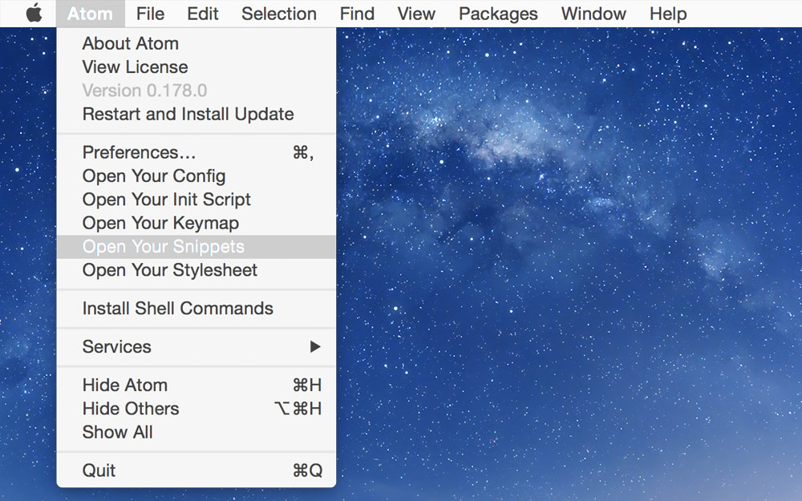
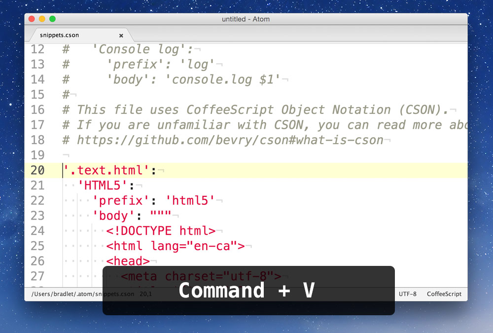
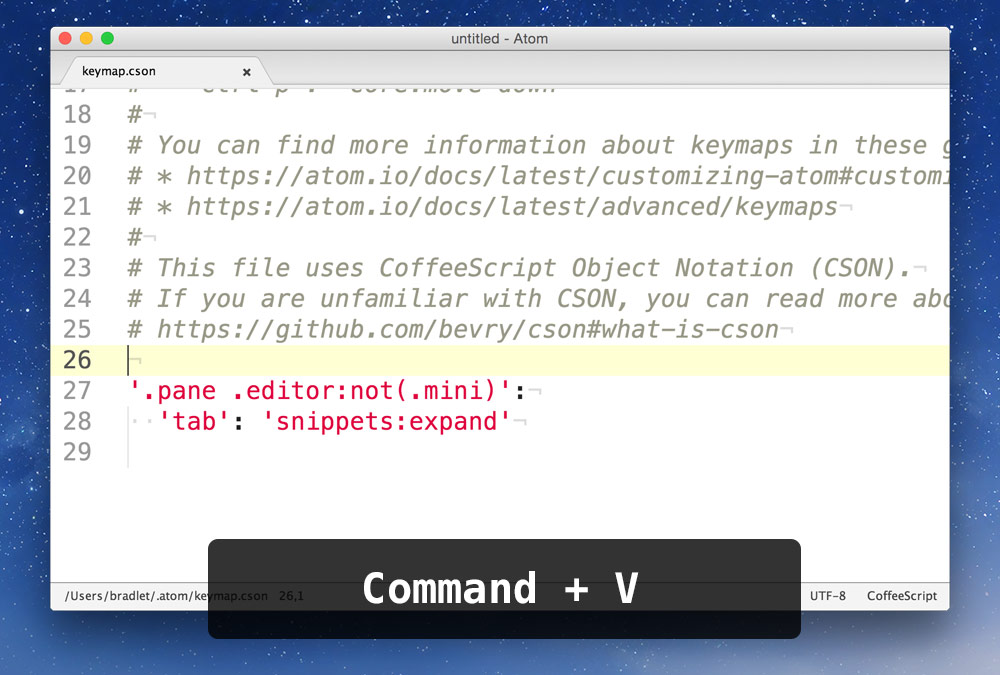

Atom is a fairly new code editor created by GitHub. It’s got lots of great features and the community is starting get really big.

**[⬇ Download Atom](https://atom.io/)**

---

## What Atom does

- Has good GitHub integration
- Supports many languages
- Has a plugin system that allows extending the functionality

---

## What Atom doesn’t do

- Preview your website—that’s what browsers are for
- Let you browse to find a file—typing is faster and more reliable anyways
- Ask you to update links and mess up your whole website

---

## Set up

Atom will work immediately after downloading it—but if you want to get the most out of it, some customization will be needed.

### Settings

To update and add your settings go in the menu to:

```
Atom > Preferences
```



### Important settings to change



- Turn on “Scroll Past End”
- Turn on “Show Indent Guide”
- Turn on “Show Invisibles”
- Turn on “Show Line Numbers”
- Turn on “Soft Tabs”
- Turn off “Soft Wrap”
- Tab length: “2”

---

## Packages

Adding a few packages (aka plugins) to Atom will give you a bunch more convenient features.

Inside preferences to to the “Packages” tab to see all the ones already installed.



Go to the “Install” tab if you want to add new packages to your editor.

On the install screen you can search for packages and install them into Atom.



### Packages to install

- **autocomplete-plus** — displays possible completions in the editor while typing
- **autoprefixer** — when run, adds the appropriate vendor prefixes to all CSS
- **browser-refresh** — pressing Fn+F5 will refresh the current HTML file in the browser
- **color-picker** — a pop-up color picker
- **editorconfig** — for matching other designers’ coding standards
- **emmet** — quick way to write HTML, using CSS selectors
- **fancy-new-file** — opens up a quick new file input at the bottom of the screen, ⌘⌥N
- **file-icons** — shows icons for each file type in the sidebar
- **highlight-line** — draws a background behind the line you’re typing on
- **linter** — finds and points out bugs
- **minimap** — adds an overview column of your code like Sublime Text
- **open-in-browser** — pressing ⌘⌥M will pop open the HTML file in the browser

---

## Snippets

Snippets are little samples of code you can get Atom to automatically insert into your document.

As an example, when creating a new `index.html` file the doctype doesn’t already exist.
You can create a snippet that will insert that code for you.

For me, I type `html5` then hit **tab** and it will insert that code for me.

### Snippets starter

If you want to get a few snippets to start out, you can download my snippets from GitHub.

#### What’s included

- `html5` — will output the `<!doctype html>…`
- `css` — will create a `<link href=…` tag to attach a CSS file
- `viewport` — will output the responsive design `<meta name="viewport"…` tags
- `cssviewport` — will output the `@viewport {…` CSS declarations
- `borderbox` — will output the `* { box-sizing: border-box…` CSS declarations
- `textsize` — will output the `text-size-adjust: 100%` CSS declarations
- `jss` — will output a Javascript `<script>` tag
- *and probably others…*

#### Installing

**[⬇ Copy my snippets](https://github.com/acgd-learn-the-web/atom-code/archive/master.zip)**

From Atom, go in the menu to:

```
Atom > Open Your Snippets
```



This will open up a new code file. Paste everything you’ve copied from the GitHub into the bottom of this file. And save.



### Collision with Emmet

If you have the Emmet package installed, it will take over the `tab` key, which isn’t ideal.

So, go to your keymap file:

```
Atom > Open Your Keymap
```


```coffee
'.pane .editor:not(.mini)':
  'tab': 'snippets:expand'
```

Copy the above couple of lines of code paste it at the bottom of your keymap file.


