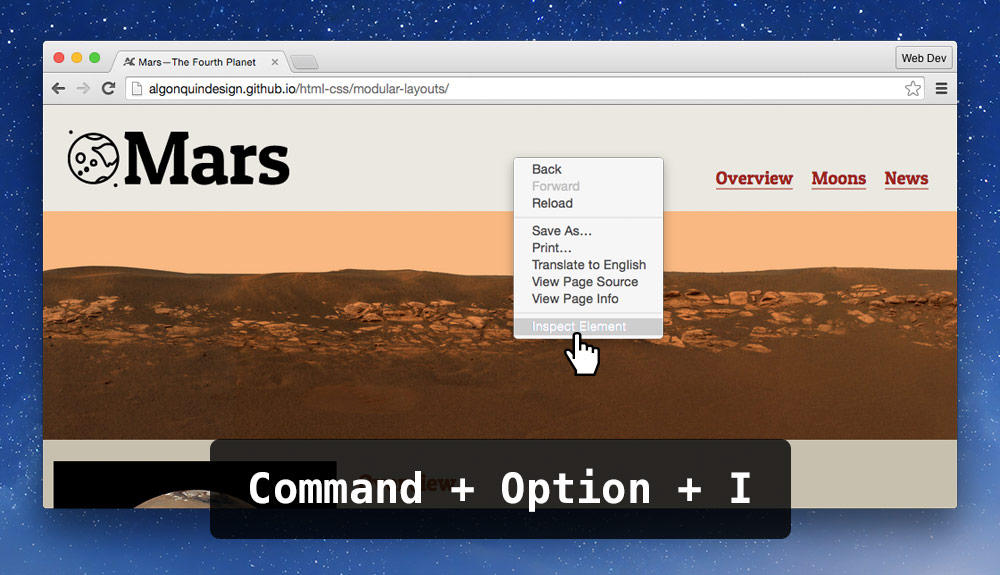
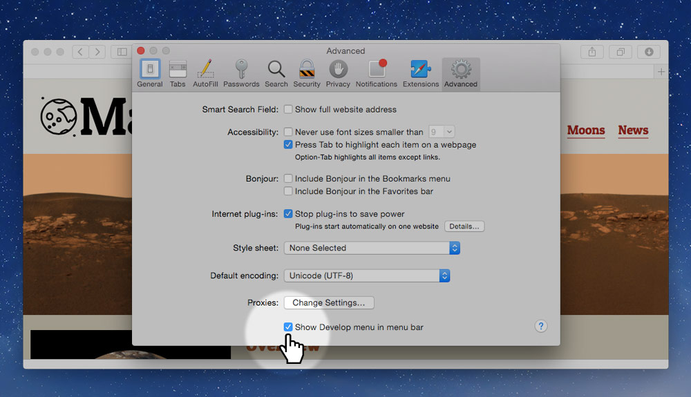
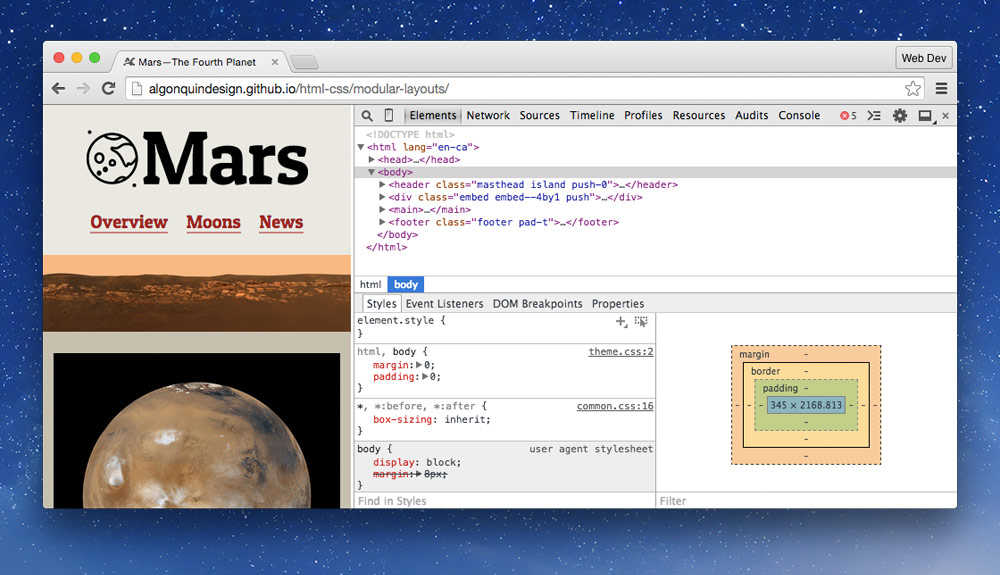
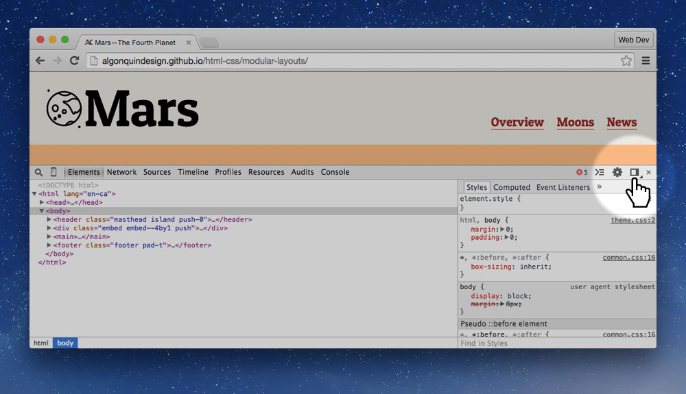
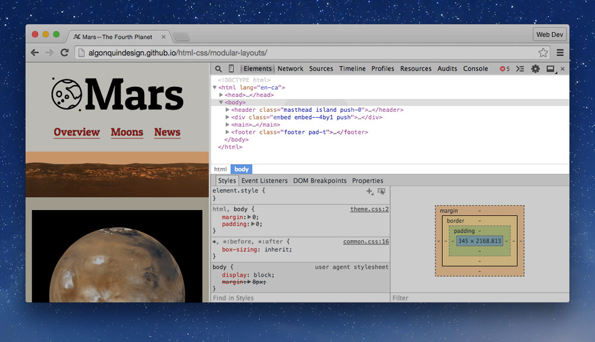
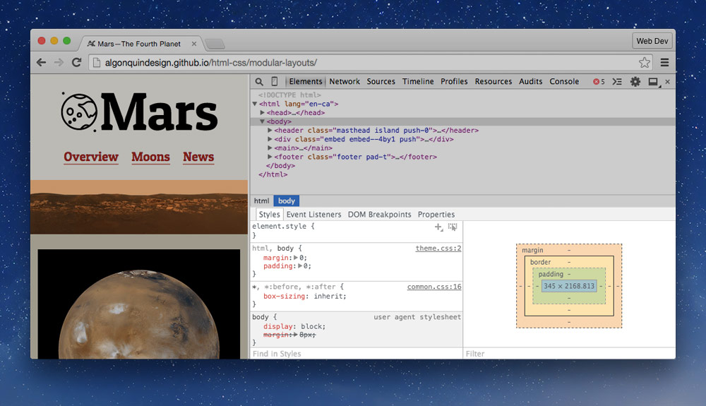
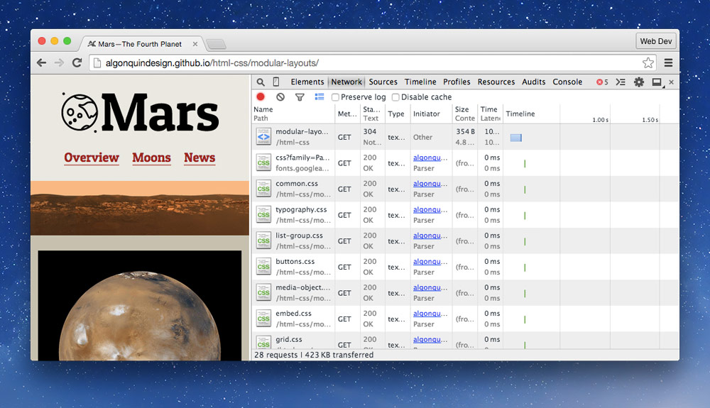
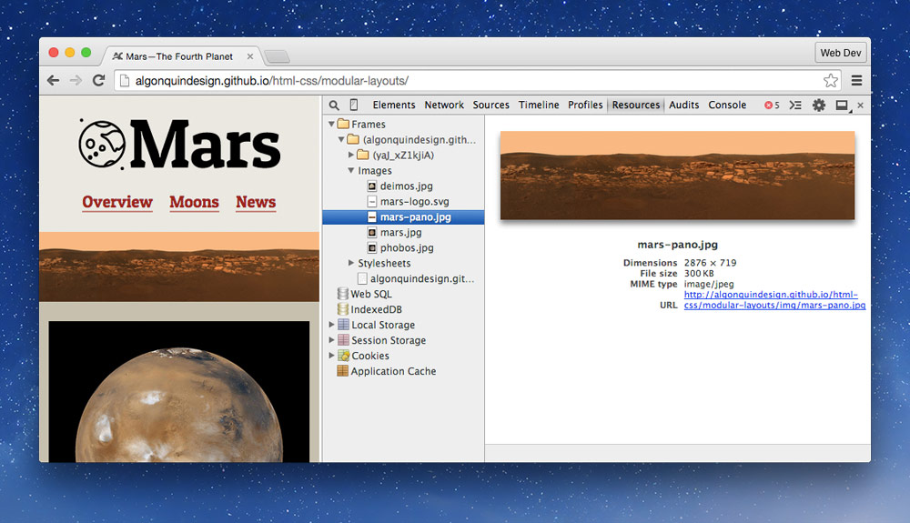

All modern browser include large suite of tools to help you debug and understand the website you’re creating.

---

## Opening developer tools

In your browser of choice, there’s two common ways to open the developer tools.

1. Right-click directly on the element you’re interested in and press “Inspect Element”.
2. Press the keyboard shortcut: `⌘⌥I`.

### Opening the tools in Safari

In Safari, the developer tools are disabled by default, so we need to turn them on. Go into your preferences to do that.

1. In the menu, go to `Safari > Preferences`
2. Go to the `Advanced` tag
3. Check the `Show Develop menu in menu bar` option

---

## Understanding the interface

Most of the developer tools are fairly similar to each other and many of them have the same features.

*The screenshots below are for Google Chrome and Opera.*

The interface is built on many different tabs, these are the most commonly used ones:

- **Elements** — viewing, editing and manipulating the HTML and CSS
- **Network** — seeing what files are downloaded when viewing the website
- **Resources** — more in-depth information on each of the files
- **Console** — where error messages are shown

### Moving tools to the right

A good way to simulate different screen sizes is to move the developer tools to the right.

All developer tools have a slightly different way to do it. In Chrome and Opera there’s a tiny button, holding down on the button will present a menu to choose the docking location.

*After moving tools to the right you can adjust the width of the tools to simulate different screen sizes. Some browsers even display a small width/height label in the top right when resizing the tools.*

---

## Using developer tools

Developer tools are extremely helpful when making websites. **In fact they should be open all the time.**

### How to find a specific element

The easiest way to find the specific element you’re looking for is to right-click directly the on it and press “Inspect Element”. Doing so will highlight the HTML in the “Elements” tab of the developer tools.

Secondarily, you can look through the elements listed in the “Elements” tab by expanding and collapsing the disclosure triangles.

**It’s important to remember that the HTML you see is the browser’s interpretation of your code. If you have errors in your code it may look differently than your code because the browser will try to work around the problems.**

### How to manipulate HTML

Using the HTML panel we can change, rearrange, add, and delete HTML elements.

- **Edit elements** by double clicking on the tag name
- **Edit attributes** by double clicking on them; good for adding and removing classes
- **Delete elements** by clicking on them and pressing `Delete`
- **Drag to rearrange** elements and tags; good for rearranging list items

### How to manipulate CSS

The CSS panel is the one I spend most of my time in, you can add new properties, manipulate existing properties, and adjust things to see how they’ll look.

**By default any manipulations you make will reset when you refresh.** But the tools can be set up to save directly into your code.

- **Toggle properties** on and off using the checkbox
- **Stoked out** properties are incorrectly spelled, or overwritten by other CSS, usually higher up in the list
- **Edit property names** by clicking directly on them
- **Edit property values** by clicking directly on them
- **Browser’s default** CSS can be seen under the “user agent” section
- **Add new** CSS properties by clicking on the curly brace `{` at the top of the declaration block

### Keyboard shortcuts

There are a few important keyboard shortcuts to remember when using the developer tools.

Here’s a few important keys when editing CSS:

- `⇥`, `⇧⇥` — Next/previous CSS property
- `↑` — Increment value
- `↓` — Decrement value
- `⇧↑` — Increment by 10
- `⇧↓` — Decrement by 10
- `⌥↑` — Increment by 0.1
- `⌥↓` — Decrement by 0.1

*If you ever forget, when in the developer tools press `?` to open up the help.*

### Finding specific files

If you’re looking for specific files there are two tabs that may be helpful.

The **Network** tab is helpful because you can see when files haven’t been downloaded—they’ll be highlighted in red.

The **Resources** tab is helpful because it gives you more details about each of the files. By finding the file in the list you’re presented with dimensions, locations, and more.

---

## Video list

1. [Developer tools](https://www.youtube.com/watch?v=09XV2psDAZ4&index=1&list=PLWjCJDeWfDde7UgEiXizAqpQE1DDzt8RM)

## Supplemental links

- **[Chrome Devtools Cheatsheet](http://anti-code.com/devtools-cheatsheet/)**
- [Dev Tool Secrets](http://devtoolsecrets.com/)
- [Chrome Developer Tools](http://code.google.com/chrome/devtools/)
- [Chrome Developer Tools: Videos](http://code.google.com/chrome/devtools/docs/videos.html)
