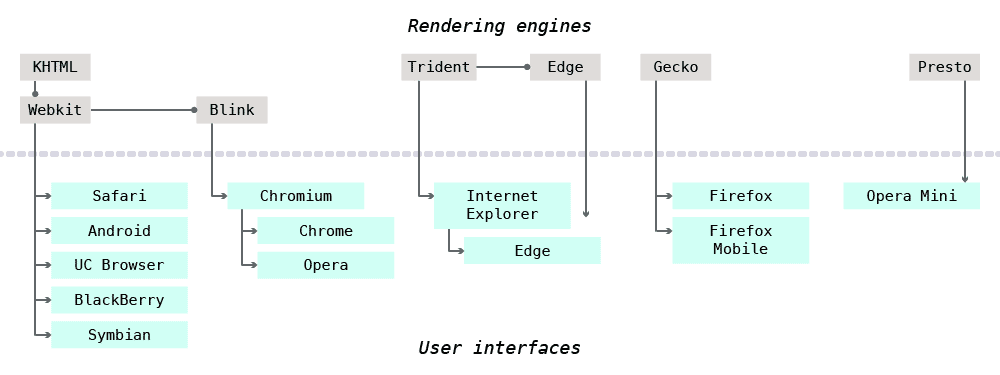

The web is about open information for all human beings—so we need to test in as many browsers and platforms as possible.

---

## Browsers

Web browsers are primarily two components: the interface and the rendering engine. Both interfaces and rendering engines can closed source or open source. There’s lots of sharing that goes on. Web browsers are a big convoluted mess.

The interface is the piece that you interact with: the URL bar, the back button, the clicking, the scrolling—the window.

The rendering engine is a big program that takes all the website’s code and turns it into the thing you can see and use.

### Browser interfaces

There are countless browser interfaces, some shared between other browsers.

- **Chromium** — Chrome (big & small), Opera (big & small).
- **Firefox** — big screen & small screen versions.
- **Internet Explorer** — big screen & small screen versions.
  *To be replaced by Microsoft Edge.*
- **Safari** — big screen & small screen versions.

### Rendering engines

When it comes to rendering engines there’s a few big players that are shared by most browsers on the web.

- **[Webkit](https://www.webkit.org/)** — open source; used in Safari, BlackBerry, Android, Symbian, UC Browser, and many many more.
- **[Blink](https://en.wikipedia.org/wiki/Blink_%28layout_engine%29)** — open source, forked from Webkit; used in Chrome & Opera.
- **[Gecko](https://en.wikipedia.org/wiki/Gecko_%28software%29)** — open source; used in Firefox & Firefox Mobile.
- **[Trident](https://en.wikipedia.org/wiki/Trident_%28layout_engine%29)** — closed source; used in Internet Explorer; to be replaced with [Edge](https://en.wikipedia.org/wiki/Microsoft_Edge).
- **[Presto](https://en.wikipedia.org/wiki/Presto_%28layout_engine%29)** — closed source; Opera Mini, (used to power Opera too).



*Web browsers are a big—beautiful—mess of different forks, of shared engines, of shared interfaces. And let’s not get into all the different versions and variations.*

---

## What versions to test

**The current version and one version back.**

Many companies follow the rule above, including Google, GitHub and more. The idea is that browsers are constantly changing and constantly updating that we can’t test all versions in history.

*That doesn’t necessarily mean the website won’t work in older versions, just that ̛it’s not optimized.* Maybe it has a simpler design, less features, less fanciness. But our primary concern—always—is to make the content accessible.

### Evergreen browsers

Many browsers have become “evergreen” browsers (Chrome, Firefox, Opera, Edge), meaning they update themselves automatically. So it’s less necessary to test their older versions because most people have the newest versions because it was automatically updated.

### Big-screen browsers

The major browsers to test on desktop & laptop computers are:

- **[Firefox](https://www.mozilla.org/firefox/)** — Win, Mac, Linux; OSS; evergreen; uses Gecko.
- **[Chrome](https://www.google.com/chrome/browser/)** — Win, Mac, Linux; partially OSS; evergreen; uses Blink.
- **[Internet Explorer](http://microsoft.com/ie/)** — Win; not evergreen; uses Trident.
  *To be replaced by Microsoft Edge.*
- **[Opera](http://www.opera.com/)** — Win, Mac, Linux; partially OSS; evergreen; uses Blink.
- **[Safari](https://www.apple.com/safari/)** — Mac; not evergreen; uses Webkit.

There are definitely other desktop browsers that you might need to test for depending on your website and your client’s needs.

### Small-screen browsers

There are countless versions of mobile browsers on countless different screen sizes. It’s been described as the “coming zombie apocalypse”.

So, when it comes to mobile browsers test in as many operating systems, as many browsers, and on as many devices as you can.

Here’s a few of the major mobile browsers and operating systems:

- **Chrome** — Android; uses Blink.
- **Android browser** — Android; uses Webkit.
- **Safari** — iOS; uses Webkit.
- **Firebox Mobile** — Android; uses Gecko.
- **Internet Explorer** — Windows Phone; uses Trident.
- **Opera Mobile** — Android; uses Blink.
- **BlackBerry browser** — BlackBerry; uses Webkit.
- **Symbian browser** — Nokia; uses Webkit.

#### Proxy browsers

Proxy browsers are a subset of mobile browsers that work to significantly reduce data usage over networks. They also work really well on less powerful devices.

Instead of downloading and rendering the website like a traditional browser they delegate to a server to render the website. The proxy browser is then sent a simplified version of the website, practically an image with hotspots.

Proxy browsers are great on slow and unreliable network speeds, but they have much less functionality than a traditional browser.

There’s two really popular proxy browsers in the world:

- **[Opera Mini](http://www.opera.com/mobile/mini)** — most popular mobile browser in the world; multi-platform; uses Presto.
- **[UC Browser](http://www.ucweb.com/)** — extremely popular in China & India; multi-platform; uses Webkit.

---

## Testing older versions of websites

Chances are you have the most up-to-date version of the browser on your computer. So, testing in older versions becomes a little more complicated.

### Testing services

Thankfully there’s lots of services to help us out. One of the really popular testing services is [BrowserStack](https://www.browserstack.com/).

After signing up for an account you have access to hundreds of devices and browsers all in the cloud. You can spin up a new machine and test your website remotely.

*These browsers & devices are completely functional so you can test all your interactions but are no substitute for the actual thing.*

### Screenshot services

There are lots of screenshot services available too, **[BrowserStack has a great screenshot service](https://www.browserstack.com/screenshots)**.

The screen shot services allow you to take an image of your website on the browser to check the look of layout, but you can’t interact with the website in any way. But they’re good for layout checks.

### Testing Internet Explorer on Mac

If you’re on a Mac, testing Internet Explorer isn’t the easiest because it doesn’t run on Mac. But thankfully Microsoft amazingly gives away [free copies of Windows and IE for testing](http://modern.ie/).

Microsoft even provides a screenshot service and a quick browser validation scan for your site.

*If you are on Windows and want to test Safari, well Apple isn’t as nice as Microsoft.*

There are two ways to test IE on your Mac:

1. [Use Remote IE and test on the Azure Cloud](https://remote.modern.ie/) — not as reliable, but quick to set up.
2. Use [Virtual Machines](http://dev.modern.ie/tools/vms/) — most reliable, but huge size.

#### IE virtual machines

Setting up the virtual machines is a little bit of a process, takes lots of hard drive space, and some patience.

1. Download & install virtualization software, like [VirtualBox](https://www.virtualbox.org/).
2. Download the VM that matches *your* operating system and virtualizer from [Microsoft’s download page](http://dev.modern.ie/tools/vms/).
  *You’ll have to download a different VM for every version of IE you want to test.*
3. Install the VM onto your computer, which puts a whole copy of Windows on your computer to test IE in—and takes up lots of hard drive space.
4. Open your virtualizer and run the VM for the version of IE you want to test.
5. Once inside Windows test out your website as you normally would.

### Open device labs

Your community may be an open device lab, where there’s just a bunch of computers and devices that are available for you to walk in and test your websites on.

**Links**

- [BrowserStack](https://www.browserstack.com/)
- [Microsoft Edge Developer Resources](http://modern.ie/)
- [Establishing an Open Device Lab](http://www.smashingmagazine.com/2012/09/24/establishing-an-open-device-lab/)
- [Open Device Lab](http://opendevicelab.com/)
- **[Ottawa Open Device Lab](http://www.bv02.com/ottawa-open-device-lab/)**

---

## What to look for when testing

When testing our websites in browsers we’re looking for any major inconsistencies or broken features.

**It is never our goal to make the designs pixel perfect if every browser—that’s impossible.**

We want to make sure that our users can all access the same information, but not necessarily have that information look or function exactly the same.

### Some things to look for:

- Any major, breaking differences in a specific browser?
- Is any of the functionality broken?
- Are there any weird inconsistencies?
- Do the layouts work on all screen sizes?
- Does it scale properly to fit the device?
- Does it work in portrait, landscape, fullscreen?
- Does the layout always fill the screen?
- Does it work with and without images? CSS?
- Does it work when the font size is increased? Decreased?
- Does it work on different operating systems? In different browsers?

**Links**

- **[Do websites need to look exactly the same in every browser?](http://dowebsitesneedtolookexactlythesameineverybrowser.com/)**

---

## Browser feature support

It’s hard to tell what features are supported by what browsers, but there a few really good resources:

- **[Can I Use](http://caniuse.com/)** — a huge library of features and what browser supports those features.
- [Mozilla Developer Documentation](https://developer.mozilla.org/) — at the bottom of every element, property, function, etc. is a table of browser support.

Some browser vendors even have platform feature lists, here’s a few of those:

- [Internet Explorer Web Platform Status and Roadmap](https://status.modern.ie/)
- [Chromium Status](https://www.chromestatus.com/features)
- [Webkit Platform Status](https://www.webkit.org/status.html)

### Targeting specific browsers

Sometimes—though it should be avoided as much as possible—you have to write different code to work around bugs in a specific browser that doesn’t happen in another browser.

First always try to work around it so that it works in all browsers before writing browser specific code. *Try to avoid detecting the browser directly, instead try to detect the feature of bug.*

#### Vendor prefixes

Some CSS properties have to be written multiple times to support all browsers. Browsers sometimes implement the feature in a beta version before they release it to the general public.

One way they do this is be adding a prefix onto the CSS property so it only works in their browser.

Here are the common prefixes you’ll run into:

- `-webkit-` — Webkit, Blink rendering engines.
- `-moz-` — Gecko (Mozilla) rendering engines.
- `-ms-` — Trident (Microsoft) rendering engine.
- `-o-` — Presto (Opera) rendering engine.
  *Only applies to Opera Mini.*

##### Vendor prefix examples

Here’s a couple examples of what vendor prefixes might look like:

```css
div {
  -webkit-transform: rotate(45deg); /* Safari still needs the prefix */
  transform: rotate(45deg);
}

p {
  -moz-hyphens: auto;
  -ms-hyphens: auto;
  -webkit-hyphens: auto;
  hyphens: auto;
}
```

##### Knowing when to prefix

[Can I Use](http://caniuse.com/) is a good resource for determining if your CSS needs to be prefixed.

An alternative, better solution, is to use a build tool like [AutoPrefixer](https://github.com/postcss/autoprefixer) that will put the prefixes on for you without you thinking about it.

#### Browser hacks

Many browsers have bugs, or singular features that we can use to exploit their rendering engines and provide CSS of Javascript directly to that browser—know as hacks.

*Hacks should be avoided unless completely necessary.*

- **[Browser Hacks](http://browserhacks.com/)**

#### Internet Explorer conditional comments

Though not supported in modern versions of IE, only working in IE 9 and below, conditional comments allow us to create stylesheets specifically targeted at IE.

*Conditional comments should be avoided unless completely necessary.*

```html
<link href="css/main.css" rel="stylesheet">
<!--[if lte IE 9]><link href="css/ie.css" rel="stylesheet"><![endif]-->
```

Now we can use the IE only CSS file for fixes specifically targeted at older versions of Internet Explorer.

---

## Video list

- [Browser testing](https://www.youtube.com/watch?v=jvv-AfFfLZc&index=1&list=PLWjCJDeWfDddYntDUSf_kMRzIfHceWpVv)

## Supplemental links

- [Wikipedia: Comparison of web browsers](https://en.wikipedia.org/wiki/Comparison_of_web_browsers)
- [Brad Frost: Accessibility and low-powered devices](bradfrost.com/blog/post/accessibility-and-low-powered-devices/)
