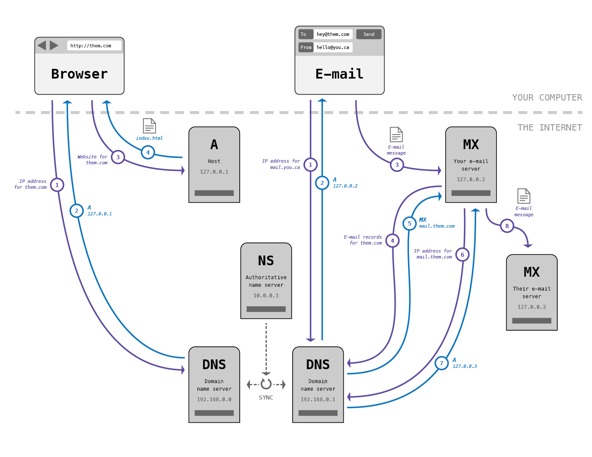
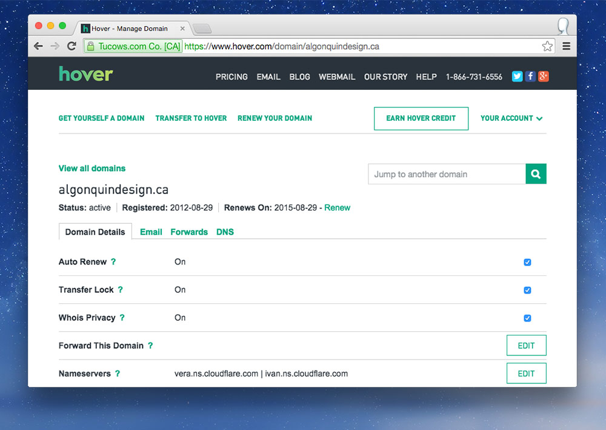
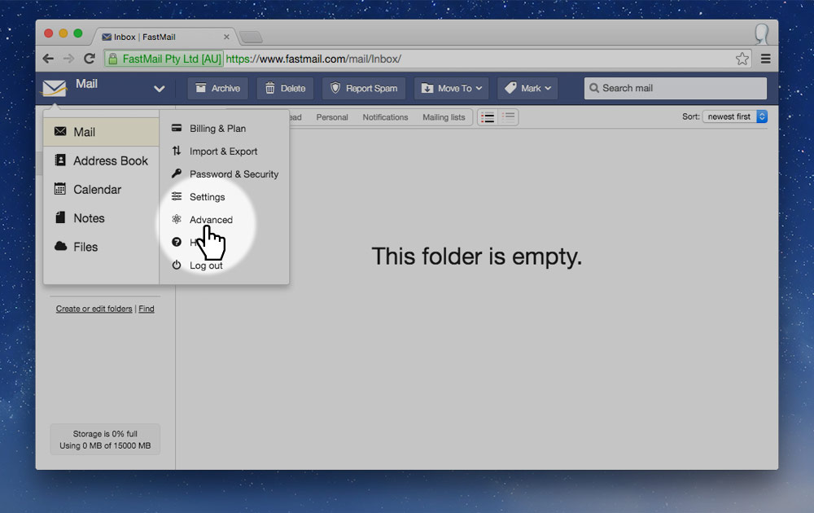
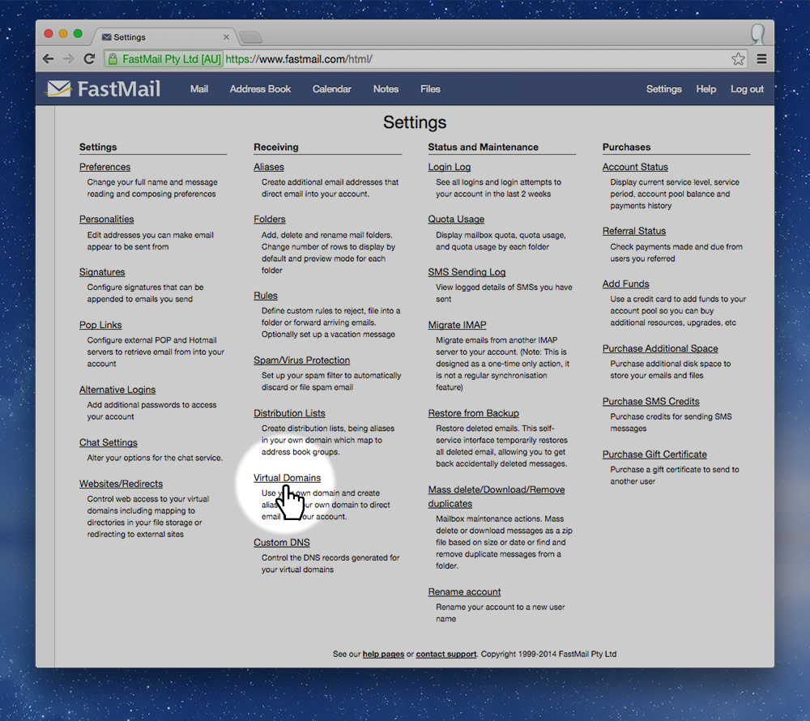
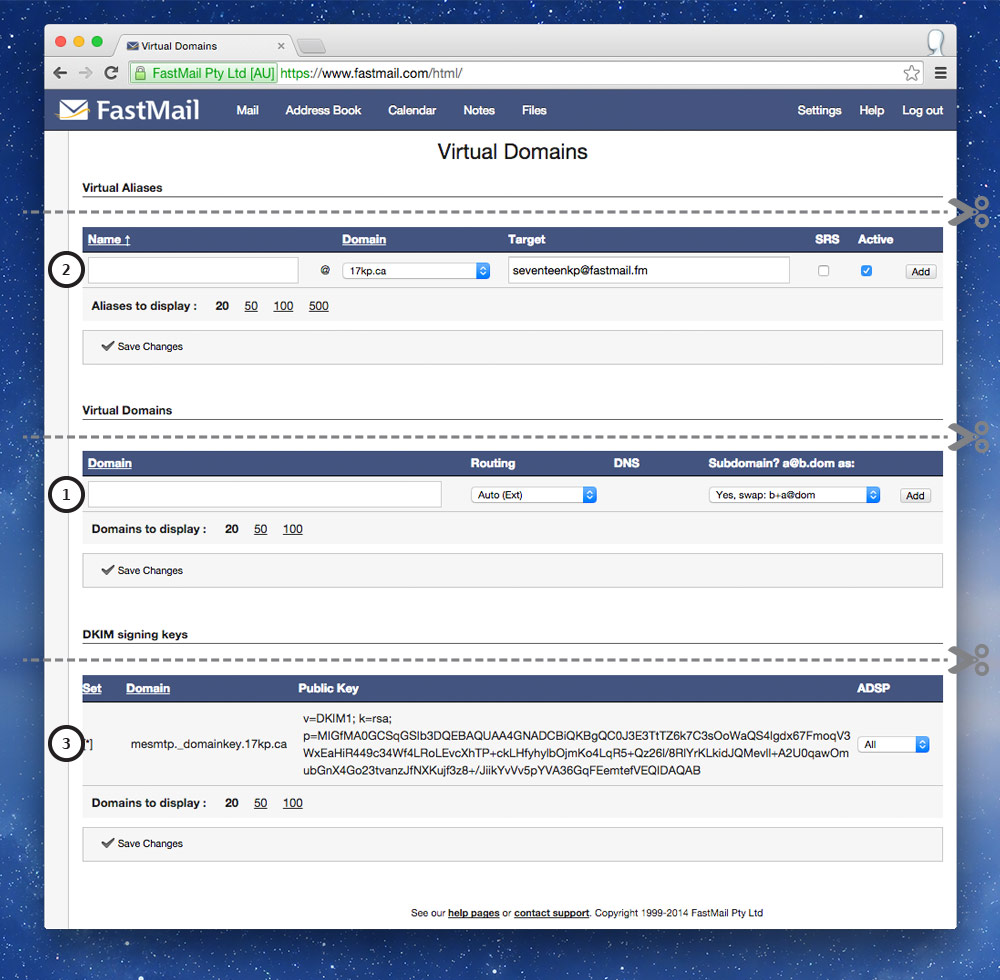
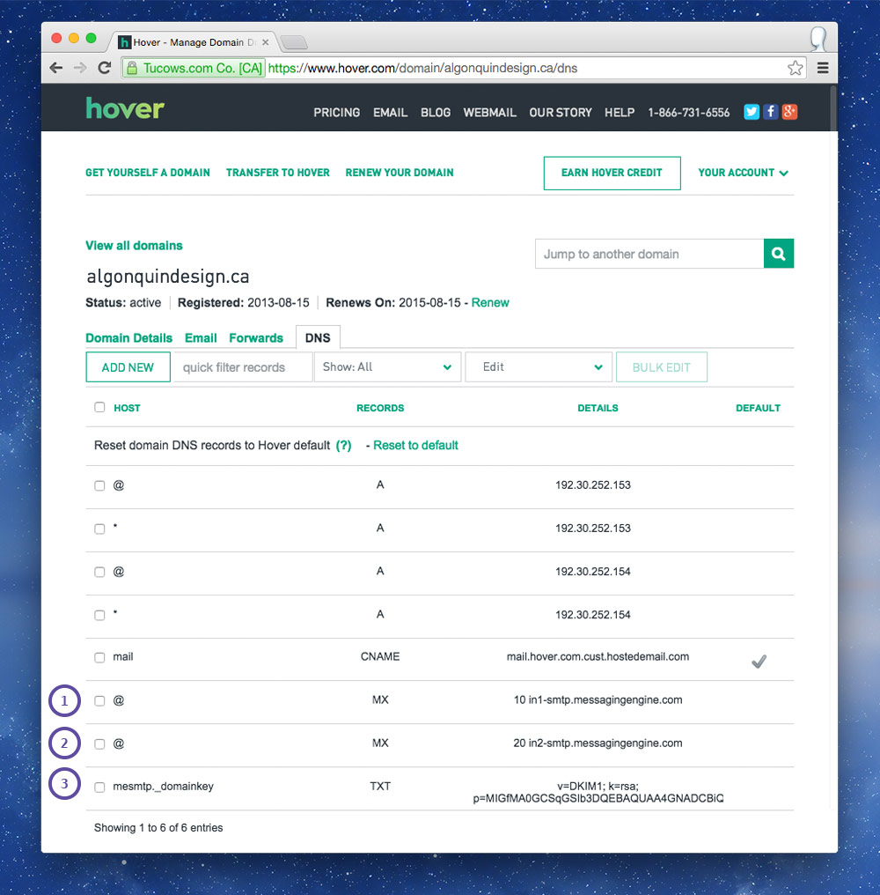
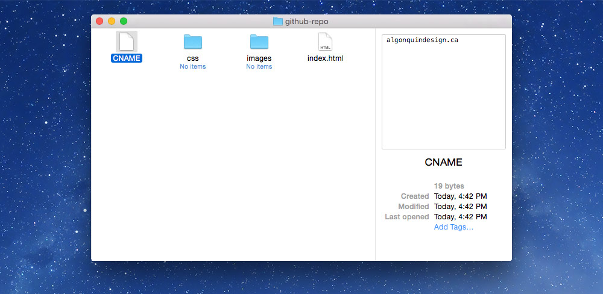
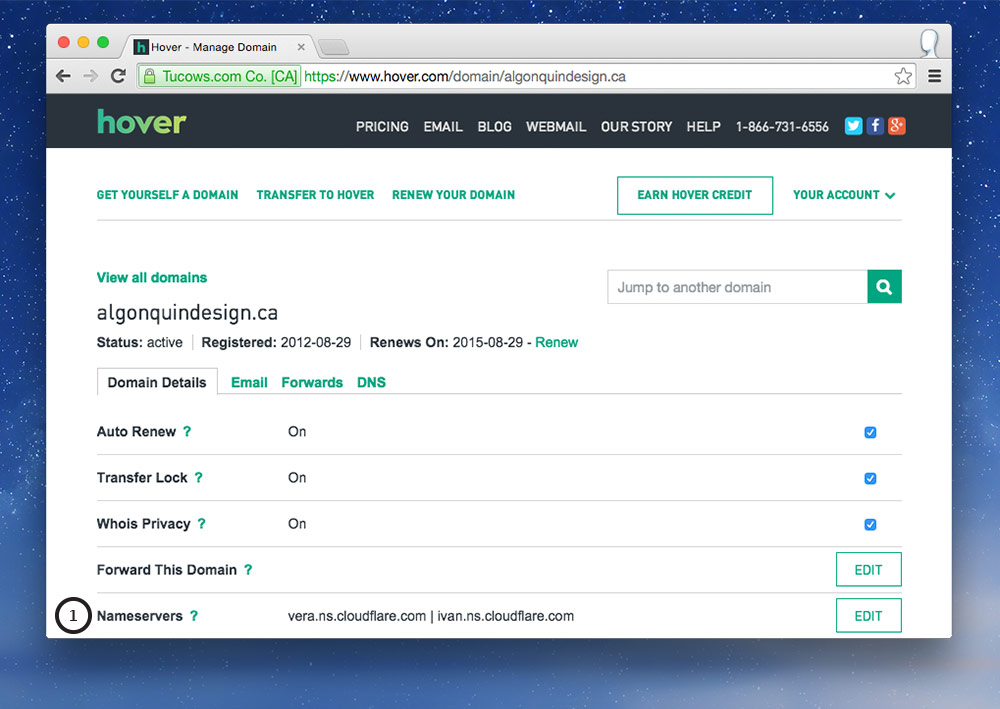
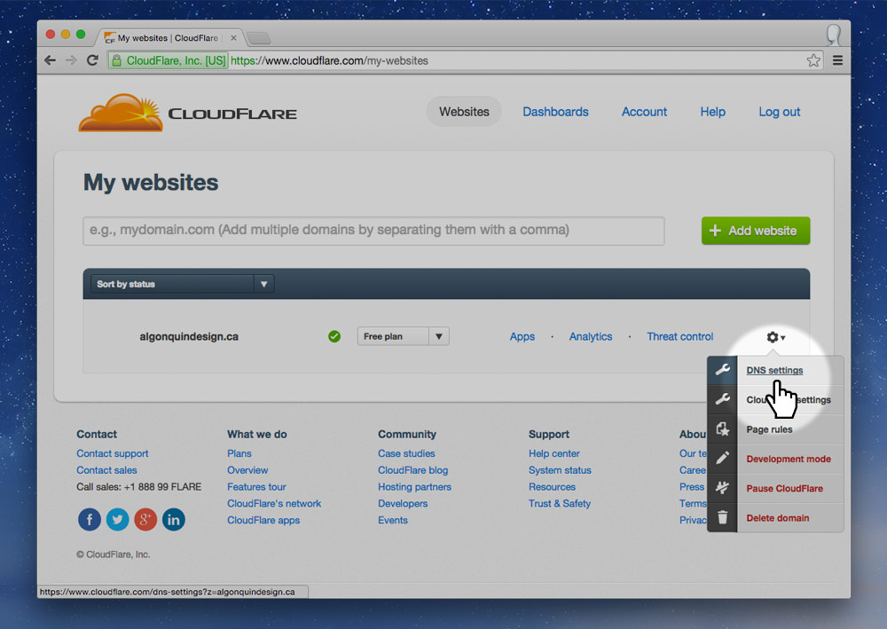
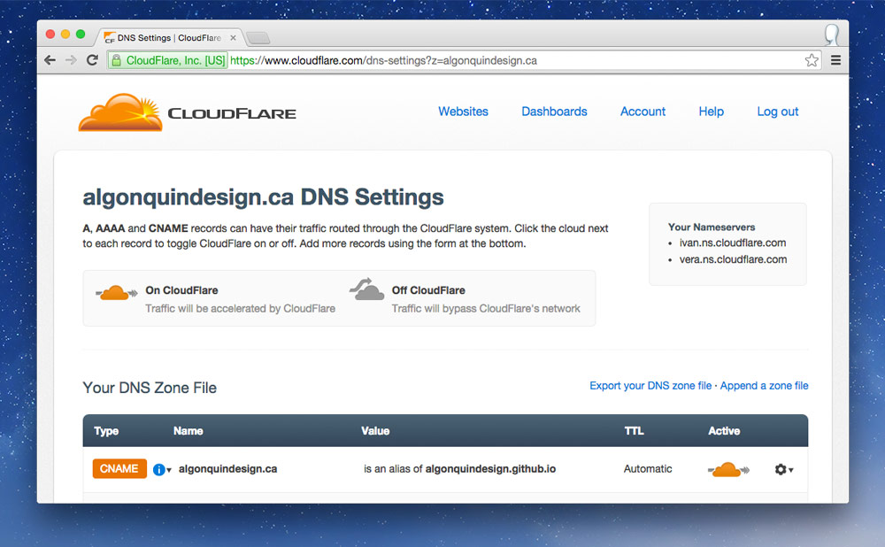

The Internet is a distributed system of interconnected computers throughout the world.

Each computer as an address, know as an IP Address, but mostly humans want something more memorable—that’s where domains come in.

---

## Domains & IPs

Domains, like `google.com` or `algonquindesign.ca`, are just for humans so we can more easily remember where a website is.

But computers don’t necessarily care about domains, they care about IP address, which are the actual locations/names of the computers connected to The Internet. *Every single computer connected to the Internet has a unique IP address.*

An IP address looks something like this: `192.168.1.0` or `2001:0db8:85a3:0000:0000:8a2e:0370:7334`—which aren’t terribly memorable for regular mortals. Whereas, domains like `github.com` are much more memorable.

So the purpose of the Domain Name System (DNS) is to map domains to IP address and provide other information about a website.

A simple example of DNS records might look like this:

```
algonquindesign.ca.        A    192.168.0.1
mail.algonquindesign.ca.   MX   192.168.0.2
```

There’s a direct connection between a domain and it’s associated IP address.

---

## How everything connects together



### How you see a website

After you type the domain into your browser and go your computer starts making a bunch of really quick requests (less than 100 ms):

1. Your computer connects to a DNS server, requesting DNS information for the domain you typed in.
  Your computer already knows the IP address to at least one DNS server because your Internet provider sent it to your computer.
2. The DNS will then send back the IP address of the computer that hosts the website to your computer, if it knows it.
  If it doesn’t know the IP address it will send your computer the IP address of another name server that might know.
  The loop continues until your computer has the IP address of the host.
  **IP address of the website host is called the `A` record.**
3. When your computer gets the IP address it connects directly to the host computer and requests to see the website.
4. The host/web-server will then return the `index.html` file for the website you requested.
  Your browser will then start requesting all the other resources of your website like CSS, images, Javascript, etc.
  If those resources are located on another domain the whole process starts all over again at step 1.

#### Authoritative name server

The `NS` records in your DNS information points to the primary name server for your domain—usually your registrar.

All the domain servers synchronize with each other so it can take time for your domain records to show up on all the DNS servers around the world.

If the DNS server your browser requests doesn’t know the IP for the domain you want, or if that information has expired, your computer will most likely connect to the authoritative name server for your domain to get the real, fresh DNS information.

### How e-mails are sent

The process for sending e-mails is similar to viewing a website but requires more requests and more DNS records.

**The DNS records for e-mail servers are called the `MX` records.**

After you write your e-mail message and click send a whole bunch of requests are sent out again:

1. Your computer connects to a DNS to find the `A` record for your mail server.
2. The DNS sends back the IP for your e-mail server.
3. Your computer connects to your e-mail server using the new IP and submits a new message.
4. Your e-mail server then connects to the DNS to find the `MX` record for the domain of the person you’re sending your message to.
5. The `MX` record is sent back to your computer.
6. If the `MX` record isn’t an IP address a whole new DNS lookup must happen for the `A` record of the other mail server.
7. The DNS will then send back the IP address of the other person’s e-mail server.
8. Your e-mail server connects to the other person’s e-mail server and posts the new message on it.

---

## Purchasing and hooking up services

It’s usually a good idea to purchase your services from different providers (domains from registrars, hosting from hosts, e-mail from e-mail providers, etc.) for a few reasons:

- More control over your domain settings, e-mail addresses, etc.
- Easier to move hosts—because you will want to at some point. If you transfer your host, then you don’t also have to transfer your e-mails—and you won’t lose any messages. And you don’t have to transfer your domain, just point it to a new host.
- If you have hosting related problems, you may also have e-mail related problems if they’re in the same location.
- Security: if your hosting account is hacked, then so is your domain registrar and the hacker can just transfer your domain somewhere else.
- It’s not always clear who owns the domain when registering it with a host.

The only real downside of separating domains and hosting is a slight loss in convenience.

### Buying a domain on Hover

The first step in the whole process is buying a domain. I usually buy my domains from [Hover](https://www.hover.com/).

Though we generally call it “buying” a domain you aren’t technically *buying* it, but *leasing* it for a certain amount of time, usually a year. *And every year you have to pay for it again.*

- If you’re purchasing a **.ca**, then under “Organization” put your full name, like: “Thomas Bradley”. It’s important that you spell it the same way you do in the “Name” fields.
- When choosing your “Legal Type” you likely want to choose “Canadian Citizen”. The **.ca** TLD is only available to Canadian citizens and corporations, but lots of other countries open up their TLDs to anybody.



#### Important domain settings

- **Auto Renew** — You probably want to keep this on, then when your domain lease is about to expire your registrar will automatically charge your credit card to register the domain again. *You will receive notice e-mails before this happens.*
- **Transfer Lock** — This disables the ability for the domain to be transfered to another registrar. If you want to transfer your domain you’d have to turn this feature off.
- **Whois Privacy** — This will hide your personal information from WHOIS lookups. So, if someone searched your domain in the WHOIS database they would not be able to see your address and phone number. *If your registrar is charging you extra for this you’re getting ripped off.*
- **Forward This Domain** — Allows you to force your domain to be redirected to another location. I use this often if I purchase both the .ca and the .com. I forward the .com to the .ca so that if anyone types .com into their browser it will automatically take them to the primary .ca domain.
- **Nameservers** — [Go to the section on CloudFlare for more information.](#better-security-and-performance-with-cloudflare)

### Buying e-mail service with FastMail

There are lots of different e-mail providers and hosts often provide e-mail exchange also. But it’s best to purchase your e-mail from another provider. I often buy my e-mail services from [FastMail](https://www.fastmail.com/).

*Make sure your e-mail provider supports custom domains—FastMail only supports this in their more expensive packages ([Enhanced](https://www.fastmail.com/signup/personal.html)).*

#### E-mail server DNS records

After you’ve purchased your e-mail service we need to do some domain pointing.

1. Let FastMail know what domain we want to use.
2. Add aliases for your e-mail address. (Also you should add profiles—read the blue box on FastMail.)
3. Update our DNS `MX` and `TXT` records for FastMail.




Go to Mail > Advanced > Virtual Domains



1. Under “Domain” add your domain into the input field and click “Add”—keep all the other settings the same.
2. Under “Virtual Aliases” add as many e-mail addresses as you want—just enter the part before the @-symbol.
  If you want your e-mail to be “info@domain.ca” just put “info” into the box and click “Add”. Keep all the other settings the same.
3. Next up: set some DNS records in Hover.



1. Edit the `MX` record that is already there and put in the first server listed on this [FastMail page—step 4, subsection 2](https://www.fastmail.fm/help/receive/domains.html).
  Last time I checked the server was: `in1-smtp.messagingengine.com`.
2. Click the “Add New” button and fill in these details:
  - *Hostname*: `@`
  - *Record Type*: `MX`
  - *Priority*: `20`
  - *Hostname*: `in2-smtp.messagingengine.com` — The second server listed on FastMail’s help page.
3. Click the “Add New” button and fill in these details:
  - *Hostname*: `mesmtp._domainkey` — This is found at the bottom of FastMail’s “Virtual Domain” settings. Previous screenshot, number 3.
  - *Record Type*: `TXT`
  - *Value*: All that gobbledygook from the bottom of FastMail’s “Virtual Domain” settings. Previous screenshot, number 3.

*And your e-mail is all set up—but it’ll take anywhere from 1 hour to 24 hours for it to start working.*

### Hosting on GitHub

Using GitHub as a static web host is simple, integrates with our processes—and it’s free.

*On GitHub create a repository like you normally do. And create a `gh-pages` branch like you normally do.*

Then, within your repository create a new file named exactly `CNAME`—no extension. Inside this file put the domain you want, like: `algonquindesign.ca`.



Sync and commit. GitHub is set up.

#### Website host DNS records

Now we have to go into Hover settings, our domain registrar, and point our records to GitHub. We need to update our `A` records for GitHub.


1. Edit the first `A` record and change the IP address the the first one listed on this [GitHub help page](https://help.github.com/articles/tips-for-configuring-an-a-record-with-your-dns-provider/). Last time I checked the server was: `192.30.252.153`.
2. Edit the second `A` record and change it to the first IP address also: `192.30.252.153`.
3. Click the “Add New” button and fill in these details:
  - *Hostname*: `@`
  - *Record Type*: `A`
  - *IP Address*: `192.30.252.154` — The second IP in GitHub’s help.
4. Click the “Add New” button and fill in these details:
  - *Hostname*: `*`
  - *Record Type*: `A`
  - *IP Address*: `192.30.252.154`

**The better way to do this is with an ANAME, ALIAS, or a Flattened CNAME—[refer to the section below on CloudFlare](#better-security-and-performance-with-cloudflare).**

*And your web host is all set up—but it’ll take anywhere from 1 hour to 24 hours for it to start working.*

### Better security and performance with CloudFlare

CloudFlare is a free service to add an extra level of security and performance to your website. They’re a DNS routing system with the added benefit of stopping security threats to your website and performance enhancements—and SSL.

First create your CloudFlare account and set everything up. *When it asks you to update your nameservers read on to the next step.*

#### Changing the NS records

Go back to Hover to the “Domain Details” tab and edit your Nameservers. **Change the 2 nameservers to the cutely named ones CloudFlare gives you.**



#### Using an apex flattened CNAME

Back in CloudFlare, edit the “DNS Settings” for your newly added domain.




1. Delete all the `A` records that got copied over from Hover—but don’t touch anything that isn’t an `A` record.
2. Add a new `CNAME` record:
  `yourdomain.ca` is an alias of `your-github-username.github.io`

CloudFlare will say something about CNAME Flattening—and you’re good to go!

---

**Phew! We made it through.**

---

## Video list

1. [Domains & DNS: how the web works](https://www.youtube.com/watch?v=rE7BjLw1UxY&list=PLWjCJDeWfDdeLUNoXWyskKFbw2P-C0p0p&index=1)
2. [Domains & DNS: purchasing a domain](https://www.youtube.com/watch?v=yFrW8zXVFSs&index=2&list=PLWjCJDeWfDdeLUNoXWyskKFbw2P-C0p0p)
3. [Domains & DNS: MX records for e-mail services](https://www.youtube.com/watch?v=kiQFbZUa2uQ&index=3&list=PLWjCJDeWfDdeLUNoXWyskKFbw2P-C0p0p)
4. [Domains & DNS: A records for hosts](https://www.youtube.com/watch?v=F1VmaHhDGsA&index=4&list=PLWjCJDeWfDdeLUNoXWyskKFbw2P-C0p0p)
5. [Domains & DNS: CloudFlare](https://www.youtube.com/watch?v=JVSE2ej8fQI&index=5&list=PLWjCJDeWfDdeLUNoXWyskKFbw2P-C0p0p)

## Supplemental links

### Articles

- [What really happens when you navigate to a URL](http://igoro.com/archive/what-really-happens-when-you-navigate-to-a-url/)
- [How Browsers Work](http://www.html5rocks.com/en/tutorials/internals/howbrowserswork/)
- [How the Web Works](http://mkcohen.com/how-the-web-works-in-one-easy-lesson)

### DNS tools

- [MX Toolbox](http://mxtoolbox.com/)
- [Pingdom: DNS check tool](http://dnscheck.pingdom.com/)

### Recommended registrars

- [Hover](https://www.hover.com/)
- [Gandi](http://www.gandi.net/)

### Recommended e-mail providers

- [FastMail](https://www.fastmail.com/)
- [Google Apps for Work](http://www.google.com/work/apps/business/)
- [Rackspace](http://www.rackspace.com/email-hosting/webmail/)
- [MailRoute](http://mailroute.net/) (strong spam protection)

### Recommended website hosts

- [GitHub](https://github.com/)
- [SiteGround](http://www.siteground.com/)
- [WiredTree](https://www.wiredtree.com/)
- [A Small Orange](http://asmallorange.com/)
- [DreamHost](https://www.dreamhost.com/)

### Security & performance

- [CloudFlare](https://www.cloudflare.com/)
