Floats and clearing are used to allow text to wrap around an object. With more complex usage, floats can be used to create complex layouts, including columns and grids.

---

## Text wrapping with float

The primary purpose of the `float` property is to allow text to wrap around another element, that element could be an image, a `div`, or any HTML element.

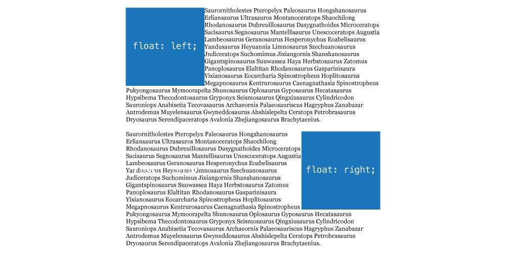

- `float: left` — move the element to the left, allowing text to wrap on the right side
- `float: right` — move the element to the right, allowing text to wrap on the left side
- `float: none` — would turn floating off

If you want to push the text away from the floated element, `margin` will work well:


### Multiple floats together

If there are multiple elements together in HTML and they are all floated, the browser will try to fit them on the same line:

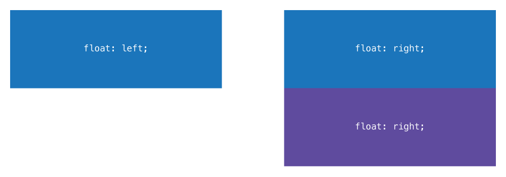

```html
<div class="box-1">…</div>
<div class="box-2">…</div>
<div class="box-3">…</div>
```

```css
.box-1 {
  float: left;
}

.box-2 {
  float: right;
}

.box-3 {
  float: right;
}
```

Since the width of `.box-1` and `.box-2` is less than with width of their parent element the can fit on they same line together.

But since there is no space left on that line for `.box-3` it will move down to the next line, underneath the other floated right box.

### Float & display

After you’ve added the `float` property to the element, the `display` property no longer works—**float is more powerful than display**.

```css
.box {
  float: left;
  display: block; /* This has absolutely no effect on the element */
}
```

#### Width collapsing

Similar to `inline-block` elements, when something is floated it will collapse to be as small as it needs to contain its content.

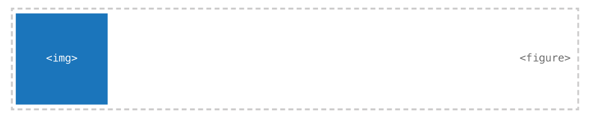

As an example, if you have a `figure` with an image inside, the `figure` will collapse to be the width of the image.


*It’s very common to add a `width` to floated elements—especially elements that only have text inside them.*

With something like text, the text will always try to fill the whole width, so it’s extremely important to always put a width on floated text.

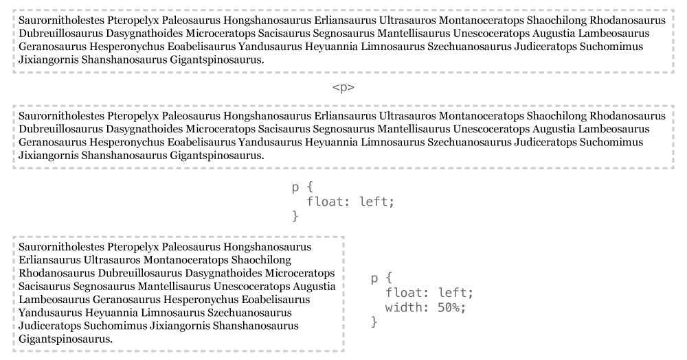

### Float & the flow

Floating only allows the text inside elements to wrap around another element. But the floated element itself is completely removed from the flow, that means that even though the text wraps, the elements ignore the float and exist behind it.

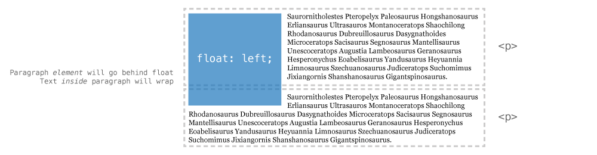

*Floated elements are completely removed from the browser’s flow of HTML elements and no longer take up space from an element layout point of view.*

#### Clearing floated content

Float has a companion property that allows us to force an element underneath other floated elements: `clear`.

- `clear: left` — go below all left floated elements
- `clear: right` — go below all right floated elements
- `clear: both` — go below all floated elements

In the example above, if we applied `clear: left` to the second paragraph it would now fall below the floated image.

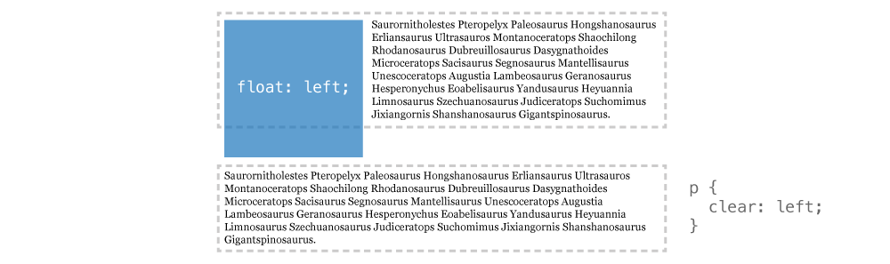

Clear can be pretty powerful in controlling where floated elements move.

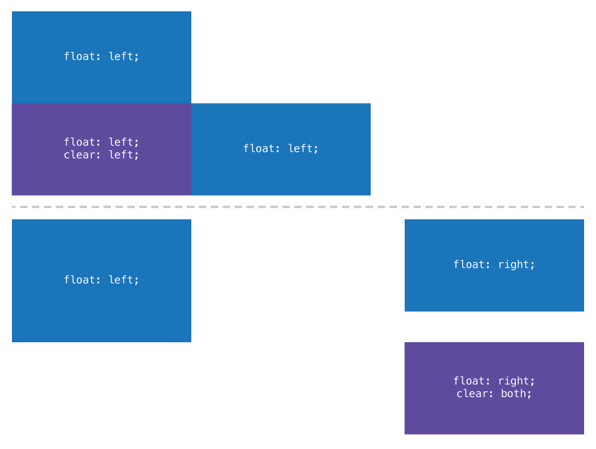

Something that is cleared can also still be floated—`clear` only forces it below other things that are floated but doesn’t prevent itself from floating.

---

## Making columns

Using floats, we can create columns fairly easily by just floating some elements around.

```html
<header>…</header>
<main>…</main>
<aside>…</aside>
<footer>…</footer>
```

```css
main {
  float: left;
  width: 70%;
}

aside {
  float: right;
  width: 20%;
}
```

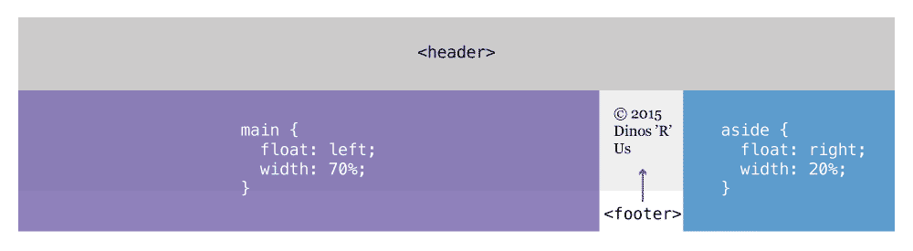

**Notice how the two widths don’t add up to `100%`—I’ve done that to leave a little space (gutter) between the two columns. But that causes some problems.**

### Clearfix

Notice above how the text inside the footer gets all mashed up between the two columns—using clear we can fix that problem.

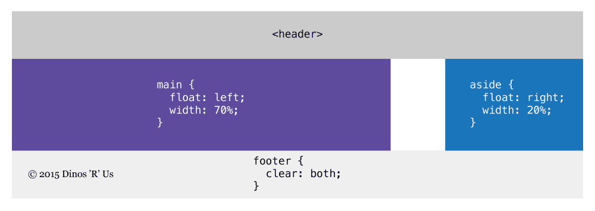

That’s an okay solution in many situations, but maybe we want the same colour behind both the columns, we’d first have to wrap them in the same element.

```html
<header>…</header>
<div class="wrapper">
  <main>…</main>
  <aside>…</aside>
</div>
<footer>…</footer>
```

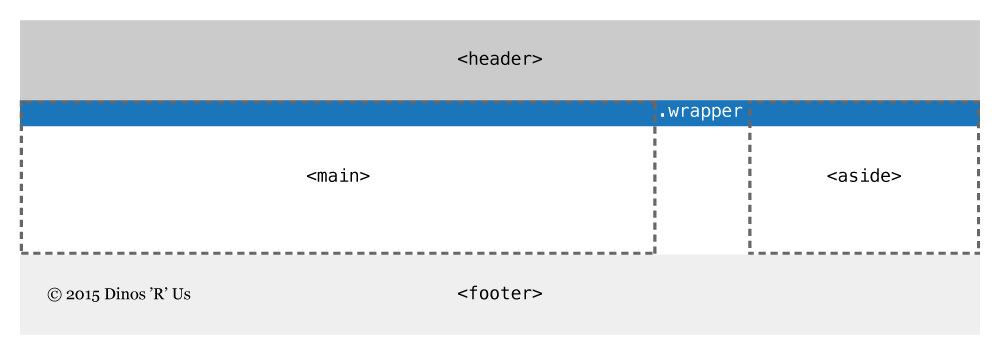

But, because the of the way float works, the `.wrapper` will not surround the `main` and `aside` because they are no longer part of the flow.

#### Clearfix with an empty element

This is the easiest way to understand how to fix the problem—**but not the best way to do it.**

Knowing how `clear` works, we could just insert another element inside the `.wrapper` and tell it to clear, forcing the `.wrapper` to wrap around its floated children.

```html
<header>…</header>
<div class="wrapper">
  <main>…</main>
  <aside>…</aside>
  <div class="dummy-clearfix"></div>
</div>
<footer>…</footer>
```

If we then added `clear: both` to the `.dummy-clearfix` element, our problem would be solved:

```css
.dummy-clearfix {
  clear: both;
}
```

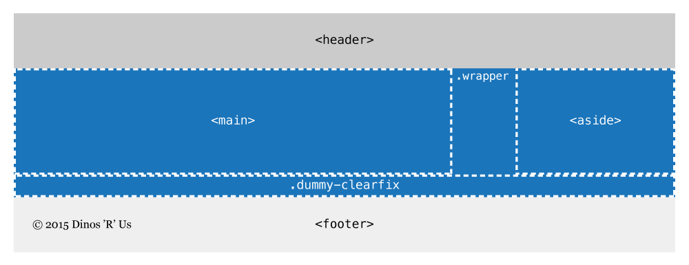

**But this solution isn’t ideal:** we don’t want to have an extra element in our HTML for a display issue if we can avoid it.

#### Clearfix class

Instead, we can generate a dummy element using CSS’s `:before` & `:after`—then we don’t have to add extra HTML.

```html
<header>…</header>
<div class="wrapper clearfix"> <!-- New second class: .clearfix -->
  <main>…</main>
  <aside>…</aside>
  <!-- No dummy element -->
</div>
<footer>…</footer>
```

All we have to do is add the following CSS to our file. Then using the class on the parent wrapper element we get our desired outcome.

```css
.clearfix::after {
  /* Generates a new element above */
  content: " ";
  display: table;
  clear: both;
}
```

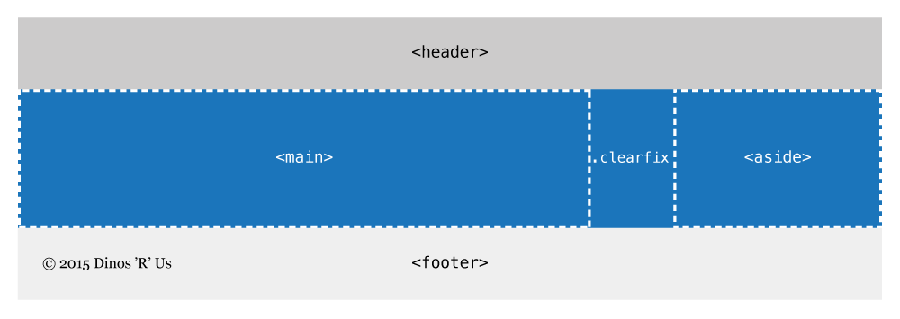

*Effectively this is exactly the same as using `.dummy-clearfix` with the benefit of not having to pollute the HTML with extra, unnecessary elements.*

#### Clearfix with overflow hidden

Instead of using the `.clearfix`, in many situations it’s often just good enough to use `overflow: hidden`.

So, as another solution to the above problem we could do this:

```html
<header>…</header>
<div class="wrapper"> <!-- No .clearfix class -->
  <main>…</main>
  <aside>…</aside>
</div>
<footer>…</footer>
```

```css
.wrapper {
  overflow: hidden;
}
```

Adding `overflow: hidden` to the `.wrapper` will totally solve the problem and works in many situations. But `overflow: hidden` has the side effect of chopping off any child that tries to be displayed outside `.wrapper`.

### Box sizing: border box

When creating floating columns in CSS with `width` and `padding` make sure to include `box-sizing: border-box` or your columns won’t fit on the same line because of the box-model math.

**[☛ Box model: adjusting layout math with border box](/topics/box-model/#adjusting-layout-math-with-border-box)**

---

## Overflow hidden & floating

`overflow: hidden` has another interesting side effect: it creates a new positioning context.

Take this example from earlier:

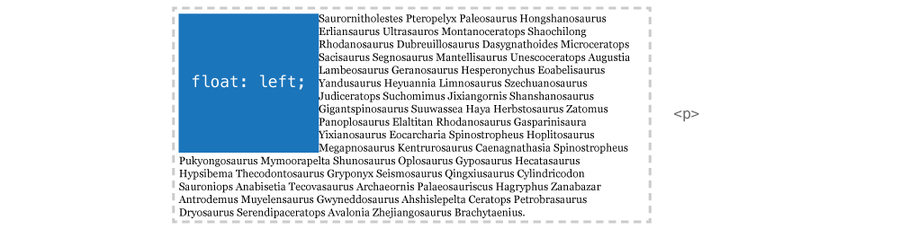

```html

<p>…</p>
```

```css
img {
  float: left;
}
```

What if we wanted the text to not wrap around the image, but instead create two columns. Following the tutorial above we know that we could just also `float` the paragraph to create columns.

But, using `overflow: hidden` on the paragraph we can create simple columns. **These aren’t true columns, but more of non-wrapping group.** It’s good when you don’t know how wide the image is going to be and you don’t want the paragraph to wrap below it.

```css
p {
  overflow: hidden;
}
```


**Links**

- [The Magic of Overflow Hidden](http://colinaarts.com/articles/the-magic-of-overflow-hidden/)

---

## Video list

1. [Float & clear: introduction](https://www.youtube.com/watch?v=fXbxt09eHj8&list=PLWjCJDeWfDdd0KA55h2H466wmas8X2kF0&index=1)
2. [Float & clear: wrapped image](https://www.youtube.com/watch?v=6YqFoNHdOPM&list=PLWjCJDeWfDdd0KA55h2H466wmas8X2kF0&index=2)
3. [Float & clear: definition list](https://www.youtube.com/watch?v=FTlb4PzwvH8&list=PLWjCJDeWfDdd0KA55h2H466wmas8X2kF0&index=3)
4. [Float & clear: columns](https://www.youtube.com/watch?v=ZbWpuW9wXK0&list=PLWjCJDeWfDdd0KA55h2H466wmas8X2kF0&index=4)

## Supplemental links

- **[MDN: float](https://developer.mozilla.org/en-US/docs/Web/CSS/float)**
- **[MDN: clear](https://developer.mozilla.org/en-US/docs/Web/CSS/clear)**
- [Codrops: float](http://tympanus.net/codrops/css_reference/float/)
- [Codrops: clear](http://tympanus.net/codrops/css_reference/clear/)
- [Positioning with float](http://learn.shayhowe.com/html-css/positioning-content/#floats)
- [Learn Layout: Float](http://learnlayout.com/float.html)
