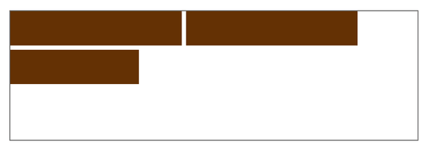
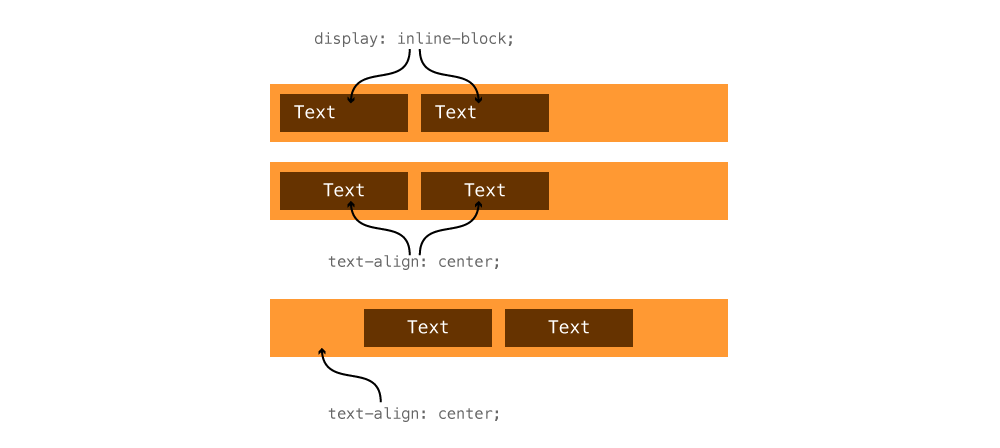
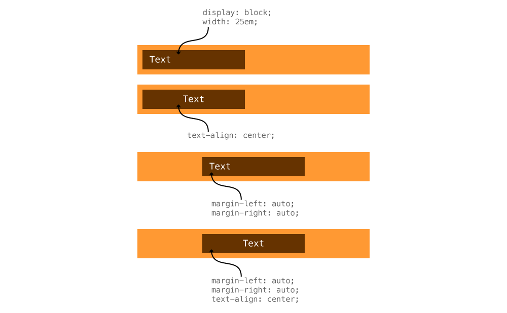

Browsers use “The Flow” to display elements on the page—understanding flow and display are critical to laying out websites.

---

## Browser rendering

When a browser renders your website it reads the HTML from the top to the bottom. The browser tries to place each box beside the previous box, unless something prevents it. Very similar to how words wrap in text editors like MS Word.



Elements may bump to the next line when:

- there's not enough space
- CSS causes it, using the `display` property
- or a `<br>` tag

**Links**

- [Gecko reflow visualization](https://www.youtube.com/watch?v=ZTnIxIA5KGw)

---

## The display property

The `display` property in CSS is one way to change the flow and rendering process of the browser.

There are four major values for display that are used regularly: `inline`, `block`, `inline-block`, `none`.

```css
p {
	/* This is the default setting for paragraphs specified by the browser */
	display: block;
}

a {
	display: inline-block;
}
```

### Inline elements

Every element is an inline level element—unless some CSS is applied to it.

**In the browser many elements have their display property changed to something else—use your developer tools to see.**


Inline level elements have the following properties:

- They allow other elements to fit beside them on the same line
- They take up only as much width as needed
- `width`, `margin`, `padding` don’t really work

#### Some common inline level elements

- `span`
- `a`
- `strong`, `em`, `b`, `i`
- `cite`
- `time`, `data`, `ins`, `del`

### Block elements

In the browser’s default CSS there’s a bunch of elements that are specified as `block`—use your developer tools to see.


Block level elements have the following properties:

- They take up their own line, anything that comes after goes onto the next line
- They take up the whole width of its parent element, by default
- `width`, `margin`, `padding` work as expected

#### Some common block level elements

- `div`
- `h1` – `h6`
- `p`
- `ul`, `ol`, `dl`, `li`
- `blockquote`
- `figure`, `figcaption`
- `header`, `footer`, `nav`
- `article`, `section`

### Hybrid inline-block elements

The inline-block elements are a hybrid of both block and inline, inheriting certain properties from each of them.

Inline-block elements have the following properties:

- They fit beside other elements on the same line *(from inline)*
- They take up only as much space as needed *(from inline)*
- `width`, `margin`, `padding` work as expected *(from block)*

#### Some common inline-block level elements

- `img`
- `button`

### Hiding elements with display none

The fourth `display` value commonly used is `none`, this will completely hide the element from the screen and any other accessibility tools.

```css
h1 {
	/* This element will not be shown on the screen, nor take up any space */
	display: none;
}
```

### Using the display property

You can apply the display property to absolutely any element you want to make it behave any way you want.

```css
span {
	/* Make span act exactly the same way as a div */
	display: block;
}

div {
	/* Make div act exactly the same way as a span */
	display: inline;
}

a {
	/* Allow the link to have padding, making it a bigger hit area */
	display: inline-block;
	padding: 0.5em 0.75em;
}
```

#### Making a horizontal navigation bar

Using the display properties to our advantage, we can very easily make a horizontal navigation bar.

Here’s the HTML I would use for navigation:

```html
<nav>
	<ul>
		<li><a href="#">Dinosaurs</a></li>
		<li><a href="#">Meat-eaters</a></li>
		<li><a href="#">Plant-eaters</a></li>
	</ul>
</nav>
```

Because of the browser’s default CSS, the `li` tags stack, one on top of each other, making a vertical list.

We want to make a horizontal list, so we need to change the display property of the `li` elements.

```css
nav li {
	display: inline;
}
```

Adding `display: inline` will allow the browser to render the `li` elements on the same line, beside each other.

Next up, we probably want to style the links, maybe make them larger hit areas.

```css
nav a {
	display: inline-block;
	padding: 0.5em 0.75em;
}
```

Adding `display: inline-block` to the `a` tags allows us to give them padding.

---

## Centering elements

There are a couple different ways to centre elements in HTML and CSS, and it’s completely dependent on what their `display` property is set to and whether you center the element itself or to it’s parent element.

### Centering display inline/inline-block & text



Using `text-align: center` on inline/inline-block elements can affect them in two ways:

1. If applied to the element itself, the text inside it will be centered
2. If applied to the parent element, the inline elements and the text inside them will be centered.

In our navigation above, if we did this:

```css
nav ul {
	text-align: center;
}
```

Then all the `li` elements inside would centre themselves within the `ul`. And all the text inside those `li` elements would centre itself inside the `li` tags.

**Text align affects text and inline/inline-block elements.**

### Centering display block



Using `text-align: center` on a block level element will only affect the content inside it, but will not move the element box itself to the centre of it’s parent.

If we have a paragraph, with a width, and want it to centre within its parent, we use automatic margins.

```css
p {
	max-width: 25em;
	margin-left: auto;
	margin-right: auto;
}
```

- `auto` — tells the browser to automatically calculate a margin that’s the same on the left and right.

This would allow the `p` tag to centre its whole box element within its parent element.

**Auto margins affect boxes that have a defined width.**

---

## Flexbox

Flexbox is a new way of controlling layout in browsers, it still requires lots of extra code and is a little buggy, but is extremely powerful.

With flexbox you can do lots of different centering and alignment like things. It also completely replaces the inline/block model above.

**Links**

- **[Flexy Boxes](http://the-echoplex.net/flexyboxes/)**
- [CSS Tricks: A Complete Guide to Flexbox](http://css-tricks.com/snippets/css/a-guide-to-flexbox/)
- [Flexbox Adventures](http://chriswrightdesign.com/experiments/flexbox-adventures/)
- [The Ultimate Flexbox Cheat Sheet](http://www.sketchingwithcss.com/samplechapter/cheatsheet.html)
- [Dive into Flexbox](http://bocoup.com/weblog/dive-into-flexbox/)
- [Flexbugs](https://github.com/philipwalton/flexbugs)
- [Flexbox Cheatsheet Cheatsheet](http://jonibologna.com/flexbox-cheatsheet/)
- [Using Flexbox today](http://chriswrightdesign.com/experiments/using-flexbox-today/)

---

## Video list

1. [Flow & display: introduction](https://www.youtube.com/watch?v=FwQo2P7L9bw&list=PLWjCJDeWfDdc6YKkkrEdYuExcnY05rmwG&index=1)
2. [Flow & display: details list](https://www.youtube.com/watch?v=-HeiRd22Tcg&list=PLWjCJDeWfDdc6YKkkrEdYuExcnY05rmwG&index=2)
3. [Flow & display: horizontal navigation](https://www.youtube.com/watch?v=sxO32mTbfUo&list=PLWjCJDeWfDdc6YKkkrEdYuExcnY05rmwG&index=3)
4. [Flow & display: centering elements](https://www.youtube.com/watch?v=QA5CiOm92Qg&list=PLWjCJDeWfDdc6YKkkrEdYuExcnY05rmwG&index=4)

## Supplemental links

- [Learn Layout](http://learnlayout.com/)
- [Grid by example](http://gridbyexample.com/)
