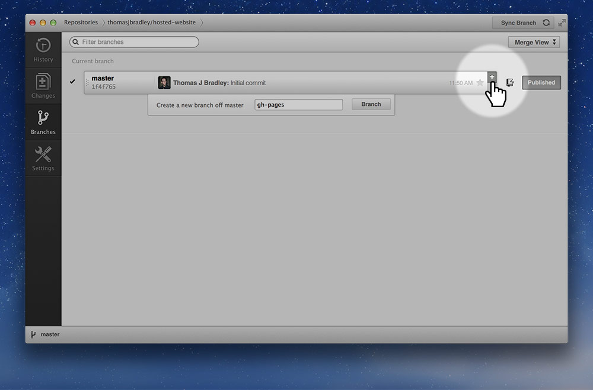
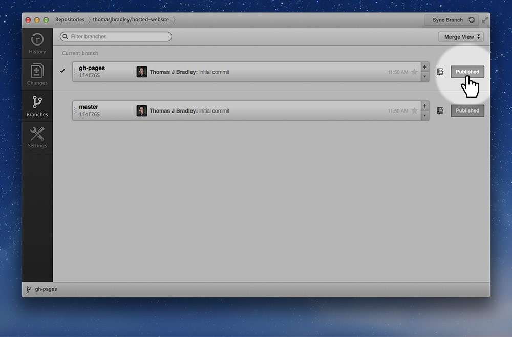
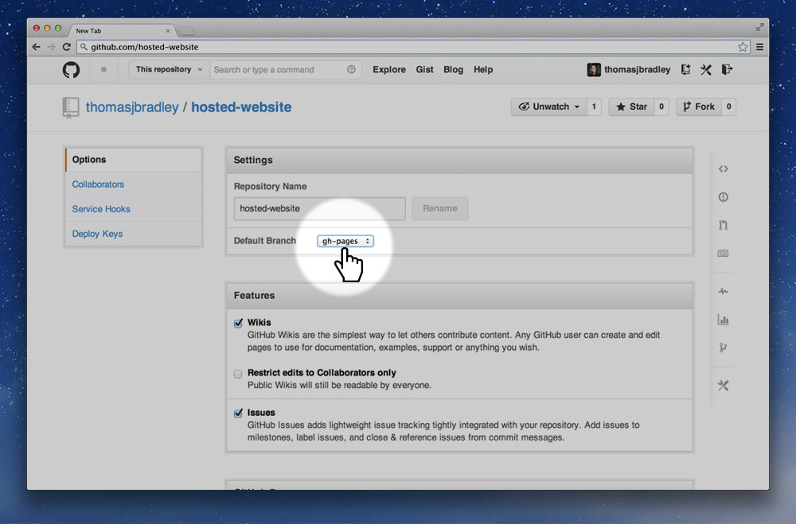
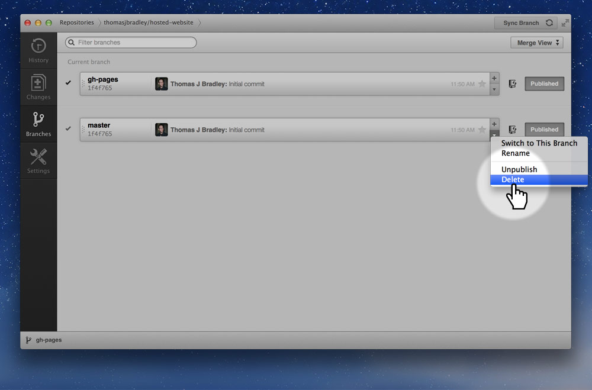

GitHub has a hosting service for static websites. All you have to do is create a branch named `gh-pages`.

---

## 1. Create a branch named gh-pages

## 2. Publish the branch

## 3. Set gh-pages as the default

## 4. Delete the master branch

*You only need to set `gh-pages` as default and delete the `master` branch if you don’t plan on using `master`. If you are just hosting a static site or a Jekyll site you likely don’t need the `master` branch.*

---

## Video list

1. [GitHub: setting up hosting with GitHub Pages](https://www.youtube.com/watch?v=-RwSh_pbu_U&list=PLWjCJDeWfDdfSZOQYvsy_jJiAvx4uaJLB&index=2)
