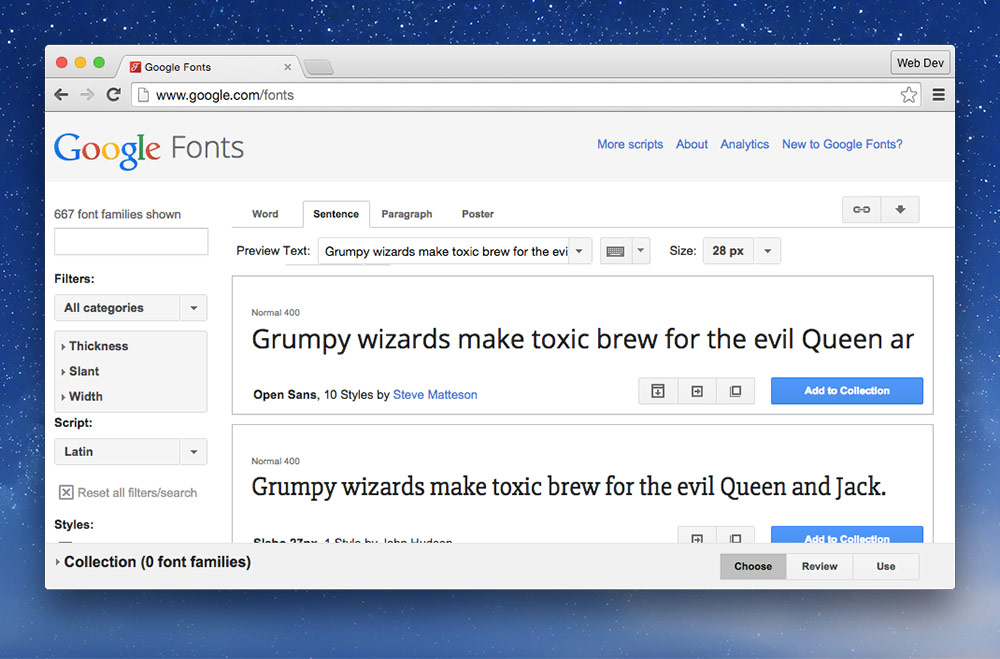
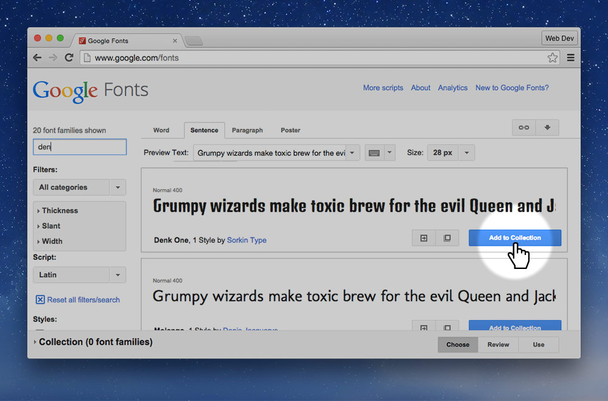
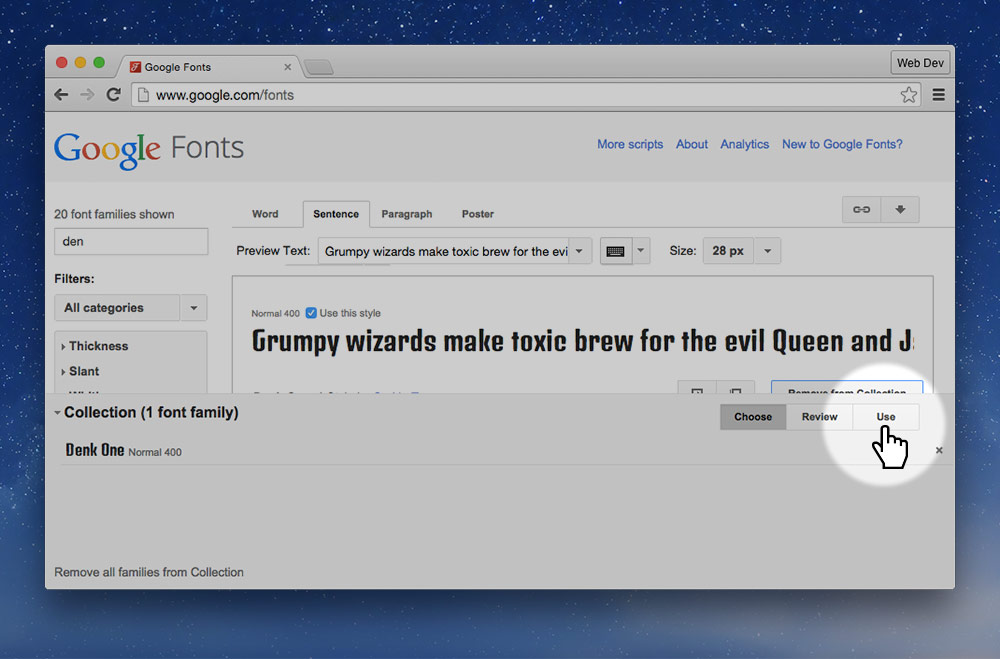
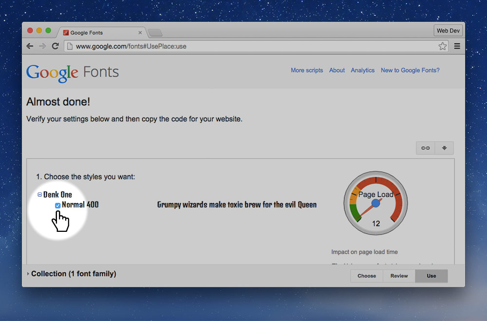
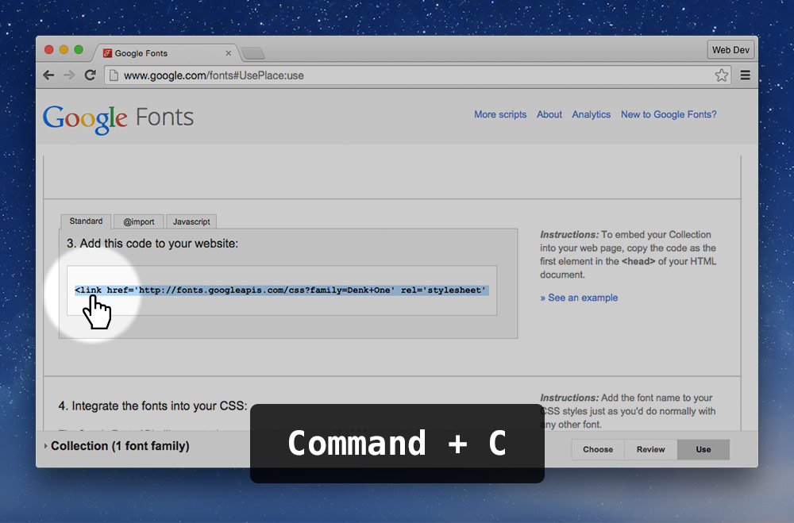
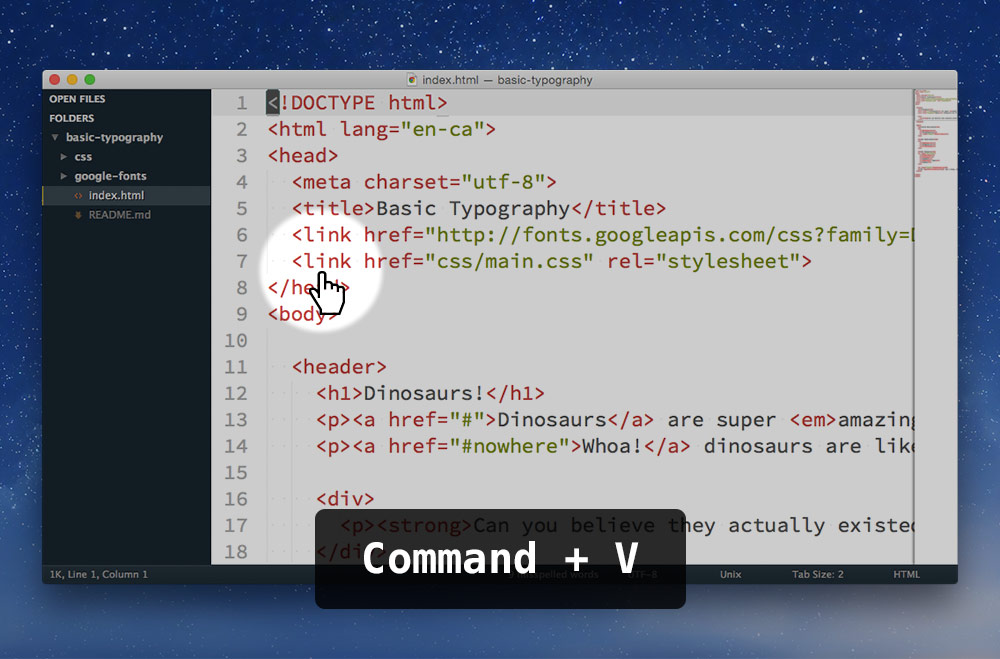
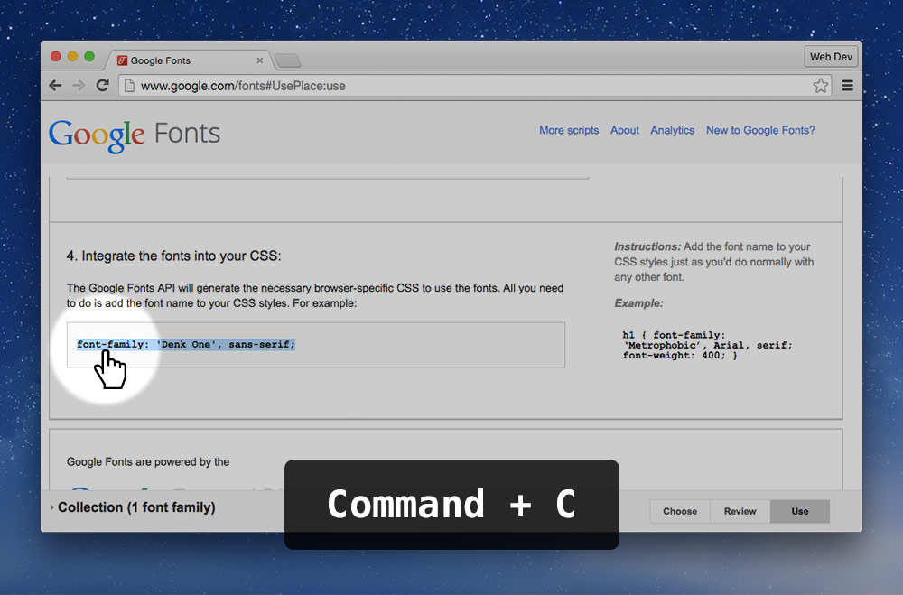
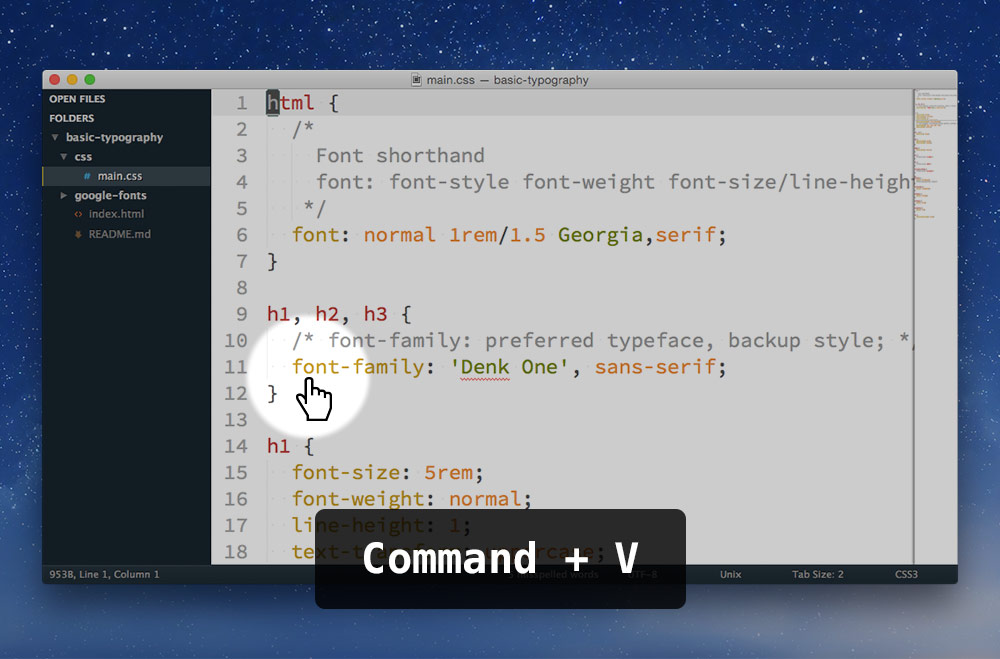

Google Fonts is a free service provided by Google that allows us to use some really nice type families on your websites.

---

**Go to Google Fonts and find the typeface you want to use.**

**Press “Add to Collection”.**

**Press “Use” in the collection drawer.**

**You’ll be taken to the use and download screen.**

It’s really important for website performance to choose only the weights and styles you need. *The more styles and weights you choose the slower your website will be.*

**Copy the HTML `link` tag that Google provides you.**

It’s a normal `link` tag but it loads a CSS file from Google’s servers instead of your own folder.

**Paste the `link` into the `head` of your website.**

**Go back to Google’s font page and copy the `font-family` declaration.**

**Paste the `font-family` declaration into your CSS where you want to use the font family.**

**…And it should work.**

---

## Video links

1. [Basic typography: custom typefaces with web fonts](https://www.youtube.com/watch?v=mmu44j4PoqQ&list=PLWjCJDeWfDdcZadRkkeuz1NYSJ0phrstG&index=8)
