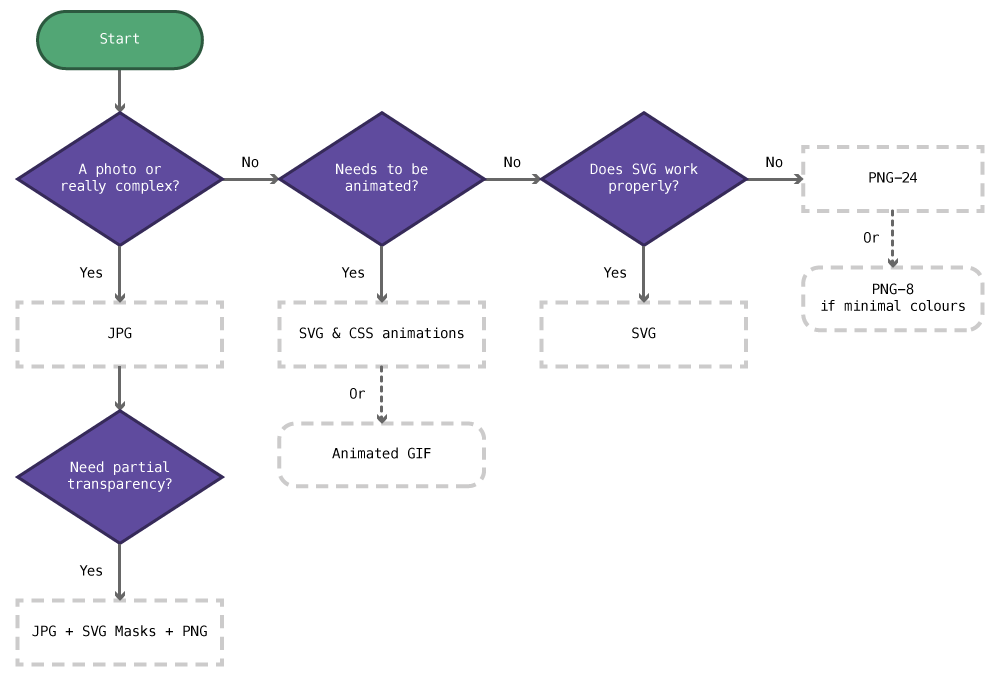
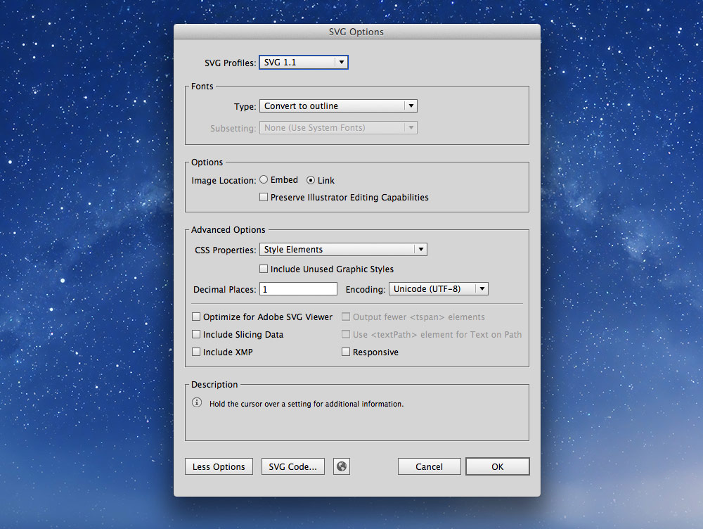
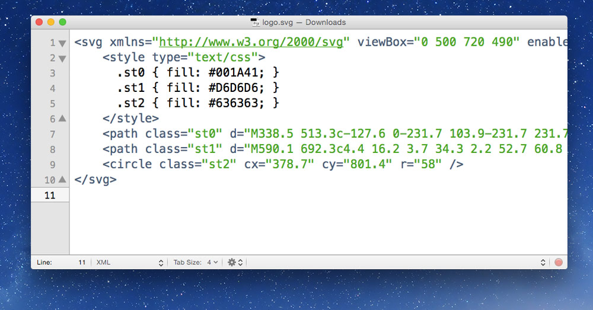
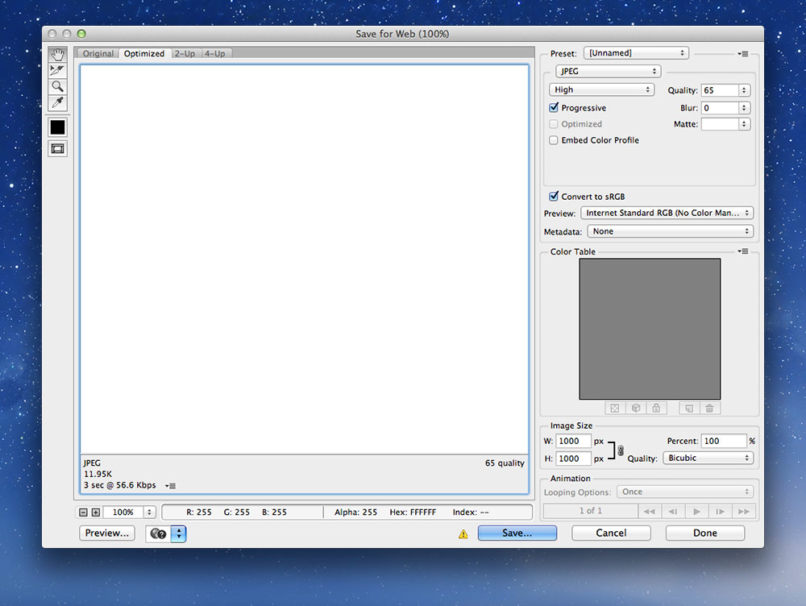
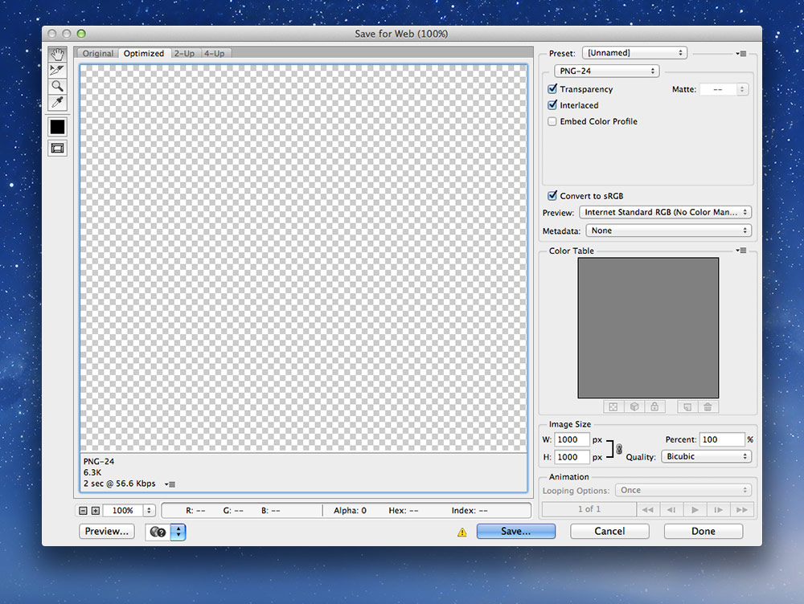

There are a few types of images that can be used on the web: JPGs, PNGs, SVGs, favicons, and GIFs.

---

## Choosing an image format



1. **Is it a photo or really complex?**
	*Yes:* JPG
2. **Does it need to be animated?**
	*Yes:* SVGs with CSS animations
	*Or:* GIF
3. **Does SVG produce good results?**
	*Yes:* SVG
	*No:* PNG-24 or PNG-8 if there’s very few colours

---

## SVG

Scalable Vector Graphics, SVG, are a vector image format specifically for the web—targeted at non-complex graphics.

SVG graphics can be created in many vector applications, like [Illustrator](http://www.adobe.com/ca/products/illustrator.html) and [Sketch](http://bohemiancoding.com/sketch/).



- Create your graphic in Illustrator then go to `File > Save a Copy`
- Choose `SVG` as the type
- In the dialogue that pops up, select `SVG 1.1`
- Under the “Fonts” section choose `Convert to Outline` for the “Type”
- “Image Location” should be set to `Link`
- Un-check “Preserve Illustrator Editing Capabilities”
- Press the `More Options` button and fill in a couple more options
	- “CSS Properties” — `Style Elements`
	- Un-check “Include Unused Graphic Styles”
	- “Decimal Places” — 1
	- Make sure “Responsive” is **not** checked (for better browser support)

**[Don’t forget to smush your SVGs afterwards.](#image-smushing)**

### SVGs are code

You can open them up in your text editor—because they are just XML—and edit them.



**[☛ Check out the tutorials on advanced SVG](/topics/advanced-svg/)**

**Links**

- No SVG fallback to PNG for HTML `` — <https://gist.github.com/3855802>
- No SVG fallback to PNG for CSS background-image — <https://gist.github.com/3856091>

---

## JPG

JPG images should be used for photos and other complex graphics with many colours. They don’t work particularly well for text.

When preparing JPGs to use on your website save them from Photoshop with the “Save for Web” tool. This allows you to control the quality and monitor the file size.

Our goal when using “Save for Web” is to increase the compression as much as possible while still retaining a good level of image quality. By playing with the quality setting and watching the image for artifacts or blurring while also watching the size we can create a balance between file size and quality.

*For standard photos I usually start around 65% quality and go up or down from there.*



There are a few other options to watch out for in the “Save for Web” dialogue:

- Put the “Quality” as low as possible without sacrificing too much, start around 65%
- Check “Progressive”
- Un-check “Embed Color Profile”
- Check “Convert to sRGB”
- Set “Preview” to “Internet Standard RGB (No Color Management)”
- Set “Metadata” to “None”

**[Don’t forget to smush your JPGs afterwards.](#image-smushing)**

### JPGs and transparency

JPG graphics don’t have transparency built in, but we can use SVG Masks and two images to create a transparent JPG. This technique is helpful if the transparent PNG version creates too large of file size.

**[☛ Advanced SVG: masking images](/topics/advanced-svg/#masks)**

---

## PNG

Portable Network Graphics, PNGs, should be used for logos, icons, and text. In many situations SVGs are better suited, but SVGs can’t create some effects.

When preparing PNGs to use on your website save them from Photoshop with the “Save for Web” tool. This allows you to control the quality and monitor the file size.

*You almost always want to use `PNG-24` because Photoshop’s implementation of PNG-8 is incorrect—but it’s always worth trying PNG-8 to see if it produces a good result.*



There are a few other options to watch out for in the “Save for Web” dialogue:

- Check “Interlaced”
- Un-check “Embed Color Profile”
- Check “Convert to sRGB”
- Set “Preview” to “Internet Standard RGB (No Color Management)”
- Set “Metadata” to “None”

**[Don’t forget to smush your PNGs afterwards.](#image-smushing)**

### PNG-24 vs. PNG-8

There are two kinds of PNGs, 24-bit and 8-bit, each with pros and cons.

- *PNG-24 graphics* have a practically unlimited colour palette and 256 levels of transparency, but they can get really big.
- *PNG-8 graphics* only have 256 possible colours and can be much smaller than PNG-24, but in images with lots of colours they can get messy.

Photoshop’s implementation of PNG-8 is incorrect. If you want to use a PNG-8, save it as a PNG-24 from Photoshop and use [ImageAlpha](http://pngmini.com/) to convert it properly to PNG-8.

---

## Favicons

Favicons are a great way to include your brand in the tab of the browser. They also often show up when you bookmark sites.

There are different file formats needed to make favicons:

1. `.ico` — used in the tab and a few other places
2. `.png` — used in more specialized places like bookmarks

### Making an ICO file

The first step in creating the ICO file is making a few different PNGs because an ICO file is actually multiple images inside a single file. *Don’t forget to smush those PNGs.*

**PNG dimensions for ICO**: 16×16, 32×32 & 48×48.

#### Converting PNGs to ICO

You need a special application to create the `.ico` file because Photoshop cannot. I like to use [Icon Slate](http://www.kodlian.com/apps/icon-slate), but [X Icon Editor](http://xiconeditor.com/) also works okay.

After you’ve converted to the ICO, trash the PNG files—it’s the ICO we need.

**Make sure this file is always named `favicon.ico`.**

#### Placing the the ICO file

It’s suggested you put the favicon right in the root of your website, `http://domain.ca/favicon.ico`, because browsers will look for it there by default.

If, for some reason, you can’t put it there you can use the `<link>` tag to include it.

```html
<!-- This is optional; it’s better to put the icon at the root of your domain. -->
<link href="img/favicon.ico" rel="shortcut icon">
```

### Platform specific favicons

Some platforms have their own favicons used in other locations:

- Apple & Android home screen icons,
- Microsoft tile icons,
- etc.

These icons are generally always PNGs.

#### Platform specific image dimensions

I usually only make two icons but you could end up making many, many more.

- **favicon-144.png** — 144×144 (transparent); for Microsoft.
- **favicon-152.png** — 152×152; for Apple/Android.

#### Platform specific meta tags

After saving the icons (and of course smushing them) you’ll need to link them in the `<head>` of your HTML file:

```html
<meta name="application-name" content="Your Site Name">
<link rel="apple-touch-icon-precomposed" href="/favicon-152.png">
<meta name="msapplication-TileImage" content="/favicon-144.png">
<meta name="msapplication-TileColor" content="#ef0303">
```

**Links**

- **[Icon Slate](http://www.kodlian.com/apps/icon-slate)**
- **[Audrey Roy Greenfeld’s Favicon Cheat Sheet](https://github.com/audreyr/favicon-cheat-sheet)**
- [Treehouse: How to Make a Favicon](http://blog.teamtreehouse.com/how-to-make-a-favicon)
- [X Icon Editor](http://xiconeditor.com/)
- [Apple Touch Icons](http://mathiasbynens.be/notes/touch-icons)
- [Windows 8 Tile Icons](http://hicksdesign.co.uk/journal/pinned-sites-in-windows-8)
- [Favico.js](http://lab.ejci.net/favico.js/) — Manipulate favicons with Javascript

---

## GIF

The Graphics Interchange Format, or GIF, is an older image format for the web. For many static images SVG or PNG are much better suited—but GIFs can be animated.

Animation alone isn’t generally a good reason to use a GIF, [try using CSS animations and SVGs](https://github.com/algonquindesign/html-css/blob/gh-pages/advanced-svg) to see if you can get the results you want.

GIF animations shine for complex, traditional, frame-by-frame animations, while SVG & CSS animations are much more straight-forward.

Photoshop has the ability to animate GIFs using the “Timeline” window.

---

## Speed of images

The most important design consideration for websites is speed.

There are a couple things you can do to your images to help speed up your website.

1. Choose the correct image format in Photoshop’s `Save for Web`—and compress it well
2. Use CSS sprites to reduce how many images get downloaded
3. Smush (recompress) all images using an app like ImageOptim

### Image smushing

Many images contain extra meta information in their files that can be stripped out without compromising the image.
Smushing will reduce the size of images without reducing their quality.

*All images should be exported from Photoshop with “Save for Web”, then run through a smusher.*

- `PNGs` & `JPGs` — should be run through ImageOptim
- `SVGs` — should be run through SVGO-GUI

### JPG optimization techniques

- Reduce the noise and complexity of the image
- Blur unimportant areas

### PNG optimization techniques

- Try PNG-8 instead of PNG-24
- Try saving as PNG-24 then using [ImageAlpha](http://pngmini.com/) to convert to PNG-8 (produces better results than Photoshop)

**Links**

- **[ImageOptim](http://imageoptim.com/)** — compresses all raster images without compromising quality (Mac)
- **[SVGO-GUI](https://github.com/svg/svgo-gui)** — removes extraneous code and whitespace from SVGs to save on filesize (Mac, Windows)
- [ImageAlpha](http://pngmini.com/) — compresses PNGs by allowing you to reduce the number of colours in the image (Mac)
- [PNGGauntlet](http://pnggauntlet.com/) — compresses PNGs ony (Windows)
- [RIOT: Radical Image Optimization Tool](http://luci.criosweb.ro/riot/) — compresses raster graphics (Windows)
- [JpegMini](http://www.jpegmini.com/) — paid (Mac, Windows)

---

## Video links

1. [Image formats: creating SVGs](https://www.youtube.com/watch?v=ypvpdYhnEy4&index=1&list=PLWjCJDeWfDdcK0q3kJyY12Wjrq0A9Ljph)
2. [Image formats: exporting SVGs using artboards](https://www.youtube.com/watch?v=UMUZ2n7TmIk&index=2&list=PLWjCJDeWfDdcK0q3kJyY12Wjrq0A9Ljph)
3. [Image formats: saving JPGs](https://www.youtube.com/watch?v=xTAgM3tZ72A&list=PLWjCJDeWfDdcK0q3kJyY12Wjrq0A9Ljph&index=3)
4. [Image formats: saving PNGs](https://www.youtube.com/watch?v=NOduAdEq3-8&list=PLWjCJDeWfDdcK0q3kJyY12Wjrq0A9Ljph&index=4)
5. [Image formats: smushing](https://www.youtube.com/watch?v=O9_L2jIr_nA&list=PLWjCJDeWfDdcK0q3kJyY12Wjrq0A9Ljph&index=5)
6. [Image formats: favicons](https://www.youtube.com/watch?v=G407yUWeU40&list=PLWjCJDeWfDdcK0q3kJyY12Wjrq0A9Ljph&index=6)

## Supplemental links

- **[Image Formats: The Nerdy Parts](http://larahogan.me/images/)**
- [The Mysterious Save For Web Color Shift](http://viget.com/inspire/the-mysterious-save-for-web-color-shift)
