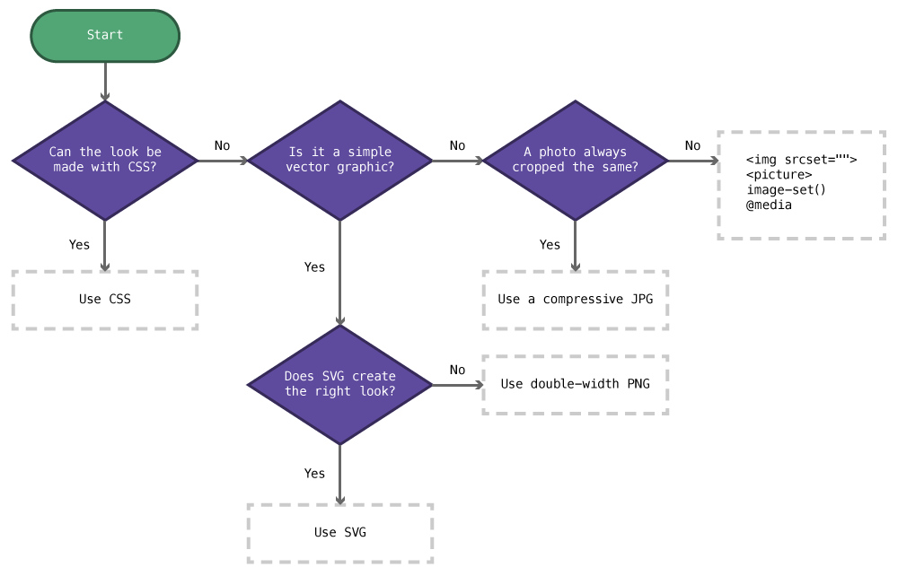

With many screens now becoming high resolution it’s time to start preparing our images to support the new technology.

---

## Choosing the right technique

There are a few techniques we can use for hi-res screens.



1. **Can the look be accomplished practically in CSS?**
	*Yes:* Use CSS.
2. **Is it a simple vector-like graphic (logo, icon, illustration)?**
	1. *Yes*: **Can the look be accomplished with SVG?**
		*Yes*: Use SVG.
		*No*: Use a double-size PNG and scale it down.
3. **Is it a photo that’s always cropped the same?**
	*Yes:* Use compressive JPGs.
	*No*: Try: ``, `<picture>`, `image-set()`, or `@media` to provide different versions of the image.

---

## CSS

Anything done in CSS is naturally retina friendly. So, if you can accomplish the look in CSS alone, do it with CSS.

Some *good* examples of when CSS works well:

- Gradients, shadows, rounded corners
- Web fonts, text shadows

Some *bad* examples of when CSS shouldn’t be used, primarily because of memory concerns:

- Icons & illustrations
- Extremely complex gradients

---

## SVG

SVG graphics are also inherently retina friendly. If you have a simple graphic and SVG can produce a good result, use SVG.

Don’t use SVG for extremely complex graphics (because of memory concerns) and don’t use SVG for photos.

---

## Compressive JPGs

Compressive JPGs are a technique for supplying hi-resolution photos while reducing the download size.

The major downside of this technique is that the images can become very memory intensive.

1. Go to your website and determine the maximum width your image will be displayed at,
2. Open the original source file in Photoshop and make its width double the size you determined for your website,
3. Use `Save For Web` to compress the image to a JPG with a quality of somewhere around 25%–35%.

Then, when sizing your JPG to the appropriate dimensions in the your website, it will actually be double the pixel width and shrunken down by the browser, therefore displayed crisply.

**Links**

- [Retina Revolution Compressive JPEGs](http://blog.netvlies.nl/design-interactie/retina-revolution/)
- [RWD Image Compression](http://filamentgroup.com/lab/rwd_img_compression/)

---

## PNGs

Sometimes SVG graphics don’t produce the result you want for icons yet you still want to provide crisp graphics for hi-res screens.

First, similar in technique to compressive JPGs, just make a double size PNG and scale it down in your website—either using an `` tag or `background-image`.

If that’s too memory intensive, or creates too large of a file, try some of the below techniques.

---

## Image tag source sets

There’s a new attribute—`srcset`—on the `` tag that allows us to provide different versions of our images and the browser will determine which image to show on the screen.

*Browser support is currently pretty poor.*

```html

```

In the `srcset` attribute we provide different versions of the image and what `width` they are, the browser will figure everything else out for us.

**Links**

- [Can I use: srcset](http://caniuse.com/#feat=srcset)

---

## Picture element

There’s a new HTML element for managing and targeting different graphics to different screen sizes: the `<picture>` element.

*Browser support is currently pretty poor.*

```html
<picture>
	<source media="(min-width: 35em)" src="medium-res.jpg">
	<source media="(min-width: 60em)" src="high-res.jpg">
	
</picture>
```

**Links**

- **[Picturefill](http://scottjehl.github.io/picturefill/)** (Good for `srcset` too!)
- [Can I use: picture](http://caniuse.com/#feat=picture)

---

## Background images

We can use a media query for detecting hi-res screens and supply two different images in our CSS.

```html
<i class="icon"></i>
```

```css
.icon {
	display: inline-block;
	width: 32px;
	height: 32px;
	background-image: url("../images/icon.png");
}

@media (-webkit-min-device-pixel-ratio: 1.5), (min-resolution: 144dpi) {

	.icon {
		background-image: url("../img/icon-2x.png");
		background-size: 32px 32px;
	}

}
```

*Or you can try the new `image-set()` function—which doesn’t have very good browser support yet.*

**Links**

- Retina media queries: <https://gist.github.com/3855791>
- [Media Query Asset Downloading Results](http://timkadlec.com/2012/04/media-query-asset-downloading-results/)
- [Can I use: resolution media query](http://caniuse.com/#feat=css-media-resolution)
- [Can I use: image-set](http://caniuse.com/#feat=css-image-set)
- [Background image-set](http://dev.w3.org/csswg/css-images-3/#image-set-notation)

---

## Video list

1. [Images for retina screens: compressive JPGs](https://www.youtube.com/watch?v=3SzWx4_mL7A&list=PLWjCJDeWfDdcuLc0AjtdeuNSXyDiv_7-f&index=1)
2. [Images for retina screens: multi-resolution PNGs](https://www.youtube.com/watch?v=Q91vXeF0mpU&list=PLWjCJDeWfDdcuLc0AjtdeuNSXyDiv_7-f&index=2)

## Supplemental links

- **[A List Apart: Responsive Images in Practice](http://alistapart.com/article/responsive-images-in-practice)**
- **Responsive Images 101: [Part 1](http://blog.cloudfour.com/responsive-images-101-definitions/), [Part 2](http://blog.cloudfour.com/responsive-images-101-part-2-img-required/), [Part 3](http://blog.cloudfour.com/responsive-images-101-part-3-srcset-display-density/), [Part 4](http://blog.cloudfour.com/responsive-images-101-part-4-srcset-width-descriptors/), [Part 5](http://blog.cloudfour.com/responsive-images-101-part-5-sizes/), [Part 6](http://blog.cloudfour.com/responsive-images-101-part-6-picture-element/), [Part 7](http://blog.cloudfour.com/responsive-images-101-part-7-type/), [Part 8](http://blog.cloudfour.com/responsive-images-101-part-8-css-images/), Part 9**
- [Smashing Magazine: Responsive Images Done Right: A Guide To picture And srcset](http://www.smashingmagazine.com/2014/05/14/responsive-images-done-right-guide-picture-srcset/)
