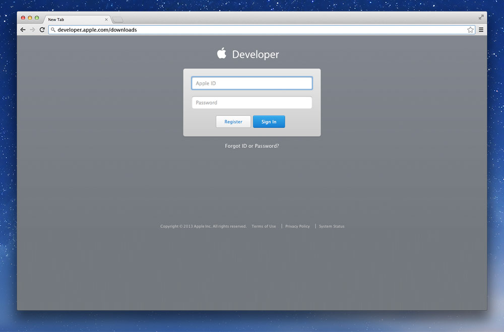
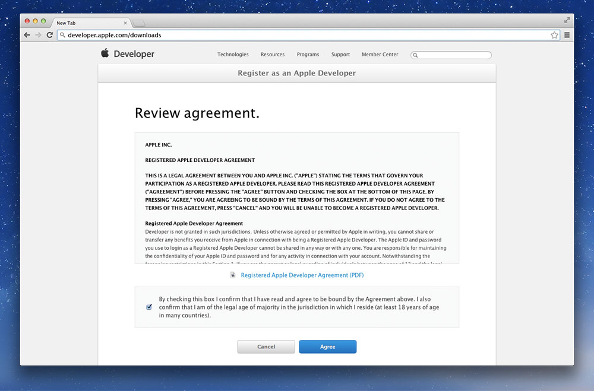
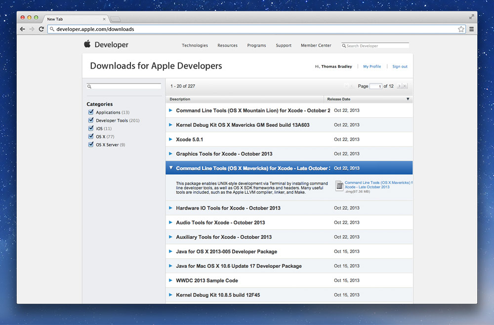
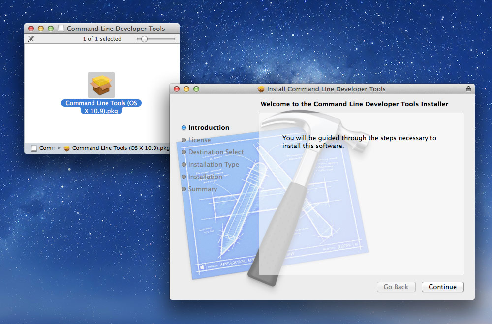
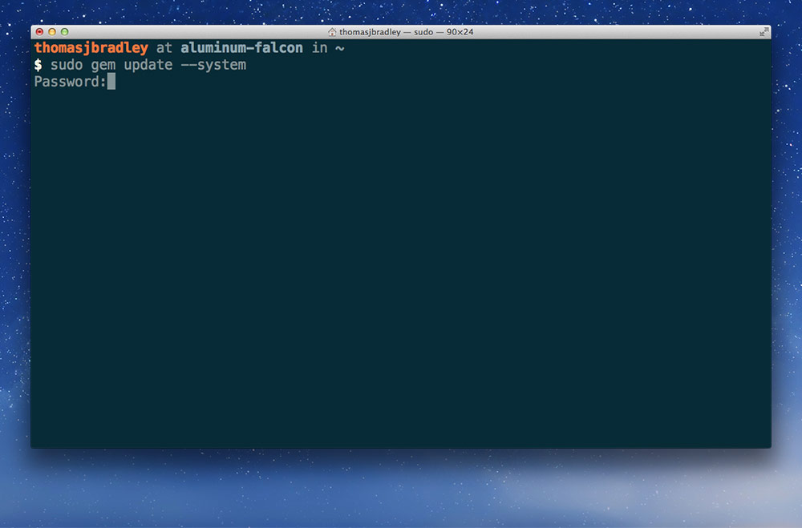
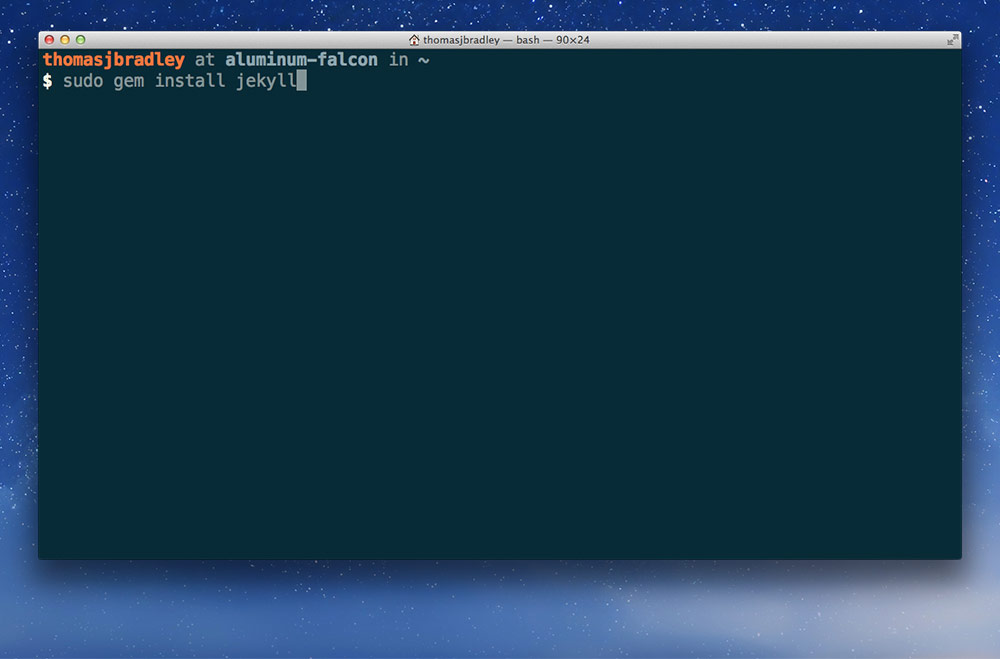

This is for installing Jekyll on older versions of Mac OS X, specifically 10.8 and below.

---

## Installing the command line tools

We first need to install the Command Line Tools before installing Jekyll—we can get older versions from Apple’s Developer Website.

**Go to [Apple Developer Downloads](http://developer.apple.com/downloads/) and sign in with your Apple/iTunes account.**



**Agree to the terms of use.**



**When you get to the download page, find the most recent version of the command line tools for your version of Mac OS X.**



**Download and install the tools—eject and delete the download when complete.**



---

## Installing Jekyll in Terminal

Open the Terminal application on your Mac and type the following commands.

### 1. Update the gem installer

```bash
sudo gem update --system
```

**It will prompt you for your computer’s password. As you type it in you won’t see anything—but it is being entered. When complete, hit `Return`.**



### 2. Install Jekyll

Installing Jekyll in the Terminal will download Jekyll and install it on your local computer.

```bash
sudo gem install jekyll
```



---

## Video list

- [Jekyll: installation (older versions of Mac OS X)](https://www.youtube.com/watch?v=IINPHVVrF5Q&index=2&list=PLWjCJDeWfDdfVEcLGAfdJn_HXyM4Y7_k-)
