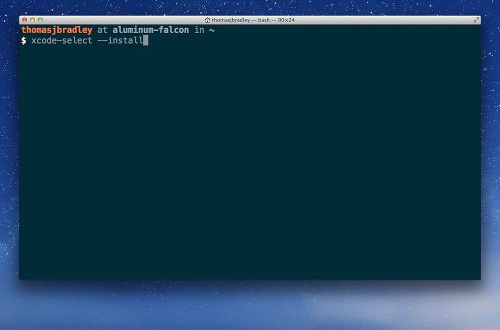

On a Mac we need to install the Command Line Tools before installing Jekyll using Terminal.

---

## Installing the command line tools

You can install the command line tools directly from Terminal.

```bash
xcode-select --install
```



It will prompt you to install and approve a terms of use then download and install the tools on your computer.

---

## Installing Jekyll in Terminal

Open the Terminal application on your Mac and type the following commands.

### 1. Update the gem installer

```bash
sudo gem update --system
```

**It will prompt you for your computer’s password. As you type it in you won’t see anything—but it is being entered. When complete, hit `Return`.**


### 2. Install Jekyll

Installing Jekyll in the Terminal will download Jekyll and install it on your local computer.

```bash
sudo gem install jekyll
```


---

## Video list

- [Jekyll: installation](https://www.youtube.com/watch?v=IINPHVVrF5Q&list=PLWjCJDeWfDdfVEcLGAfdJn_HXyM4Y7_k-&index=1)
