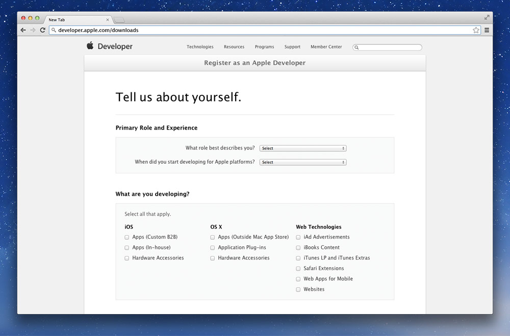
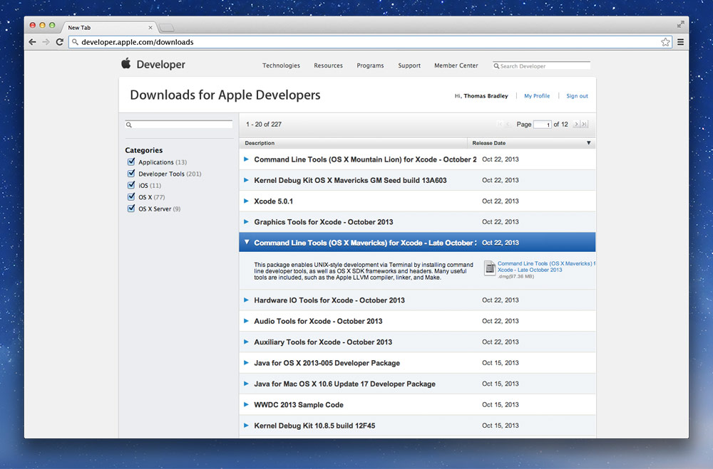
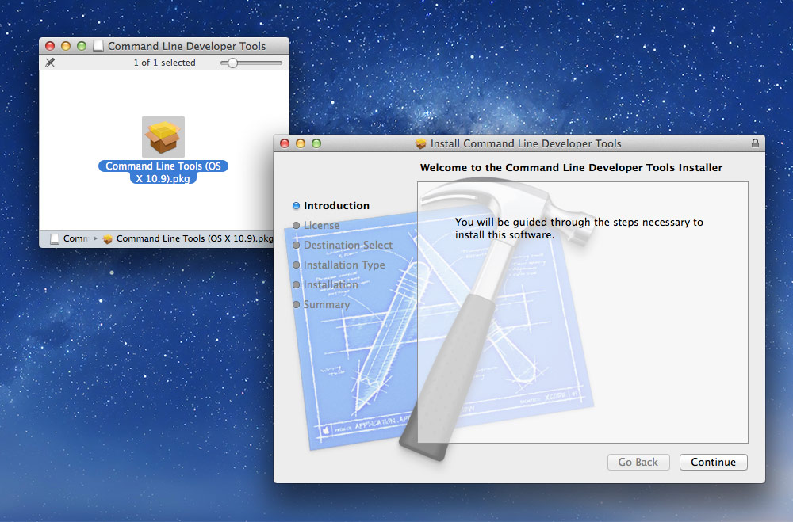

# Installing the command line tools on pre-Mavericks Macs

**Go to [Apple Developer Downloads](http://developer.apple.com/downloads/) and sign in with your Apple/iTunes account.**

**Agree to the terms of use.**

**Fill out the quick user survey.**

**When you get to the download page, find the most recent version of the command line tools for your version of Mac OS X.**

**Download and install the tools—eject and delete the download when complete.**

