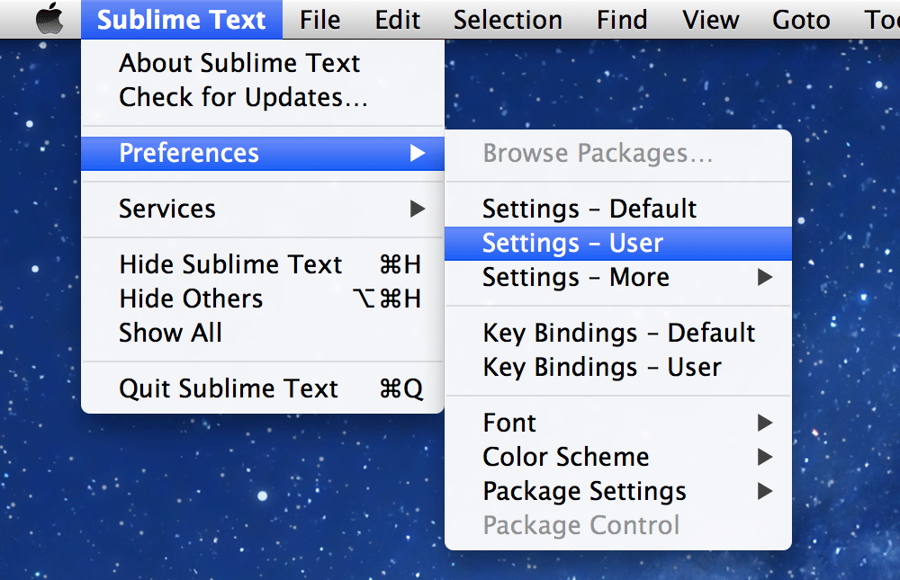
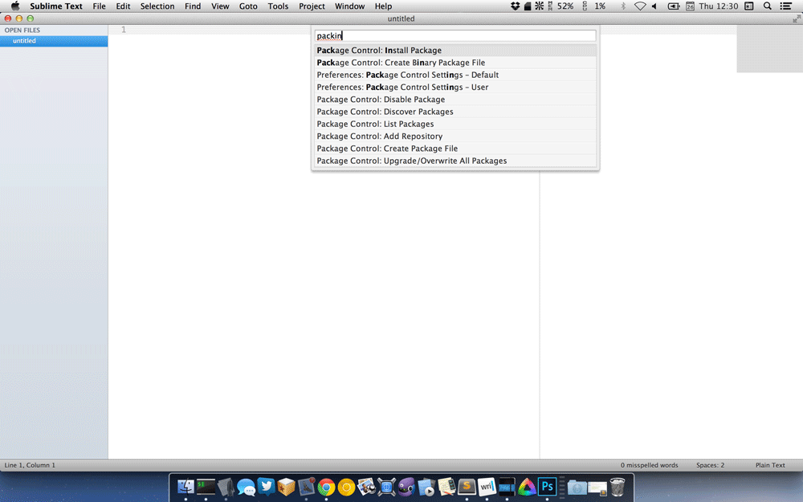
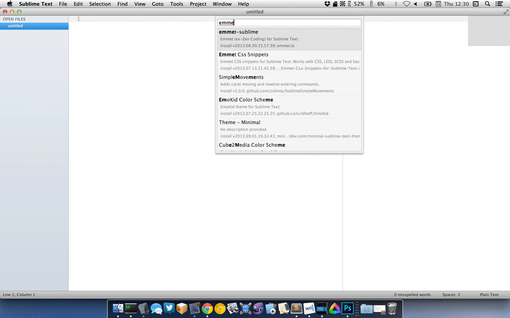
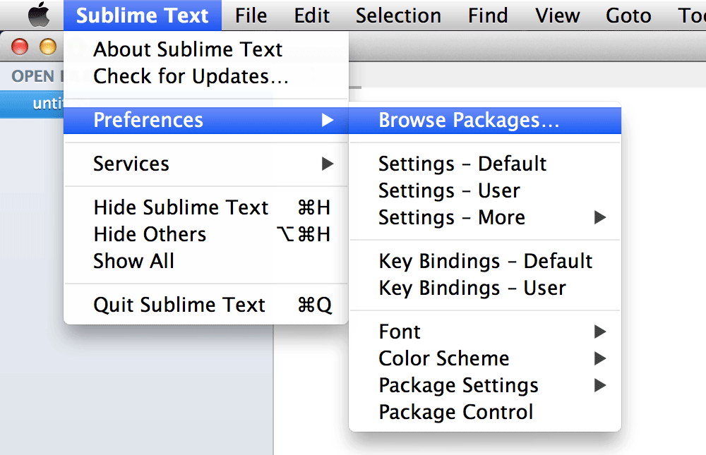
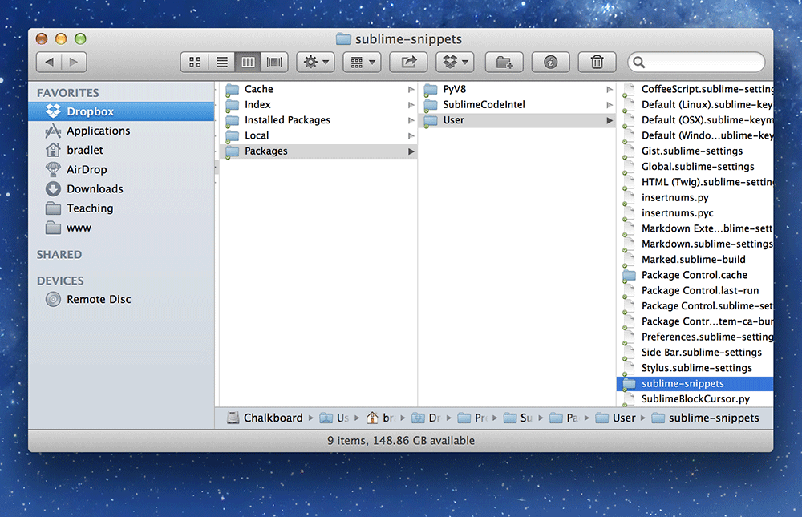

Sublime Text is a powerful code editor that we can use as a replacement for Dreamweaver.

It’s **faster**, *more powerful*, *more efficient*, and *purely targetted at writing code*.

**[⬇ Download Sublime Text 3](http://www.sublimetext.com/3)**

---

## What Sublime Text does

- Starts up significantly faster
- Less application bloat
- Supports many languages
- Has a plugin system that allows extending the functionality

---

## What Sublime Text doesn’t do

- Preview your website—that’s what browsers are for
- Let you browse to find a file—typing is faster and more reliable anyways
- Ask you to update links and mess up your whole website

---

## Set up

Sublime Text will work immediately after downloading it—but if you want to get the most out of it, some customization will be needed.

### Settings

Sublime Text is extremely powerful and comes with a bunch of settings to make it work the way you want.

To view all the settings built into Sublime Text go in the menu to:

```
Sublime Text > Preferences > Settings - Default
```

To update and add your own settings go in the menu to:

```
Sublime Text > Preferences > Settings - User
```



#### Some default settings

To save time and have Sublime Text set up quickly, copy these settings and overwrite everything in your user settings.

**[☛ User settings](https://github.com/acgd-learn-the-web/sublime-text-code/archive/master.zip)**

**Just copy and paste those settings into  your `Settings - User` file, overwriting everything that’s in there.**

*These settings contain lots of helpful bits to set up Sublime Text the way that it works for me—if you don’t like one of the options feel free to change it.*

---

## Packages

Adding a few packages (aka plugins) to Sublime Text will give you a bunch more convenient features.
Before we add any packages we should install [Package Control](https://sublime.wbond.net/) to help adding/removing packages.

[☛ Install Package Control](https://sublime.wbond.net/installation)

### Some default packages

Below is a list of packages I would recommend you install into Sublime Text:

- **AdvancedNewFile** — opens up a quick new file input at the bottom of the screen, ⌘⌥N
- **All Autocomplete** — finds matching classes from your HTML to autocomplete
- **ApplySyntax** — helps detect the right syntax highlighter for the code you’re looking at
- **AutoFileName** — when typing filenames, like `src=""` it will help write the files
- **Autoprefixer** — when run, adds the appropriate vendor prefixes to all CSS
- **BracketHighlighter** — shows opening and closing tags and brackets
- **ColorPicker** — a colour picker for Sublime Text
- **CSS3** — a better CSS syntax highlighter
- **EasyMotion** — a quick way to jump to different locations on screen
- **EditorConfig** — for matching other designers’ coding standards
- **Emmet** — quick way to write HTML, using CSS selectors
- **jQuery** — better jQuery syntax highlighting
- **Liquid** — to syntax highlight the Jekyll template tags
- **Markdown Extended** — to syntax highlight our Markdown+YAML files
- **Placeholders** — lorem-ipsum generation with HTML tags
- **SideBarEnhancements** — adds new features when right clicking on files in the sidebar, including `Open in Browser`
- **SublimeCodeIntel** — more auto-completion for lots of different languages
- **WordCount** — shows a word count in the bottom left of the status line

### How to install packages

After you’ve installed Package Control, you install the packages from directly inside Sublime Text.

```
Press ⌘⇧P and start typing “Package Control: Install Package”
```

You don’t have to type all the letters, just some of them—it’s called fuzzy matching.
In the screenshot you can see I only had to type “packin”.
You can select it by hitting the up/down arrow keys and pressing `Return`.



A list of available packages will come up and you can start typing the name of the one you want.
When you find the one you want select it and it will download and install.



---

## Snippets

Snippets are little samples of code you can get Sublime Text to automatically insert into your document.

As an example, when creating a new `index.html` file the doctype doesn’t already exist.
You can create a snippet that will insert that code for you.

For me, I type `html5` then hit **tab** and it will insert that code for me.

### Snippets starter

If you want to get a few snippets to start out, you can download my snippets from GitHub.

**[⬇ Download my snippets](https://github.com/thomasjbradley/sublime-snippets/archive/master.zip)**

#### What’s included

- `html5` — will output the `<!doctype html>…`
- `css` — will create a `<link href=…` tag to attach a CSS file
- `viewport` — will output the responsive design `<meta name="viewport"…` tags
- `cssviewport` — will output the `@viewport {…` CSS declarations
- `borderbox` — will output the `* { box-sizing: border-box…` CSS declarations
- `textsize` — will output the `text-size-adjust: 100%` CSS declarations
- `jss` — will output a Javascript `<script>` tag
- *and probably others, so check out the folder…*

#### Installing

From Sublime Text, go in the menu to:

```
Sublime Text > Preferences > Browse Packages
```



This will open up a Finder window. You should see a folder named “User”—navigate into it.
Drop the folder you downloaded into the “User” folder.



---

## Supplemental links

- Videos: [Perfect Workflow in Sublime Text 2](https://tutsplus.com/course/improve-workflow-in-sublime-text-2/)
	- [Emmet](https://tutsplus.com/lesson/emmet/)
	- [AdvancedNewFile](https://tutsplus.com/lesson/lightning-fast-folder-and-file-creation/)
- [Emmet Cheat Sheet](http://docs.emmet.io/cheat-sheet/)
