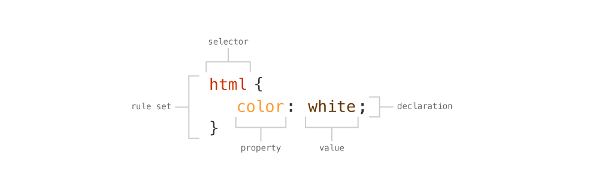

Covering creating Cascading Style Sheets, attaching them to your HTML, and basic targeting and styling of websites.

---

## Creating a CSS file

A CSS file isn’t anything special, it’s just a basic plain-text file like HTML.

In your code editor, just create a new file, and save it with the extension `.css`. Name the file whatever you want—following our [naming conventions](/topics/naming-conventions/).

*It’s always a good idea to put your CSS into a `css` folder, for better organization.*


### Attaching a CSS file

After creating and saving the CSS file, we just need to link the CSS and HTML files together so the browser knows where to look for the CSS file.

In the `head` of the HTML document, add a `link` tag:

```html
<head>
	⋮
	<link href="css/main.css" rel="stylesheet">
</head>
```

The `link` element is used to associate different types of documents to your HTML, primarily CSS, but also blog feeds, help documents, licenses, etc.

- `href` — this attribute is used to point to the location of the CSS file.
	*The path to the CSS file must point into the correct folder.*
- `rel` — this attribute is used to define this item as a `stylesheet`.

## Anatomy of CSS

The parts of CSS are very simple, but allow complex designs.



- `rule set` — a grouping of CSS styles that design a certain set of elements
- `declaration` — a single line of CSS that adds some design
- `selector` — the targeted item in your HTML document to design
- `property` — the type of design you want to add, like `color`, `border`
- `value` — how to change the design property

**Links**

- [CSS Terms and Definitions](http://www.impressivewebs.com/css-terms-definitions/)

---

## Targeting things in HTML

To style something in CSS you first need to target the element then apply some new design styles.

### Targeting by HTML element

When you know the name of the HTML element you want to design, you can simply target it directly—called an **element selector**.

```css
/* This would target the <html> element */
html {
	/* background-color, spelled American, would change the background of the element */
	background-color: red;
	/* Since we are applying background-color to the <html> element we’d style the whole page */
}

/* This would target every single <p> tag */
p {
	/* color, spelled American, would change the text colour of the element */
	color: green;
}
```

Targeting by tag means that you’re targeting every single element of that kind in your document.

### Targeting multiple elements at once

If you’d like to style more than one element the same way you can use a comma to separate the tag names.

```css
/* Target the <h1> tags, the <h2> tags, and the <h3> tags */
h1, h2, h3 {
	color: white;
}
```

### Targeting child elements

If you’d like to target an element because it’s inside something else you can use a **descendant selector**.

```html
<header>
	<h1>Dinosaurs!</h1>
	<p>Dinosaurs are super amazing ancient land animals.</p>
	<p>Whoa! dinosaurs are like totally rad!</p>

	<div>
		<p>Can you believe they actually existed!?</p>
	</div>
</header>
```

In your CSS if you wrote: `header p`, you’d select every `p` tag inside a `header` element.

```css
/* Would select every <p> tag inside a <header> tag */
header p {

}

/* Target every <p> tag, inside a <div> tag, that is inside a <header> tag */
header div p {

}
```

The child selector allows a little more precision, looking at the HTML above, say we wanted to get just the `p` tags outside the `div`.

Using the `>` symbol—**the child selector**—we select only direct children of another tag.

```css
/* Target a <p> tags that is directly inside a <header> tag */
header > p {

}
```

This wouldn’t select the other `p` tag because it’s also inside a `div`.

If we only want to get the `p` tag immediately after the `h1` we can use the **adjacent selector**, a `+` symbol.

```css
/* Target every <p> tag that is immediately beside an <h1> */
h1 + p {

}
```

This CSS selector would only select the first `p` tag, but not the second `p` tag.

### Naming and classes

If we want to be extremely specific about what element we select we can assign a name to the HTML tag—called a **class**.

```html
<ol>
	<li>Spinosaurus</li>
	<li>Tyrannosaurus</li>
	<li class="veloci">Velociraptor</li>
</ol>
```

We can add a new attribute to any HTML element we want, the `class` attribute, and completely make up a name—following our [naming conventions](/topics/naming-conventions/).

Now that we have given the element a class, we can target that class directly in our CSS:

```css
/* The period on this line denotes that we are targeting a class name */
.veloci {

}
```

Classes aren’t really unique though, we can assign them to other HTML elements too.

```html
<h2 class="veloci">Brachisaurus</h2>
```

Now both elements would get the same CSS.

But, an element can actually have more than one class on it:

```html
<h2 class="veloci dino">Brachisaurus</h2>
```

Now the `h2` element has both the `veloci` class **and** the `dino` class. *The reason we can’t have a space in our class names is because the space is used to separate multiple classes on the same element.*

### Styling by number

We can also style elements based on their location and number: whether they’re first, last, odd, even, etc.

```html
<ul>
  <li>Dimetrodon</li>
  <li>Pterasaur</li>
  <li>Mammoth</li>
  <li>Sabertooth Tiger</li>
  <li>Humans</li>
</ul>
```

We can select different `li` elements based on their position in the unordered list.

```css
/* Target every <li> tag that is the first element inside a <ul> */
/* Dimetrodon */
ul li:first-child {}

/* Target every <li> tag that is the last element inside a <ul> */
/* Humans */
ul li:last-child {}

/* Target every even numbered <li> tag inside a <ul> */
/* Pterasaur, Sabertooth Tiger */
ul li:nth-child(even) {}

/* Target every odd numbered <li> tag inside a <ul> */
/* Dimetrodon, Mammoth, Humans */
ul li:nth-child(odd) {}

/* Target the 4th <li> tag inside a <ul> */
/* Sabertooth Tiger */
ul li:nth-child(4) {}
```

**Links**

- **[MDN: CSS selectors](https://developer.mozilla.org/en-US/docs/Web/Guide/CSS/Getting_started/Selectors)**
- [CSS Tricks: How nth-child Works](http://css-tricks.com/how-nth-child-works/)
- [SitePoint: Understanding :nth-child Pseudo-class Expressions](http://www.sitepoint.com/web-foundations/understanding-nth-child-pseudo-class-expressions/)
- **[The CSS3 :nth-child Calculator](http://nth-calculator.com/)**

---

## CSS colours

There are many ways to specify colours in CSS: by keyword, hex codes, RGB(A), and HSL(A), are a few.

### Keywords

There are a bunch of colour keywords build into CSS:

```css
h1 {
	color: red;
	color: green;
	color: lightgrey;
	color: hotpink;
}
```

**Links**

- [MDN: Color keywords](https://developer.mozilla.org/en-US/docs/Web/CSS/color_value#Color_keywords)

### Hex codes

Hexadecimal colour codes are an RGB colour system made of 6 digits.

```css
h1 {
	color: #000000; /* Black */
	color: #ffffff; /* White */
	color: #ff0000; /* Red */
	color: #ffff00; /* Yellow */
	color: #cccccc; /* Light grey */
	color: #6afbcb; /* Some random colour */
}
```

Each pair of numbers represents part of the colour: the first two numbers are red, second two green, and last two are blue. So this colour: `#ff0000` means maximum red, no green, and no blue.

#### Understanding hexadecimal

The hexadecimal system is a little different from our common number system. Normally we use the decimal system, with ten digits: 0, 1, 2, 3, 4, 5, 6, 7, 8, 9—all numbers in our common system consist only of these digits.

The hexadecimal system has sixteen digits to work with: 0, 1, 2, 3, 4, 5, 6, 7, 8, 9, a, b, c, d, e, f—0 is the smallest and f is the largest.

When there are 3 pairs of numbers, like `#ffffff`, or `#ccff00` we can simplify the hex code.

- `#ffffff` becomes `#fff`
- `#ccff00` becomes `#cf0`
- `#000000` becomes `#000`

### RGB

The RGB colour system is similar to hex, just specified a different way. Also, it has the ability to have semi-transparent colours, which the hex system does not.

You can specify the red, green, and blue component of the colour:

```css
h1 {
	color: rgb(0, 0, 0); /* Black */
	color: rgb(255, 255, 255); /* White */
	color: rgb(255, 0, 0); /* Red */
	color: rgb(255, 255, 0); /* Yellow */
	color: rgb(200, 200, 200); /* Light grey */
	color: rgb(124, 65, 99); /* Some random colour */
}
```

#### RGB semi-transparency

The best thing about the RGB system is that some colours can be specified with semi-transparency by adding another number.

```css
h1 {
	background-color: rgba(0, 0, 0, 0.5); /* 50% transparent black */
	background-color: rgba(255, 0, 0, 0.75); /* 75% opaque red */
}
```

### HSL

HSL (Hue, Saturation, Lightness) is another colour system we can use in CSS that has a different way of specifying colours. It’s based on the circular colour wheel where we choose a colour by the degrees of rotation in the wheel.

```css
h1 {
	color: hsl(0, 0%, 0%); /* Black */
	color: hsl(0, 100%, 100%); /* White */
	color: hsl(0, 100%, 50%); /* Red */
	color: hsl(53, 100%, 50%); /* Yellow */
	color: hsl(0, 0%, 78%); /* Light grey */
	color: hsl(167, 38%, 59%); /* Some random colour */
}
```

- The first number is the hue in degrees of rotation from the colour wheel: 0 is red, going around the circle through the rainbow to 360.
- The second number is the saturation: the lower the number the more grey the colour is, the higher colour the more intense the colour is.
- The third number is the lightness: the lower the number the darker the colour and higher numbers are lighter colours.

#### HSL semi-transparency

Just like RGB, we can also have a fourth number that provides a semi-transparency.

```css
h1 {
	background-color: hsla(0, 0%, 0%, 0.5); /* 50% transparent black */
	background-color: hsla(0, 100%, 50%, 0.75); /* 75% opaque red */
}
```

*The HSL colour system is great because it’s really easy to adjust the colour right in code without having to go into a design tool.*

**Links**

- [MDN: Color](https://developer.mozilla.org/en-US/docs/Web/CSS/color)
- [MDN: Color value](https://developer.mozilla.org/en-US/docs/Web/CSS/color_value#Color_keywords)
- **[HSL Color Picker](http://hslpicker.com/)**
- [Six Revisions: Introduction to CSS Colors](http://sixrevisions.com/css/css-colors/)
- [Colors in CSS](http://hugogiraudel.com/2012/11/27/css-colors/)

---

## CSS units

CSS provides a bunch of different units for sizes and lengths, e.g. `width: 100px;`

- **px** — pixels
	`100px` is exactly 100 pixels in all situations

- **em** — based on the font-size of the parent (or current element)
	`1em` is 1 × the parent element’s size
	`0.5em` is 0.5 × the parent element’s size
	[☛ Refer to CSS typography](/topics/basic-typography#font-sizing-units-rem-vs-em-vs-px)

- **rem** — based on the font-size set in the `html` element
	`1.5rem` is 1.5 × the `html` element’s font size
	[☛ Refer to CSS typography](/topics/basic-typography#font-sizing-units-rem-vs-em-vs-px)

- **%** — a percentage of the parent element
	`100%` is to whole width of the parent element
	If the parent element is `50%` wide, and this element is `50%` wide, then it only takes up `25%` of the original grand parent element

- **vh** — like percentage, but based on the height of the window
	`100vh` is the whole height of the window
	`50vh` is half the height of the window

- **vw** — like percentage, but based on the width of the window

---

## Video list

1. [Using CSS: attaching a CSS file](https://www.youtube.com/watch?v=TCTOxnP-KTk&index=1&list=PLWjCJDeWfDdfth1HiYjyc_LCEEKUuqFvS)
2. [Using CSS: targeting HTML elements](https://www.youtube.com/watch?v=tkhyrBugWfI&index=2&list=PLWjCJDeWfDdfth1HiYjyc_LCEEKUuqFvS)
3. [Using CSS: targeting multiple elements at once](https://www.youtube.com/watch?v=bdtBivwSoqQ&index=3&list=PLWjCJDeWfDdfth1HiYjyc_LCEEKUuqFvS)
4. [Using CSS: styling child elements](https://www.youtube.com/watch?v=QMUyscA0mYI&index=4&list=PLWjCJDeWfDdfth1HiYjyc_LCEEKUuqFvS)
5. [Using CSS: naming and classes](https://www.youtube.com/watch?v=HQBBQzPSmlM&index=5&list=PLWjCJDeWfDdfth1HiYjyc_LCEEKUuqFvS)
6. [Using CSS: styling an element by its number](https://www.youtube.com/watch?v=GRK70oscYIA&index=6&list=PLWjCJDeWfDdfth1HiYjyc_LCEEKUuqFvS)
7. [Using CSS: specifying colours in CSS](https://www.youtube.com/watch?v=TbM-kMiC-vg&index=7&list=PLWjCJDeWfDdfth1HiYjyc_LCEEKUuqFvS)

## Supplemental links

- [Wikipedia: Cascaing Style Sheets](https://en.wikipedia.org/wiki/Cascading_Style_Sheets)
- **[MDN: CSS Reference](https://developer.mozilla.org/en-US/docs/Web/CSS/Reference)**
- [CSS Vocabulary](http://apps.workflower.fi/vocabs/css/en)
