Uniform resource locators are an extremely important part of the web—they’re how we address nearly everything.

---

## Why do URLs matter

The whole web is built on URL—everything has a URL. Without URLs there would be no links—and links are everything to the web. At the top of every web browser us the URL where you can see the URL of the current page.

*Many modern browsers are starting to hide the URL bar, or at least make it less important—which is a real disappointment.* But, I suppose, they are a little bit of a power user feature—that you should be using.

---

## Pieces of a URL

A URL is comprised of a few different pieces, mostly human readable:

```
scheme://hostname:port/path?query#fragment
```

- `scheme` — usually “http” or “https”, the communication method the computers use to speak with each other
- `hostname` — also known as the domain, the name given to a computer on the network
- `port` — can use to different ports for communication on the computers, the default port for websites is 80 for `http` and 443 for `https`
- `path` — the file that you’d like to see on the computer
- `query` — a query that allows the file to dynamically change
- `#fragment` — also known as the hash; where in that file you want to jump to, jumps down the page

*Each of these pieces should make sense to a human and should be adjustable—hackable—to change the web page that’s being viewed.*

---

## URLs should be hackable

URLs are supposed to be human readable and when considered and made properly by humans—for humans—URLs are greatly manipulatable to change the page.

The most important shortcut key you should remember for your browser is `⌘L`—get to the URL bar.

### HTTP vs HTTPS

Having a website over HTTPS is almost always better—[**☛ Learn more about HTTPS**](/topics/web-browsers/)

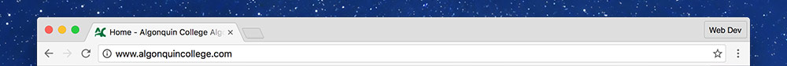

*A URL without HTTPS: `http://www.algonquincollege.com`—can be easily snooped on.*

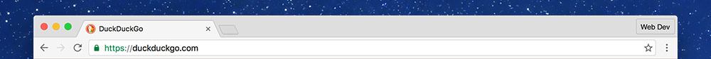
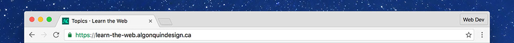

*URLs with HTTPS, like `https://duckduckgo.com` and `https://learn-the-web.algonquincollege.ca`, are encrypted for your protection.*

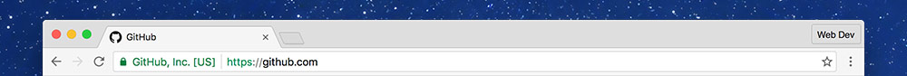

*Some companies have authenticated organization information in the HTTPs certificate.*

### WWW is useless

The `www` part of URLs is completely useless—and as far as many people are concerned—outdated. You should be able to safely remove it from the URL without the page breaking—if the page stops working the developer did a really poor job.

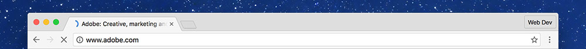

*URLs with `www` in them, like `http://www.adobe.com`, are adding extra, unneeded information.*

### Domains

First, if you know the domain for something just type it in: instead of going to Google and searching for “Facebook”—just type `facebook.com` into your URL field.

Typing the domain directly is significantly faster because you don’t have to wait for Google to load, then display the results, then click the first entry.

### Paths

I use paths all the time to move around a website. By just tweaking the information in the path we can move between pages and back and forth much more quickly than clicking.


*Let’s start at the top of Learn the Web.*

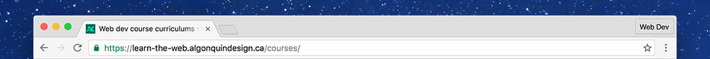

*Add `/courses/` to the end will take us to the “Courses” page.*

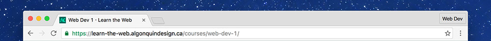

*Add `/web-dev-1/` to the end will take us to the “Web Dev 1” weekly details.*

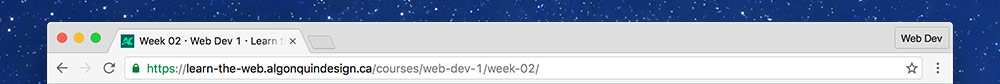

*Add `/week-01/` afterwards will take us directly to the “Week 1” information.*


*Change the week number to `05` and we can jump to another week in the term.*


*Or change the course number to jump to that week in another course.*

### Location hashes

By adding a `#` to the end of a URL we can just to a specific location on the page, assuming you know what it’s called.

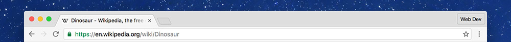
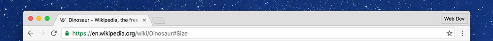

*Jump down to the “Sizes” section of this Wikipedia page by adding `#sizes` to the end.*

### Query strings

Query strings always start with a `?` and are usually used to manipulate the content of the page in some way.

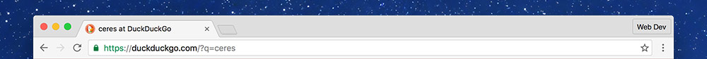

*One really common use is for searching.*


*We can change the term after the `?q=` to get different search results.*

#### Pages with query strings

Often the search results page is also visible in the URL, here’s an example of changing page results on Amazon:

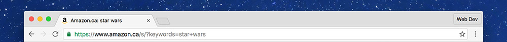
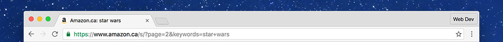


*See the extra information, the page number, stored in the URL as `page=2` or `page=3`*

---

## Video list

1. [Using URLs: HTTPS](https://www.youtube.com/watch?v=Iqg75AviCMk&index=1&list=PLWjCJDeWfDdd95etxxAqsXPHKhfqyx0Cn)
2. [Using URLs: paths](https://www.youtube.com/watch?v=aImZR5IjDMI&list=PLWjCJDeWfDdd95etxxAqsXPHKhfqyx0Cn&index=2)
3. [Using URLs: hashes](https://www.youtube.com/watch?v=mtEYBoXKnKE&list=PLWjCJDeWfDdd95etxxAqsXPHKhfqyx0Cn&index=3)
4. [Using URLs: query strings](https://www.youtube.com/watch?v=ukUu5LFE66A&list=PLWjCJDeWfDdd95etxxAqsXPHKhfqyx0Cn&index=4)
5. [Using URLs: keyboard shortcuts](https://www.youtube.com/watch?v=WIUrrp5KkCo&list=PLWjCJDeWfDdd95etxxAqsXPHKhfqyx0Cn&index=5)

## Supplemental links

- [How many ways to slice a URL](http://tantek.com/2011/238/b1/many-ways-slice-url-name-pieces)
- [URLs Matter](http://paulrobertlloyd.com/2009/12/urls_matter/)
- [URL Design](http://warpspire.com/posts/url-design/)
