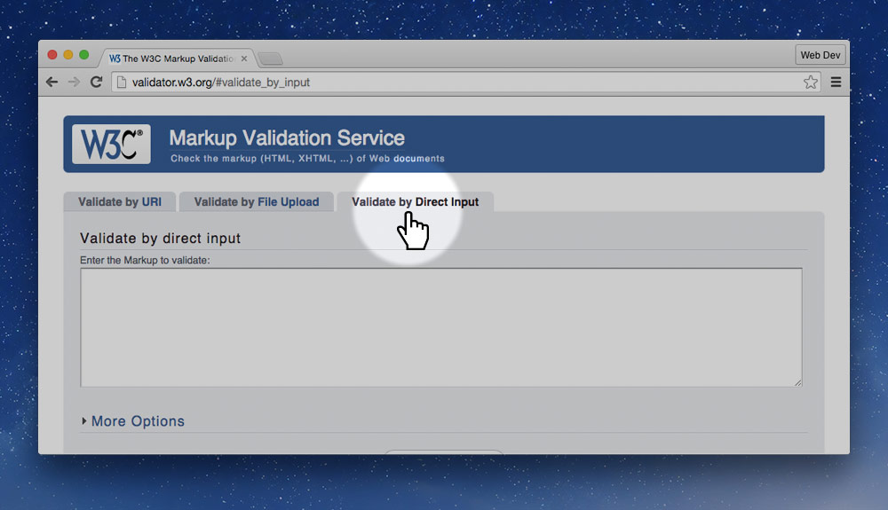
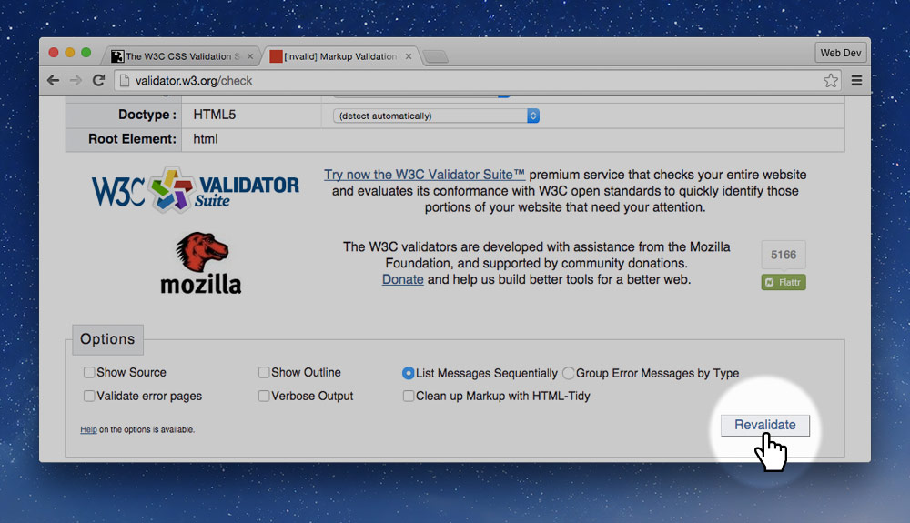
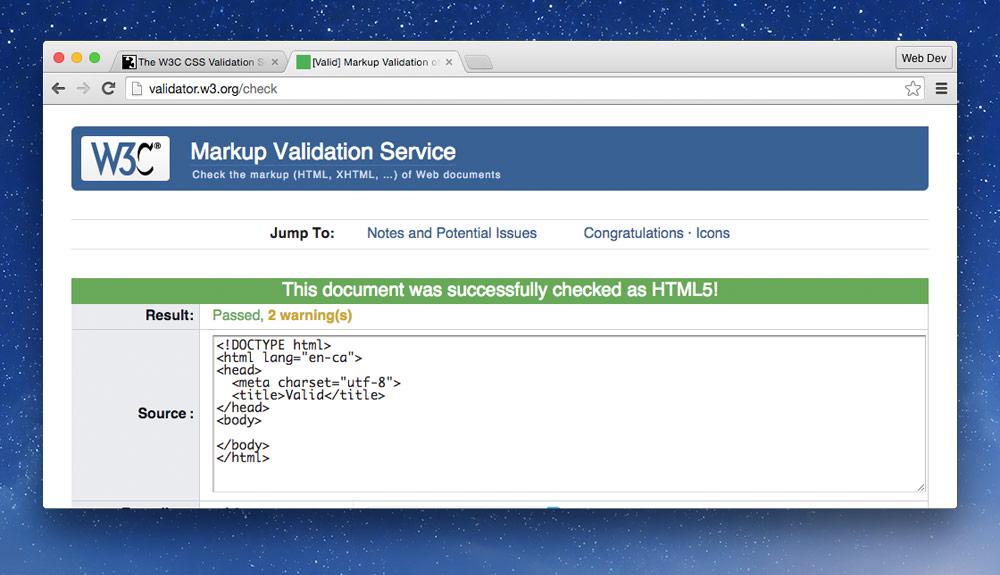
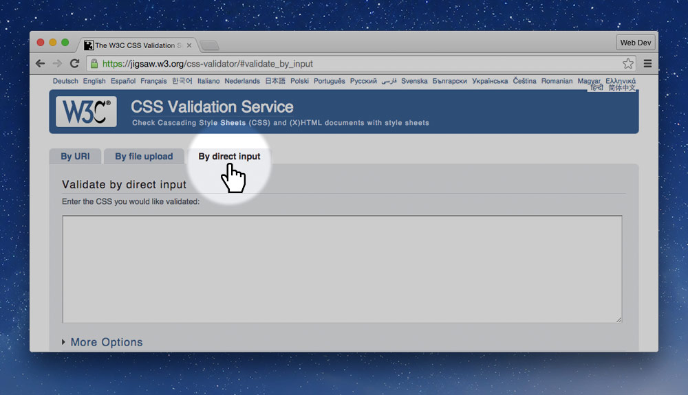
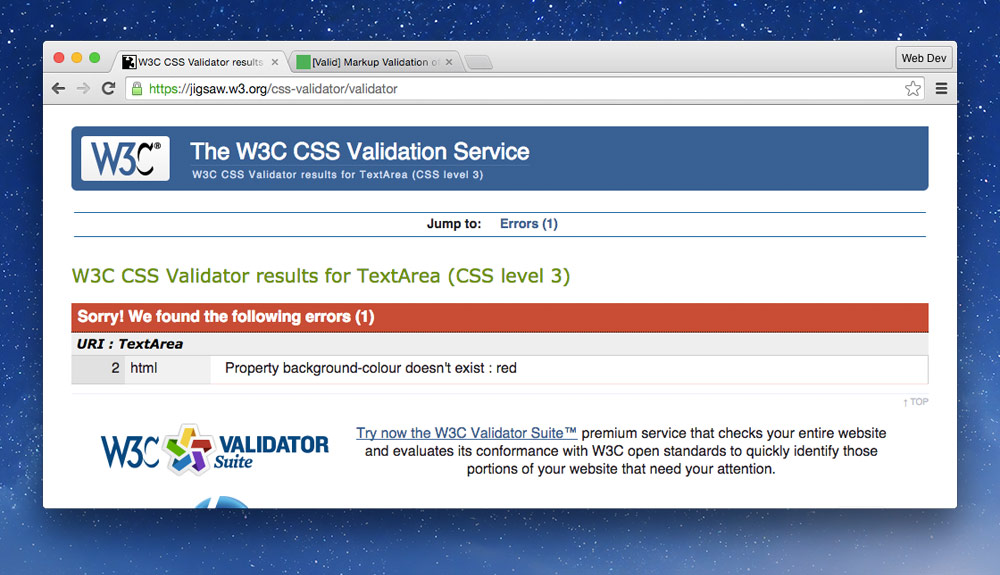
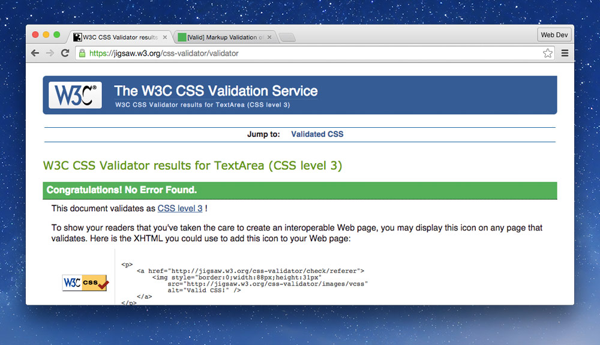
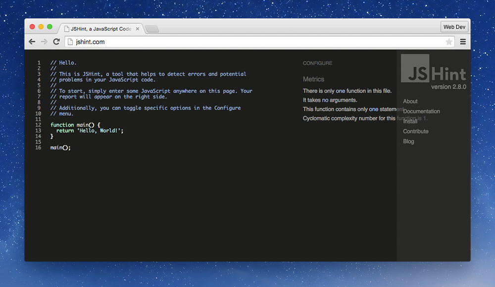
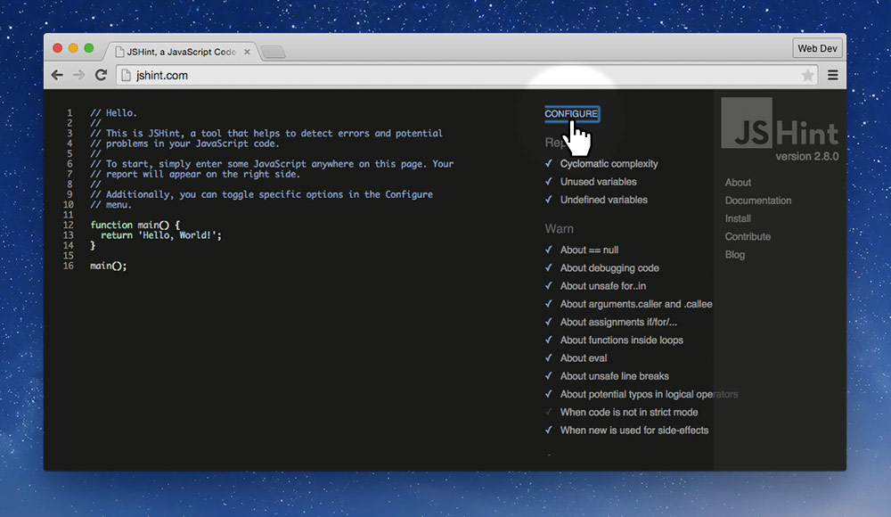

Validating our HTML, CSS, and Javascript is helpful for finding bugs as well has helping make sure it will render more consistently in all browsers.

---

## Validating HTML

Validating HTML is a good way to find errors in our code, especially if it isn’t doing what we want in the browser.

HTML validation also helps use make our websites a little more consistent between browsers.

When writing plain HTML, it’s easiest to just copy and paste the HTML into the validator.

Go to “By Direct Input” and paste your code into the box.

The validation tool should give you a report of errors—scroll down the page.

**It’s very important to solve the first error because HTML errors compond down.**

**After fixing the first error** revalidate the HTML directly on that page by pasting in the box at the top and pressing the “Revalidate” button.

If you get a green bar, everything is good to go.

### Common HTML validation errors to ignore

Sometimes you can’t quite achieve a green bar and that’s okay—but make sure you can get as close as possible.

- Ignore the two warnings: HTML conformance & UTF-8
- Ignore the Google Font Error

**Links**

- **[HTML validator](http://validator.w3.org/)**

---

## Validating CSS

Go to “By Direct Input” and paste your code into the box.

You should be presented with the error screen next:

**Make sure to fix the top error first—the errors can cascade.**

Once your CSS is green everything is good.

### Common CSS validation errors to ignore

Sometimes you can’t quite see the green. Don’t worry, but try to solve as many problems as you can.

- Ignore the `@viewport` error codes
- The errors for `text-rendering`
- Ignore anything with vendor prefixes, like `-webkit-`, `-moz-`, etc.

**Links**

- **[CSS validator](http://jigsaw.w3.org/css-validator/)**

---

## CSS linting & stats

Beyond just validating our CSS we go a little further to find common issues and excess code.

With **[CSS Lint](http://csslint.net/)**, we process our code looking for common problems: things that may cause browser inconsistencies, or things that may trip developers up.

Using **[CSS Stats](http://cssstats.com/)** we can get a bunch of information including:

- a list of all the colours we’re using,
- a list of all the fonts we’re using,
- how many font sizes we’re using,
- how many rule sets there are,
- etc.

Then, armed with this information we can help make our CSS better by: combining similar colours, removing extra typefaces, reducing the number of font sizes used, and more.

**Links**

- [CSS Lint](http://csslint.net/)
- [CSS Stats](http://cssstats.com/)

---

## Validating Javascript

Validating Javascript, also called linting, allows us to find major bugs in our code, or things that often cause weirdness.

There are two major linters: JS Hint & JS Lint:

- **[JS Hint](http://jshint.com/)** — isn’t too strict and has lots of configurable options.
- [JS Lint](http://jslint.com/) — is extremely strict, it will hurt your feelings.

To use JS Hint, go to the website and select all the code on the left side. Paste your code in and it will automatically be validated. You can even make changes right then to pass the linting tests then copy and paste the code back into your website.

You can configure the linting, for instance to allow jQuery by pressing the “Configure” button.

*Consider doing this automatically with a build tool.*

**Links**

- **[JS Hint](http://jshint.com/)**
- [JS Lint](http://jslint.com/)
- [A Comparison of JavaScript Linting Tools](http://www.sitepoint.com/comparison-javascript-linting-tools/)

---

## Video list

1. [Validation: HTML and CSS](https://www.youtube.com/watch?v=79qAXqE3Qz8&index=1&list=PLWjCJDeWfDde7UgEiXizAqpQE1DDzt8RM)
2. [Validation: CSS linting & stats](https://www.youtube.com/watch?v=LN5P4SrRgeE&list=PLWjCJDeWfDde7UgEiXizAqpQE1DDzt8RM&index=2)
3. [Validation: Javascript](https://www.youtube.com/watch?v=4vXx5gClY6c&list=PLWjCJDeWfDde7UgEiXizAqpQE1DDzt8RM&index=3)
