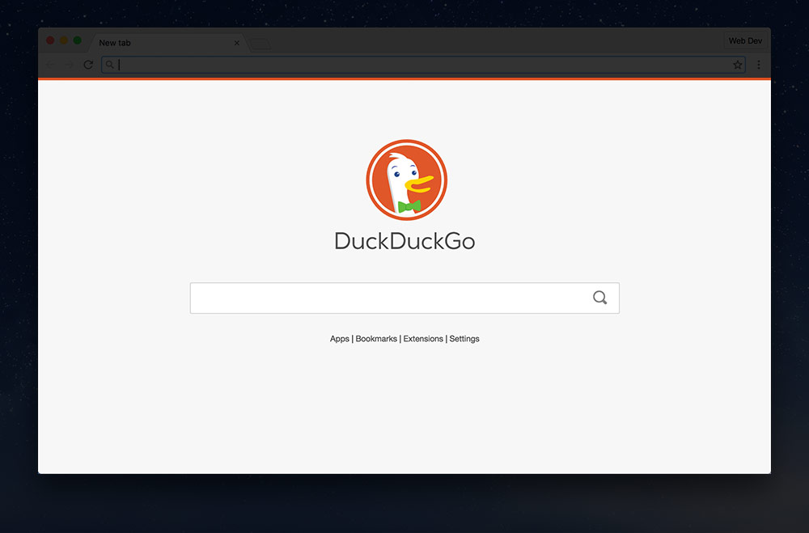
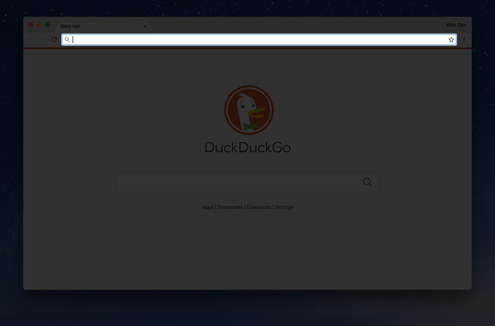
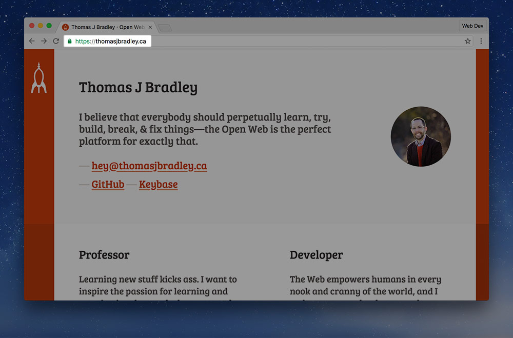

---
playlist:
---

Web browsers—complex multi-part pieces of software—are one of the major pieces that make up the backbone of the Internet.

---

## Browsers

Web browsers have two major components: the interface and the rendering engine. Both interfaces and rendering engines can closed source or open source. There’s lots of sharing that goes on. Web browsers are a big convoluted mess.

The *interface* is the piece that you interact with: the URL bar, the back button, the clicking, the scrolling—the window.

The *rendering engine* is a big program that takes all the website’s code and turns it into the thing you can see and use.

### Browser interfaces

There are countless browser interfaces, some shared between other browsers. Some of them are <dfn><abbr>OSS</abbr> (Open Source Software)</dfn> and some of them are closed-source. Here’s a few popular ones:

- **Chromium** — Chrome (big & small), Opera (big & small).
- **Firefox** — big screen & small screen versions.
- **Edge** — Microsoft’s newest browser for big & small screens.
- **Internet Explorer** — big screen & small screen versions.
- **Safari** — big screen & small screen versions.

### Rendering engines

When it comes to rendering engines there’s a few big players that are shared by most browsers on the web.

- **[Webkit](https://www.webkit.org/)** — open source; used in Safari, BlackBerry, Android, Symbian, UC Browser, and many many more.
- **[Blink](https://en.wikipedia.org/wiki/Blink_%28layout_engine%29)** — open source, forked from Webkit; used in Chrome & Opera.
- **[Gecko](https://en.wikipedia.org/wiki/Gecko_%28software%29)** — open source; used in Firefox & Firefox Mobile.
- **[EdgeHTML](https://en.wikipedia.org/wiki/EdgeHTML)** — closed source; used in Microsoft Edge.
- **[Trident](https://en.wikipedia.org/wiki/Trident_%28layout_engine%29)** — closed source; used in Internet Explorer.
- **[Presto](https://en.wikipedia.org/wiki/Presto_%28layout_engine%29)** — closed source; Opera Mini, (used to power Opera too).

*Web browsers are a big—beautiful—mess of different forks, of shared engines, of shared interfaces. And let’s not get into all the different versions and variations.*

---

## How browsers display your web page

The browser goes through whole bunch of steps to display a web page on the screen—each one taking a little bit of time to complete.

1. The browser starts by making a connection to the web server—this requires a bunch of hopes through different computers to get a specific IP address.
   [**☛ See Domains & DNS for more details**](/topics/domains-dns/).
2. It then downloads the HTML file from the server—this is the most important file in a website—it contains everything—and a website is nothing without it.
3. The browser will then parse the HTML (change the code into something it understands).
4. After the browser understands the HTML it looks through it for other resources that it needs to display the website: images, CSS, Javascript, etc. It’ll start downloading these.
   (With newer browsers and newer servers this step can be skipped because the server can provide a manifest of all files that need to be downloaded.)
5. If the browser encounters CSS or Javascript it will pause while the file downloads—these are called blocking resources. The browser cannot display a page until these finish downloading.
6. After all the blocking resources (CSS, JS) are downloaded, the browser can start rendering (displaying) the page to the screen. It matches together the HTML and CSS to show the page as the designer suggested.
7. Then, as the rest of the resources finish, like images, fonts, etc. the browser will pop those into place.

### Proxy browsers

Proxy browsers are a slightly different version of a browser—the most famous being Opera Mini.

In regular browsers all the stuff above happens directly on the device. But with proxy browsers all the stuff happens on another computer. The server renders and displays the web page then simplifies it into basically a single image and sends that to the device.

This is *amazing* for performance, but we lose some of the fancy interaction—another reason why we shouldn’t rely on Javascript and all the fanciness.

#### Some popular proxy browsers

- [Opera Mini](https://www.opera.com/mobile)
- [UC Browser](http://www.ucweb.com/)

---

## What does the URL field do?

The URL bar or address bar is **the most important piece of interface** in a browser. It tells you all the important information you need about the site:

1. Where you are currently,
2. The structure of the website,
3. The name of the page and website,
4. [Whether the connection is secure](#https),
5. And it may have a cute favicon.

Most new browsers also use this as a search field which is very convenient so you don’t have to go to a search engine to find websites.

*Many people, unfortunately don’t use the URL bar to it’s full potential—I find it extremely helpful and with a little learning you can see it’s massive potential as a quick user-interface tool.*

**[☛ Learn more about URLs](/topics/using-urls/)**

### HTTPS

HTTPS is a way for accessing websites in a secure manner by encrypting the connection and the URL between your computer and the web server. This is fantastic because it helps prevent people snooping on what you’re doing.

HTTPS helps with a few things:

1. It encrypts information so that nobody can see what you send & receive.
2. Helps show you that you’re talking to a legitimate website & organization.
3. It prevents tampering of the information being sent & received.

Search engines, like DuckDuckGo and Google, also use HTTPS as a sign that the website is more trusted and should be higher in search results.

Finally, there are new features that websites can use that are only available with HTTPS: like knowing your location, microphone or camera access, fullscreen & more.

**Just remember: never send a password to a website that isn’t using HTTPS—anybody on the same network, or any of the computer hops in between can see it fully.**

**Links**

- [HTTPS provides more than just privacy](https://certsimple.com/blog/ssl-why-do-i-need-it)
- [An introduction to HTTPS](https://18f.gsa.gov/2015/07/16/introduction-to-https-webinar/)
- [The HTTPS-Only Standard](https://https.cio.gov/faq/)

---

## What makes a website slow?

There are many factors that make a website slow—beyond a poor Internet connection.

*It’s one of the most important considerations of a web designer to make the website load quickly—if it’s slow, it’s most likely the developer’s fault.*

Here are a list of some possible causes:

- Many images
- Auto-playing videos or audio
- Javascript that starts too early
- Lots of ads
- Too much CSS or Javascript
- Poor caching
- Loading the website from a slow server
- Loading the website from around the world

**[☛ Learn more about performance](/topics/performance/)**

---

## There’s weirdness in my browser—do I have a virus?

Modern browsers are really powerful—but they are still prone to user error.

- Are you seeing weird ads pop up?
- Pages showing that you didn’t expect?
- Weird things when hovering?
- Or anything else unexpected?

**You likely don’t have a virus—possibly malware—or most likely you have a rogue extension. One you installed or got install accidentally.**

### Removing rogue extensions

Follow these steps to fix the problem:

1. Go to your browser extensions:
  - *Chrome* — `Window > Extensions`
  - *Firefox* — `Tools > Add-ons`
  - *Safari* — `Safari > Preferences > Extensions`
  - *Opera* — `Window > Extensions`
2. Look at every single extension
3. If you didn’t purposefully install it or don’t know what it is—remove it
4. Quit your browser and start it again

### Persistent malware

**If you’re still having problems there may be some malware—check out [Malwarebytes Anti-Malware for Mac](https://www.malwarebytes.com/antimalware/mac/), an amazing system cleaning tool.**

---

## Supplemental links

- [**An Introduction to Browser Rendering**](https://www.youtube.com/watch?v=n1cKlKM3jYI)
- [Chrome, Firefox, Safari, Opera, Edge? Impressive Web Browser Alternatives](http://www.smashingmagazine.com/2015/09/chrome-firefox-safari-opera-edge-impressive-web-browser-alternatives/)
- [Understanding proxy browsers](https://timkadlec.com/2015/07/understanding-proxy-browsers-architecture/)
